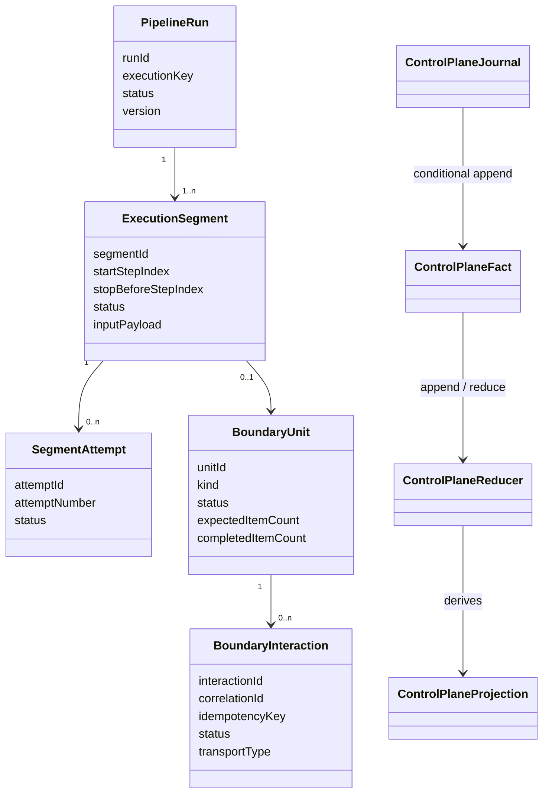
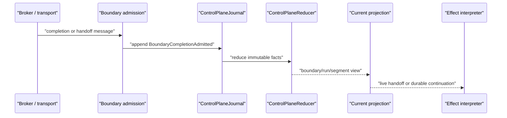
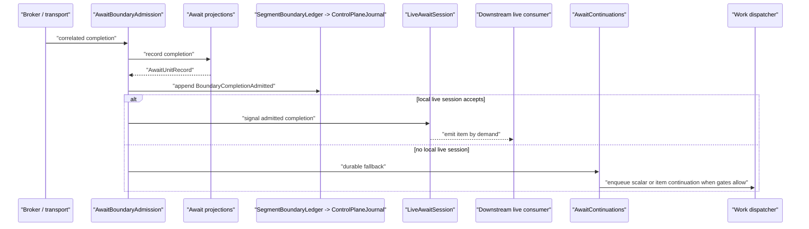

# Immutable Segment And Boundary Model

Queue-async should be modeled as immutable facts flowing through reducers, not as one mutable execution record being marked from state to state.

This page describes the internal segment and boundary model used to connect synchronous pipeline execution segments across await, checkpoint, and terminal publication boundaries. The current `ExecutionStateStore`, `AwaitUnitStore`, and `AwaitInteractionStore` are projection stores for the active runtime path. The immutable model gives queue-async a stable semantic vocabulary for those projections and for future append-only storage providers.

## Core Model

`PipelineRunner` remains the synchronous segment runner. Queue-async adds durable boundaries between those synchronous segments:

1. A `PipelineRun` is the logical submitted run.
2. An `ExecutionSegment` is one synchronous step range between async boundaries.
3. A `SegmentAttempt` is one worker attempt for a segment.
4. A `BoundaryUnit` is an async handoff boundary: await, checkpoint handoff, or terminal publication.
5. A `BoundaryInteraction` is the transport-facing correlation/idempotency item within the boundary.

The model is intentionally append-only. A timeout is not "mark this execution timed out"; it is an `InteractionTimedOut` fact. Reducers derive the current run, segment, boundary, and due-work projections from that fact stream.

## Fact Flow

The control-plane model uses facts such as:

- `RunSubmitted`
- `SegmentAttemptStarted`
- `SegmentCompleted`
- `SegmentSuspended`
- `BoundaryInteractionDispatched`
- `BoundaryDispatchCompleted`
- `BoundaryCompletionAdmitted`
- `InteractionTimedOut`
- `ContinuationSegmentCreated`
- `TerminalPublicationCompleted`
- `RunSucceeded`
- `RunFailed`

These facts are immutable. A `ControlPlaneJournal` appends them conditionally by expected projection version, assigns monotonically increasing event sequences, and rebuilds projections through `ControlPlaneReducer`.

Duplicate completions and terminal publications are handled by fact keys. Retrying the same append is a no-op when the fact key already exists; retrying a different fact against a stale version fails with an append conflict.

## Boundary Admission

Await completion and checkpoint handoff are the same architectural shape: a transport message admits a correlated payload into a TPF-owned boundary.

`BoundaryAdmissionFacts` is deliberately transport-agnostic. Kafka await completions and Kafka checkpoint handoffs should produce the same `BoundaryCompletionAdmitted` fact shape after their protocol-specific decoding.

For await completions, `AwaitBoundaryAdmission` is the internal owner of that route. It normalizes the completion command, applies local control-plane admission, records the existing await completion projection, appends `BoundaryCompletionAdmitted`, and only then chooses between a local live-session handoff or durable continuation work.

`AwaitContinuations` owns the "future beginning" after the boundary. It releases scalar awaits, records per-item continuation outputs, assembles ordered itemized parent output, and dispatches resumed segment work. `QueueAsyncCoordinator` remains the API and provider façade for now; it should not own completion-routing semantics directly.

## Relationship To Projection Stores

The existing stores are projection stores for efficient runtime lookup:

- `ExecutionStateStore`
- `AwaitUnitStore`
- `AwaitInteractionStore`

The queue-async runtime records semantic facts around those projection updates. The projection stores keep existing lookup and recovery paths stable, while the journal records the immutable story of a run: submitted, attempted, suspended, completed, admitted, continued, published, succeeded, or failed.

Dynamo append-only storage design remains tracked by issue #396. That work should implement the same fact model with explicit table, index, retention, and stale-candidate handling.
