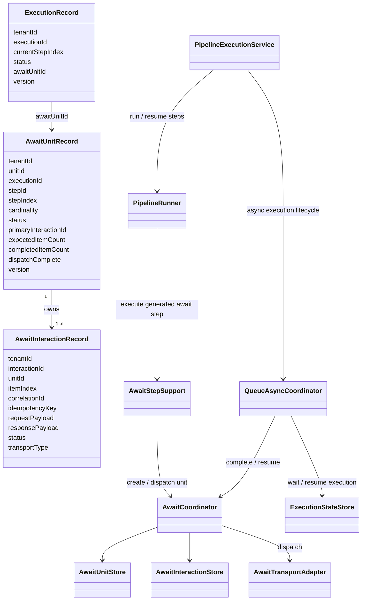
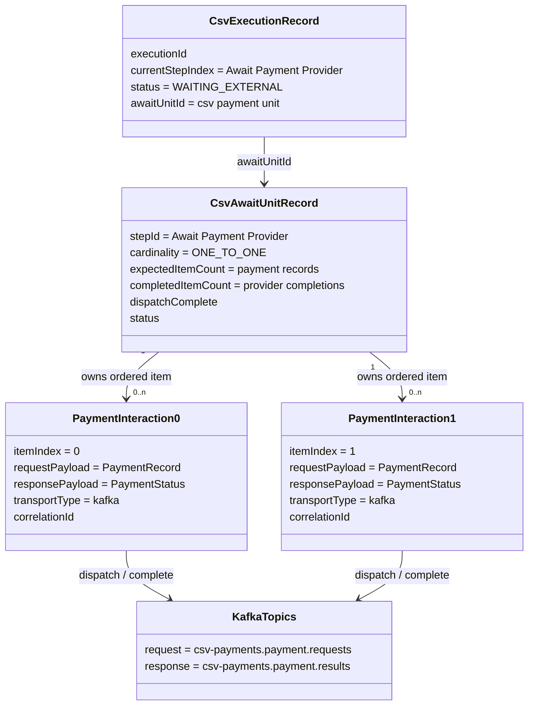

# Await Unit Runtime

Await units are the durable suspend/resume model for `kind: await` steps. The unit is the interaction boundary TPF owns: it records what was dispatched, what completion is required, and what payload should be replayed when the owning execution resumes.

This guide is implementation-facing. Application-facing design guidance lives in [Await Boundaries](/design/await-boundaries). Runtime setup lives in [Await runtime setup](/deploy/orchestrator-runtime/await).

For the longer-term orchestration boundary that can move await units out of each app-hosted orchestrator, see [Durable Coordinator](/evolve/durable-coordinator/). For the immutable queue-async model that treats await completion and checkpoint handoff as the same boundary-admission shape, see [Queue-Async Immutable Boundaries](/evolve/queue-async-immutable-boundaries).

## Guide Pages

1. [Model](/evolve/await-unit-runtime/) explains the durable records and cardinality semantics.
2. [Sequences](/evolve/await-unit-runtime/sequences) shows unary, stream, aggregate, timeout, and resume flows.
3. [Patterns](/evolve/await-unit-runtime/patterns) explains the architectural patterns and why the unit model fixed the design.
4. [Limitations And Debt](/evolve/await-unit-runtime/operations-and-debt) tracks implementation limitations and follow-up work.

## Core Model

The key split is:

1. `AwaitUnitRecord`: one durable interaction unit for an authored await step at a specific execution and step index.
2. `AwaitInteractionRecord`: one externally visible interaction that can be queried, dispatched, completed, timed out, or correlated by transport.
3. `ExecutionRecord.awaitUnitId`: the parked continuation pointer used while the execution is `WAITING_EXTERNAL`.

`AwaitUnitRecord` is the current compatibility projection for completion of the authored await boundary. `AwaitInteractionRecord` is the transport-facing projection. The target queue-async model represents the same behavior as immutable `BoundaryUnit` and `BoundaryInteraction` projections derived from appended facts.

In that model, `PipelineRunner` still runs synchronous step segments. An await step suspends one `ExecutionSegment` by appending a `SegmentSuspended` fact. Kafka, webhook, or interaction-api completion appends `BoundaryCompletionAdmitted`. If a live await session is present, the admitted completion can flow into the active downstream `Multi`; if not, the same durable facts create continuation segment work.

## CSV Payments Applied Model

`csv-payments` applies this model to a Kafka-backed payment-provider boundary:

1. `Process Csv Payments Input` expands an input file into a stream of `PaymentRecord` items.
2. `Await Payment Provider` is authored as `kind: await` with `cardinality: ONE_TO_ONE`.
3. Because the await step receives a stream, TPF creates one owning await unit with one item interaction per `PaymentRecord`.
4. The Kafka adapter publishes requests to `csv-payments.payment.requests`; the mock provider publishes completions to `csv-payments.payment.results`.
5. Completed item outputs are `PaymentStatus` records. In the live Kafka path, completions are recorded and signalled into the live await session so `Process Payment Status` can run as downstream demand accepts them. In the fallback path, the runtime resumes per-item work from durable item continuations.
6. In the connector-first default path, terminal `PaymentOutput` records are published by Object Publish rather than by a `ProcessCsvPaymentsOutputFileService` business step.

The important detail is that CSV does not model the provider as a pipeline step. The provider is an external actor reached through the await transport. The pipeline resumes from admitted `PaymentStatus` completions.

`WAITING_EXTERNAL` is still the durable recovery pointer. It is not the live-path release gate when a live await session is active and accepting completions.

## Cardinality As Unit Shape

Cardinality defines the unit TPF must durably replay.

| Authored cardinality | Unit shape | Interactions | Resume input |
| --- | --- | --- | --- |
| `ONE_TO_ONE` on one input | one input, one output | one primary interaction | scalar output |
| `ONE_TO_ONE` over a stream | one unit owning ordered item interactions | one interaction per input item | ordered list/stream of completed item outputs |
| `ONE_TO_MANY` | one input, many output items | one primary interaction | materialized output unit replayed as a stream |
| `MANY_TO_ONE` | many input items, one output | one primary interaction after input materialization | scalar output |
| `MANY_TO_MANY` | many input items, many output items | one primary interaction after input materialization | materialized output unit replayed as a stream |

The unit, not an ad hoc dispatch mode, decides what gets snapshotted and replayed. For aggregate cardinalities, v1 materializes the input and/or output unit. If downstream replay fails halfway through a materialized output unit, TPF restarts replay of that whole output unit. It does not claim exactly-once progress inside the unit.
