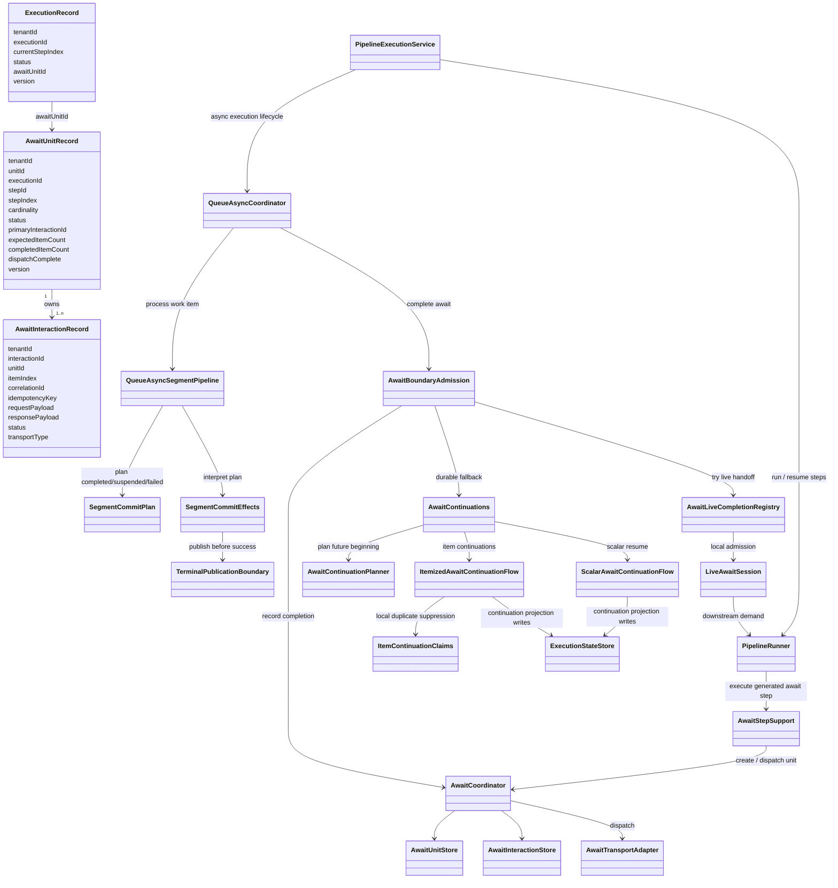
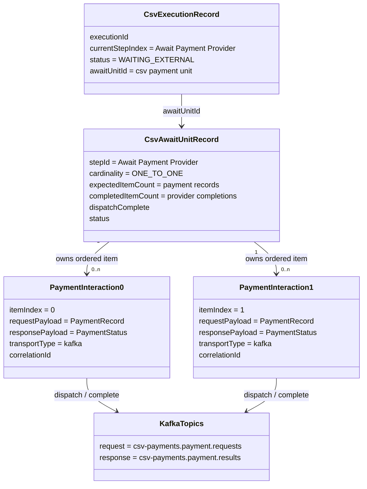

# Await Unit Runtime

Await units are the durable suspend/resume model for `kind: await` steps. The unit is the interaction boundary TPF owns: it records what was dispatched, what completion is required, and what payload should be replayed when the owning execution resumes.

This guide is implementation-facing. Application-facing design guidance lives in [Await Boundaries](/design/await-boundaries). Runtime setup lives in [Await runtime setup](/deploy/orchestrator-runtime/await).

For the longer-term orchestration boundary that can move await units out of each app-hosted orchestrator, see [Durable Coordinator](/evolve/durable-coordinator/). For the immutable queue-async model that treats await completion and checkpoint handoff as the same boundary-admission shape, see [Immutable Segment And Boundary Model](/evolve/await-unit-runtime/immutable-boundaries).

## Transition boundary, not pipeline transport

`pipeline.transport` selects the generated pipeline contract. It does not select how an await
continues. The transition-worker boundary owns that choice:

| Transition-worker boundary | Await continuation | Terminal output ownership |
| --- | --- | --- |
| in-process worker | retain a live window only when the adapter supports it; otherwise suspend through the await unit | the worker keeps the existing local terminal-output path |
| portable REST, gRPC, or SQS worker | durably hand the completed interaction back to the coordinator | the coordinator publishes the terminal output |

`interaction-api` and webhook awaits always use the interaction/unit suspension path. Kafka and
SQS itemized adapters may optimize an in-process worker with a live completion window, but their
completion remains admissible through the same unit path when that window is unavailable.

The word *durable* has two scopes here. An await unit always gives the running runtime a canonical
interaction and continuation protocol. Crash recovery additionally requires durable execution,
await, command-effect, lease, and admission stores. The memory/event providers implement the
first scope for one running process; they intentionally lose orchestration state on restart.

## Canonical and transport completion values

An await interaction carries both its canonical output type and its transport output type. A v3
completion is first coerced to the transport representation, then passed through the generated
canonical adapter before the continuation resumes. For example, a protobuf union is converted to
its generated sealed domain union before canonical validation; Jackson must not be asked to
construct the abstract union directly.

The generated v3 await client supplies this boundary explicitly. The runtime also rebuilds it from
`pipeline.yaml` for older generated three-argument descriptor calls, so persisted/transport
completion handling retains the same typed contract during an upgrade.

## Guide Pages

1. [Model](/evolve/await-unit-runtime/) explains the durable records and cardinality semantics.
2. [Immutable Boundaries](/evolve/await-unit-runtime/immutable-boundaries) explains the segment, boundary, fact, and projection model behind queue-async.
3. [Sequences](/evolve/await-unit-runtime/sequences) shows unary, stream, aggregate, timeout, and resume flows.
4. [Patterns](/evolve/await-unit-runtime/patterns) explains the architectural patterns and why the unit model fixed the design.
5. [Limitations And Debt](/evolve/await-unit-runtime/operations-and-debt) tracks implementation limitations and follow-up work.

## Core Model

The key split is:

1. `AwaitUnitRecord`: one durable interaction unit for an authored await step at a specific execution and step index.
2. `AwaitInteractionRecord`: one externally visible interaction that can be queried, dispatched, completed, timed out, or correlated by transport.
3. `ExecutionRecord.awaitUnitId`: the parked continuation pointer used while the execution is `WAITING_EXTERNAL`.

```mermaid
classDiagram
    class ExecutionRecord {
      tenantId
      executionId
      currentStepIndex
      status
      awaitUnitId
      version
    }

    class AwaitUnitRecord {
      tenantId
      unitId
      executionId
      stepId
      stepIndex
      cardinality
      status
      primaryInteractionId
      expectedItemCount
      completedItemCount
      dispatchComplete
      version
    }

    class AwaitInteractionRecord {
      tenantId
      interactionId
      unitId
      itemIndex
      correlationId
      idempotencyKey
      requestPayload
      responsePayload
      status
      transportType
    }

    class PipelineExecutionService
    class PipelineRunner
    class QueueAsyncCoordinator
    class QueueAsyncSegmentPipeline
    class SegmentCommitPlan
    class SegmentCommitEffects
    class TerminalPublicationBoundary
    class AwaitBoundaryAdmission
    class AwaitLiveCompletionRegistry
    class LiveAwaitSession
    class AwaitContinuations
    class AwaitContinuationPlanner
    class ScalarAwaitContinuationFlow
    class ItemizedAwaitContinuationFlow
    class ItemContinuationClaims
    class AwaitStepSupport
    class AwaitCoordinator
    class AwaitUnitStore
    class AwaitInteractionStore
    class AwaitTransportAdapter
    class ExecutionStateStore

    ExecutionRecord --> AwaitUnitRecord : awaitUnitId
    AwaitUnitRecord "1" --> "1..n" AwaitInteractionRecord : owns
    PipelineExecutionService --> PipelineRunner : run / resume steps
    PipelineRunner --> AwaitStepSupport : execute generated await step
    AwaitStepSupport --> AwaitCoordinator : create / dispatch unit
    PipelineExecutionService --> QueueAsyncCoordinator : async execution lifecycle
    QueueAsyncCoordinator --> QueueAsyncSegmentPipeline : process work item
    QueueAsyncSegmentPipeline --> SegmentCommitPlan : plan completed/suspended/failed
    QueueAsyncSegmentPipeline --> SegmentCommitEffects : interpret plan
    SegmentCommitEffects --> TerminalPublicationBoundary : publish before success
    QueueAsyncCoordinator --> AwaitBoundaryAdmission : complete await
    AwaitBoundaryAdmission --> AwaitCoordinator : record completion
    AwaitBoundaryAdmission --> AwaitLiveCompletionRegistry : try live handoff
    AwaitLiveCompletionRegistry --> LiveAwaitSession : local admission
    LiveAwaitSession --> PipelineRunner : downstream demand
    AwaitBoundaryAdmission --> AwaitContinuations : durable fallback
    AwaitContinuations --> AwaitContinuationPlanner : plan future beginning
    AwaitContinuations --> ScalarAwaitContinuationFlow : scalar resume
    AwaitContinuations --> ItemizedAwaitContinuationFlow : item continuations
    ItemizedAwaitContinuationFlow --> ItemContinuationClaims : local duplicate suppression
    ScalarAwaitContinuationFlow --> ExecutionStateStore : continuation projection writes
    ItemizedAwaitContinuationFlow --> ExecutionStateStore : continuation projection writes
    AwaitCoordinator --> AwaitUnitStore
    AwaitCoordinator --> AwaitInteractionStore
    AwaitCoordinator --> AwaitTransportAdapter : dispatch
```

`AwaitUnitRecord` is the current compatibility projection for completion of the authored await boundary. `AwaitInteractionRecord` is the transport-facing projection. The target queue-async model represents the same behavior as immutable `BoundaryUnit` and `BoundaryInteraction` projections derived from appended facts.

In that model, `PipelineRunner` still runs synchronous step segments. An await step suspends one `ExecutionSegment` by appending a `SegmentSuspended` fact. Kafka, webhook, or interaction-api completion appends `BoundaryCompletionAdmitted`. If a live await session is present, the admitted completion can flow into the active downstream `Multi`; if not, the same durable facts create continuation segment work.

That continuation is the future beginning of the suspended pipeline. `AwaitContinuationPlanner` decides whether a completion is still held, releases a scalar resume, dispatches item continuations, records item output, or releases an itemized parent. `ScalarAwaitContinuationFlow` and `ItemizedAwaitContinuationFlow` interpret those decisions through the existing projection stores and dispatcher. `ItemContinuationClaims` is only process-local duplicate suppression; durable truth remains in the stores and immutable ledger facts.

## Durable Recovery Contract

Every await transition must be reconstructable from durable state. A worker-local observation,
claim, cache, live session, or scheduler entry may reduce duplicate work, but it cannot be needed
to determine whether an interaction, child continuation, or parent execution may progress.

| Durable precondition | Event | Durable mutation | Emitted action | Restart reconstruction |
| --- | --- | --- | --- | --- |
| pending interaction | request creation | interaction persists | dispatch request | reload interaction and redispatch by its delivery contract |
| pending interaction | completion admission | response persists as completed | release evaluation | reload interaction and await unit |
| completed scalar interaction | release evaluation | parent becomes queued | continuation work | reload parent state and deduplicate by transition identity |
| completed item interaction | item continuation | child becomes succeeded | parent release evaluation | query the durable child execution |
| all required children succeeded | parent release evaluation | parent becomes queued | aggregate continuation work | query every required durable child execution |
| queued parent | transition admission | next execution state persists | business segment | reload the execution and lease/retry safely |

The itemized parent release rule is deliberately strict: a parent remains held while any required
durable child execution is missing, pending, failed, or otherwise non-successful. Local child
claims never prove aggregate completion. More than one worker may physically attempt release or
continuation work, but optimistic durable admission permits only one accepted semantic advance.

### Provider completion and continuation completion

Itemized await has two distinct durable progress facts. They answer different questions and must
not be collapsed into one count:

| Durable fact | Meaning | Produced by | Enables |
| --- | --- | --- | --- |
| provider completion | the external provider answered an interaction and TPF admitted that response | completion admission | item-continuation work for that response |
| continuation completion | TPF durably incorporated the admitted response into its item child execution | successful child continuation | final aggregate readiness evaluation |

An await unit may therefore have every provider response admitted while some child continuations
are still pending. Each successful child writes an idempotent continuation-completion fact to the
unit. Only when the required set of those facts is complete does the runtime read the ordered child
executions, verify that each is successful, and attempt the parent release. This keeps the
aggregate decision reconstructable after reassignment and avoids repeated all-sibling scans after
each provider response.

Older durable units that predate continuation-completion facts remain recoverable through their
existing child-execution evidence. New units use the fact-based release gate. Process-local claims
may suppress duplicate dispatch work, but they never establish either provider or continuation
completion.

The runtime verifies these durable guarantees across every lifecycle transition, supported await
shape, defined completion race, and restart boundary. A recovered runtime rebuilds progress from
the persisted execution, await-unit, and interaction state; it does not depend on a local claim,
cache, session, or scheduler entry from the process that observed an earlier event.

Kafka, SQS, and webhook completion ingress each admit a single durable completion before release
evaluation. Terminal execution leaves no pending interaction, active await unit, orphaned child
execution, or unresolved continuation state. Admission capacity and item claims are released by
their owning boundaries, so duplicate physical work cannot produce additional accepted semantic
progress.

## CSV Payments Applied Model

`csv-payments` applies this model to a Kafka-backed payment-provider boundary:

1. `Process Csv Payments Input` expands an input file into a stream of `PaymentRecord` items.
2. `Await Payment Provider` is authored as `kind: await` with `cardinality: ONE_TO_ONE`.
3. Because the await step receives a stream, TPF creates one owning await unit with one item interaction per `PaymentRecord`.
4. The Kafka adapter publishes requests to `csv-payments.payment.requests`; the mock provider publishes completions to `csv-payments.payment.results`.
5. Completed item outputs are `PaymentStatus` union variants. In the live Kafka path, completions are recorded and signalled into the live await session so the approved or unapproved status branch can run as downstream demand accepts it. In the fallback path, the runtime resumes per-item work from durable item continuations.
6. In the connector-first default path, terminal `PaymentOutput` records are published by Object Publish rather than by a `ProcessCsvPaymentsOutputFileService` business step.

```mermaid
classDiagram
    class CsvExecutionRecord {
      executionId
      currentStepIndex = Await Payment Provider
      status = WAITING_EXTERNAL
      awaitUnitId = csv payment unit
    }

    class CsvAwaitUnitRecord {
      stepId = Await Payment Provider
      cardinality = ONE_TO_ONE
      expectedItemCount = payment records
      completedItemCount = provider completions
      dispatchComplete
      status
    }

    class PaymentInteraction0 {
      itemIndex = 0
      requestPayload = PaymentRecord
      responsePayload = PaymentStatus
      transportType = kafka
      correlationId
    }

    class PaymentInteraction1 {
      itemIndex = 1
      requestPayload = PaymentRecord
      responsePayload = PaymentStatus
      transportType = kafka
      correlationId
    }

    class KafkaTopics {
      request = csv-payments.payment.requests
      response = csv-payments.payment.results
    }

    CsvExecutionRecord --> CsvAwaitUnitRecord : awaitUnitId
    CsvAwaitUnitRecord "1" --> "0..n" PaymentInteraction0 : owns ordered item
    CsvAwaitUnitRecord "1" --> "0..n" PaymentInteraction1 : owns ordered item
    PaymentInteraction0 --> KafkaTopics : dispatch / complete
    PaymentInteraction1 --> KafkaTopics : dispatch / complete
```

The important detail is that CSV does not model the provider as a pipeline step. The provider is an external actor reached through the await transport. The pipeline resumes from admitted `PaymentStatus` completions.

`WAITING_EXTERNAL` is still the durable recovery pointer. It is not the live-path release gate when a live await session is active and accepting completions.

## Cardinality As Unit Shape

Cardinality defines the unit TPF must durably replay.

| Authored cardinality | Unit shape | Interactions | Resume input |
| --- | --- | --- | --- |
| `ONE_TO_ONE` on one input | one input, one output | one primary interaction | scalar output |
| `ONE_TO_ONE` over a stream | one unit owning ordered item interactions | one interaction per input item | ordered list/stream of completed item outputs |
| `ONE_TO_MANY` | one input, many output items | one primary interaction | materialized output unit replayed as a stream |
| `MANY_TO_ONE` | many input items, one output | one primary interaction after input materialization | scalar output |
| `MANY_TO_MANY` | many input items, many output items | one primary interaction after input materialization | materialized output unit replayed as a stream |

The unit, not an ad hoc dispatch mode, decides what gets snapshotted and replayed. For aggregate cardinalities, v1 materializes the input and/or output unit. If downstream replay fails halfway through a materialized output unit, TPF restarts replay of that whole output unit. It does not claim exactly-once progress inside the unit.
