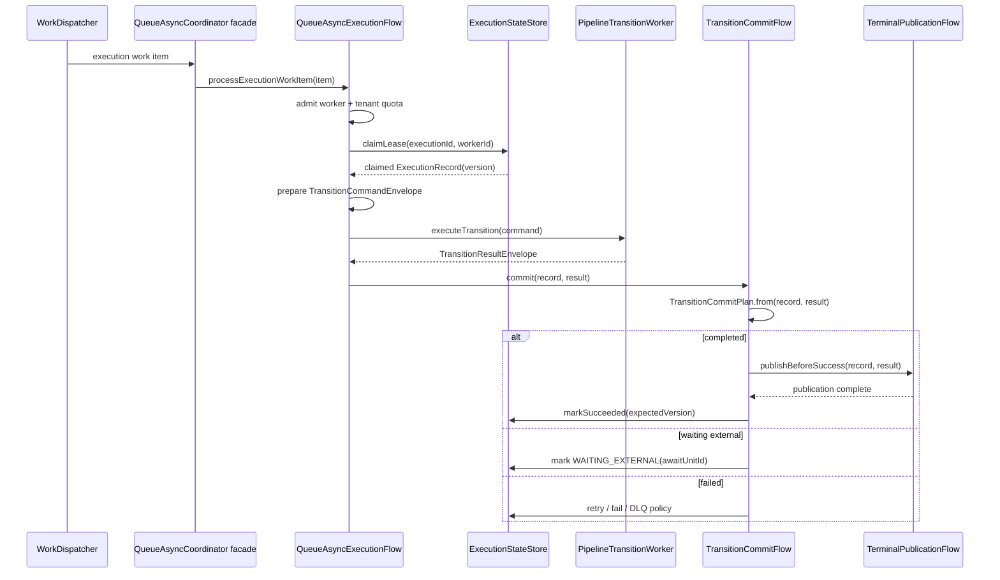
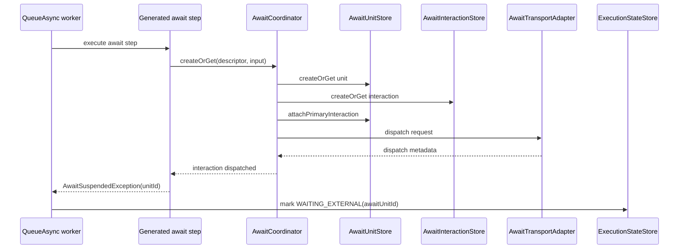
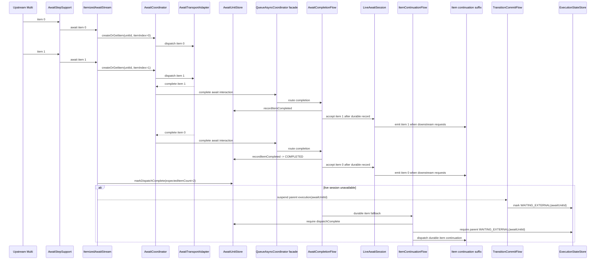
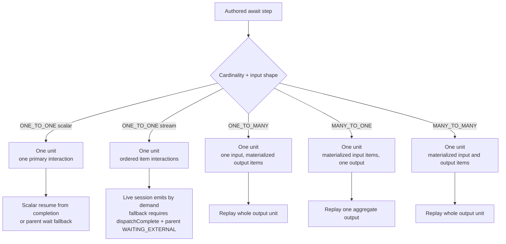
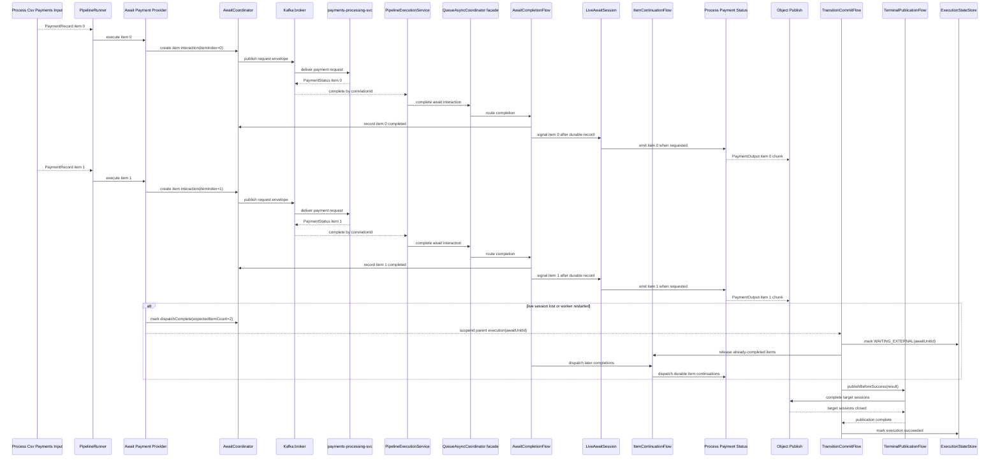
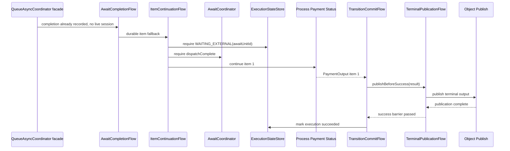
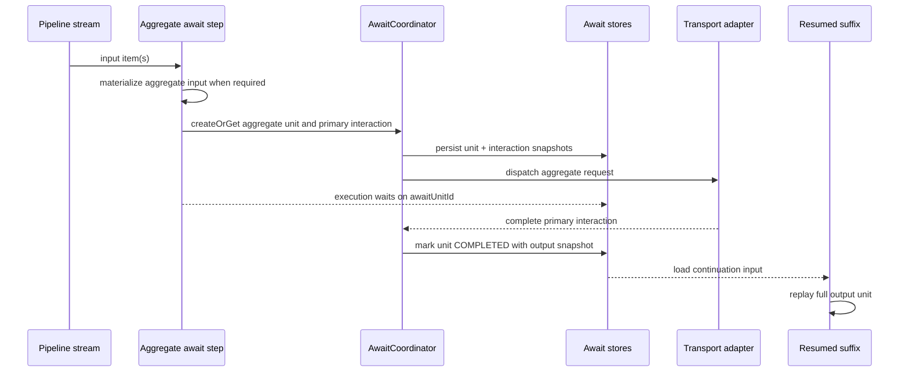
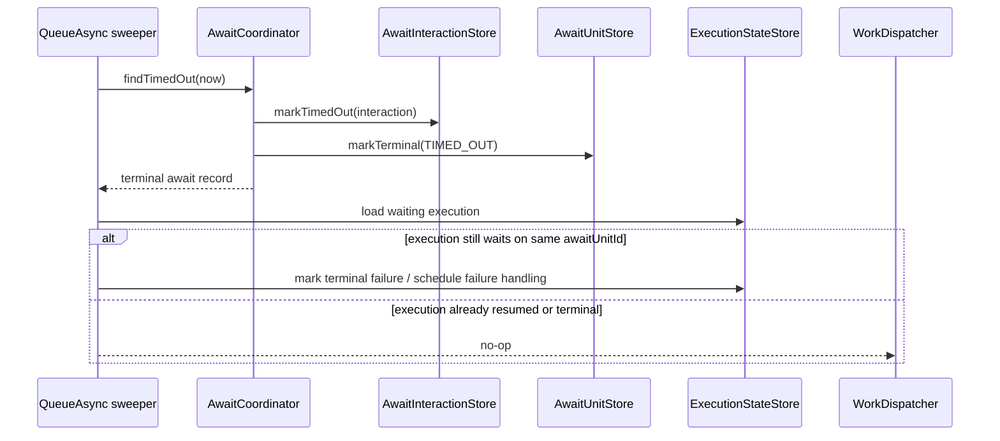

# Await Unit Sequences

These diagrams show how the await unit model parks and resumes `QUEUE_ASYNC` executions.

`QueueAsyncCoordinator` is still the entrypoint and lifecycle facade. The diagrams below name the internal semantic owners when the distinction matters: `QueueAsyncExecutionFlow` composes claimed work as a `Uni`, `ItemizedAwaitStream` owns the stream-await `Multi`, `AwaitCompletionFlow` routes completions, `LiveAwaitSession` owns live demand and stream terminal signals, `ItemContinuationFlow` owns durable item fallback, `TransitionCommitFlow` commits suspended or completed transitions, and `TerminalPublicationFlow` owns publish-before-success effects.

## Queue-Async Transition Flow

Processing one execution work item is a reactive flow over durable facts. The coordinator admits and delegates; the flow claims the execution, prepares the transition command, invokes the worker, and passes the result to commit. The immutable `TransitionCommitPlan` decides whether the result is success, wait, or failure before effects are interpreted.

## Unary Await

Suspension is normal control flow. It should not be logged as a failed step or routed through recovery as an exception.

## One-To-One Over Stream

`ONE_TO_ONE` over a `Multi` is a stream of unary awaits inside one owning unit. This is the model used by `csv-payments`: each `PaymentRecord` is one input unit and each provider completion is one output unit.

For brokered await transports, the preferred queue-async path is live. `AwaitStepSupport` delegates stream await work to `ItemizedAwaitStream`, which opens a live await session for the unit. Source dispatch is bounded by the configured in-flight window, and each completion is recorded before it is emitted to the resumed suffix. If that live session is unavailable, the coordinator falls back to durable item continuations.

Completion may arrive out of order. The live path can process accepted completions as they arrive; durable replay and aggregate release preserve item identity by reading completed item interactions by `itemIndex`.

## Await Unit Gatekeeper

The await unit is the durable shape for the boundary. In the live path, it is the identity, ordering, and dedupe anchor for item interactions. In the fallback path, it also gates release so completions cannot race ahead of durable parent suspension. For aggregate cardinalities, it defines what must be replayed together.

For `ONE_TO_ONE` over a stream, the unit groups item interactions for ordering, dedupe, live-session identity, and fallback release. It is not provider-side batching. For aggregate cardinalities, the unit is the batch because the runtime materializes the relevant side of the boundary.

## CSV Payments Itemized Await

This is the concrete connector-first `csv-payments` shape. `Await Payment Provider` owns the Kafka boundary, but `Process Payment Status` can run per completed item through the live await session. Terminal Object Publish writes output chunks before success is committed.

The model is itemized until the next aggregate or terminal boundary. If an authored downstream step is `MANY_TO_ONE` or `MANY_TO_MANY`, durable fallback resumes the parent execution there with the collected ordered item outputs. If the suffix remains itemized through the terminal output, Object Publish owns final grouping and object writes.

## Aggregate Unit

`ONE_TO_MANY`, `MANY_TO_ONE`, and `MANY_TO_MANY` are aggregate interaction units. The runtime materializes the relevant side of the boundary so replay has one stable unit to restart.

This deliberately avoids partial-output checkpointing inside the interaction unit. TPF owns retry/replay of the unit as a whole.

## Timeout And Resume

Completion admission follows the opposite path: complete the interaction, update the unit, and resume the execution only when the unit is complete.
