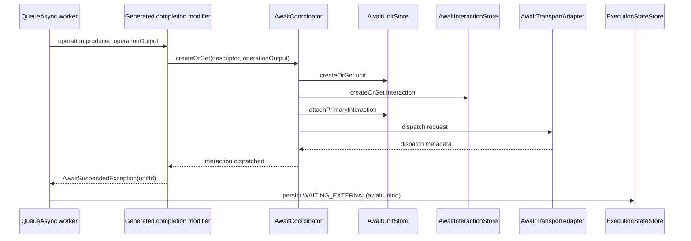
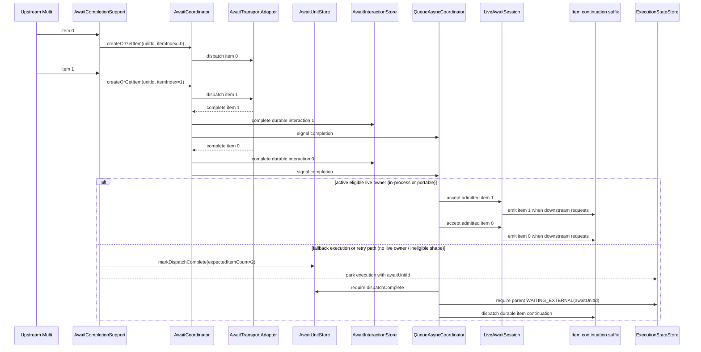
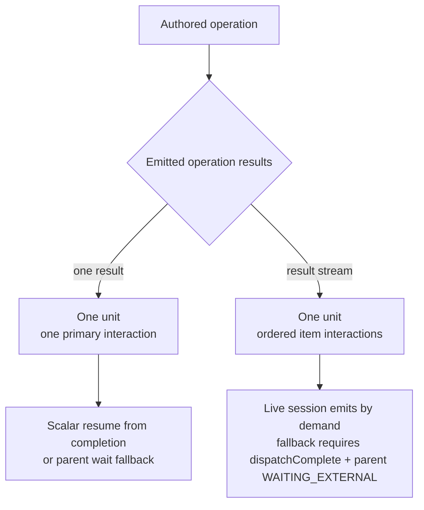
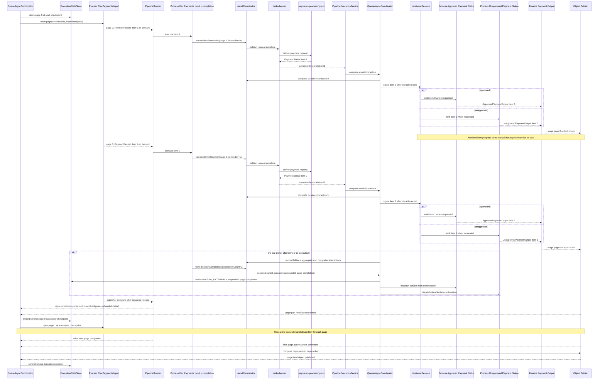
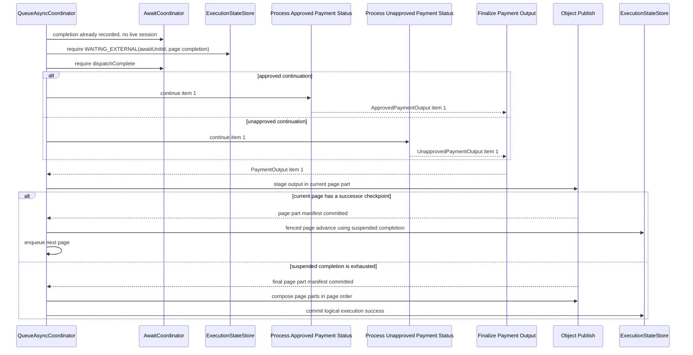
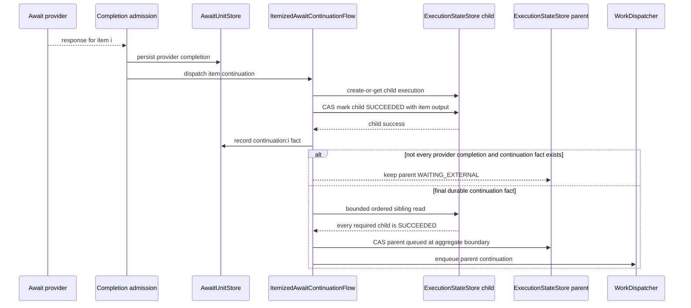
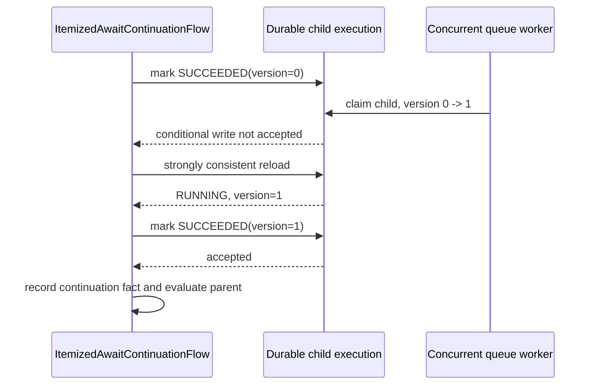
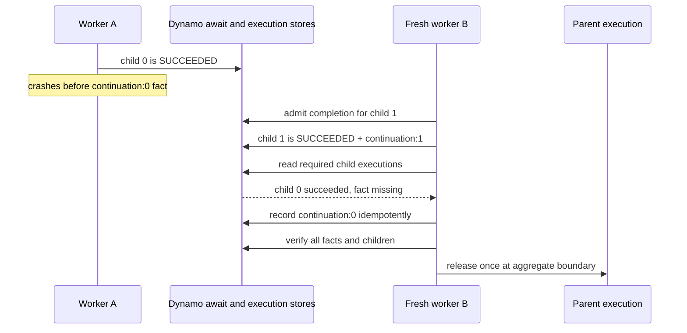
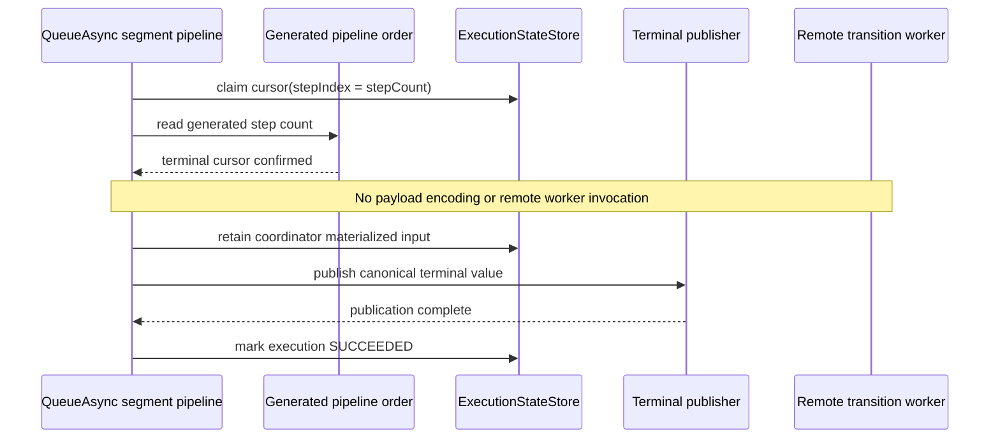
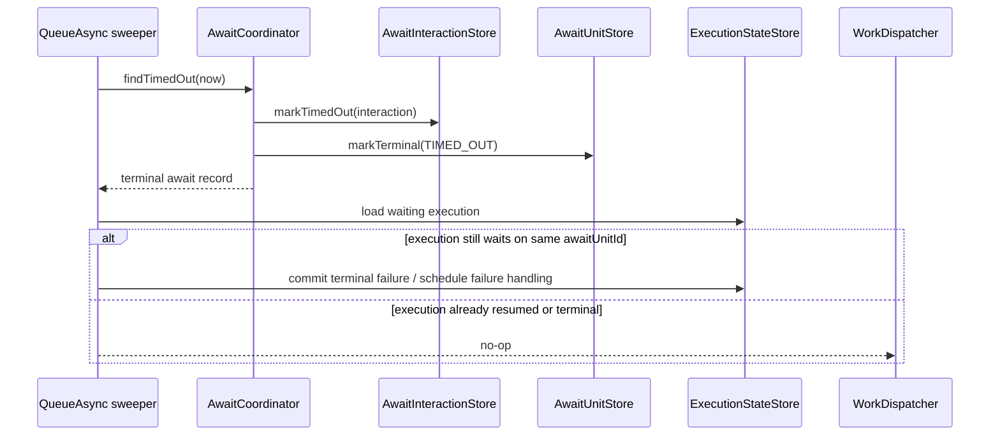

# Await Unit Sequences

These diagrams show how the await unit model parks and resumes `QUEUE_ASYNC` executions.

## Unary Deferred Completion

```mermaid
sequenceDiagram
    participant Worker as QueueAsync worker
    participant Step as Generated completion modifier
    participant Coord as AwaitCoordinator
    participant UnitStore as AwaitUnitStore
    participant InteractionStore as AwaitInteractionStore
    participant Adapter as AwaitTransportAdapter
    participant ExecStore as ExecutionStateStore

    Worker->>Step: operation produced operationOutput
    Step->>Coord: createOrGet(descriptor, operationOutput)
    Coord->>UnitStore: createOrGet unit
    Coord->>InteractionStore: createOrGet interaction
    Coord->>UnitStore: attachPrimaryInteraction
    Coord->>Adapter: dispatch request
    Adapter-->>Coord: dispatch metadata
    Coord-->>Step: interaction dispatched
    Step-->>Worker: AwaitSuspendedException(unitId)
    Worker->>ExecStore: persist WAITING_EXTERNAL(awaitUnitId)
```

Suspension is normal control flow. It should not be logged as a failed step or routed through recovery as an exception.

## One-To-One Over Stream

An operation emitting a `Multi` creates a stream of unary completions inside one owning unit. This is the model used by `csv-payments`: each `PaymentRecord` operation result is one request and each provider completion is one final output. For a paged source, that unit belongs to the current page transition. Its page identity scopes item positions, correlations, and idempotency keys so the same page can replay safely without colliding with another page.

For brokered completion transports, the preferred queue-async path is live. `AwaitCompletionSupport` opens a live await session for the unit, source dispatch is bounded by the configured in-flight window, and each completion is recorded before it is emitted to the resumed suffix. If that live session is unavailable, the coordinator falls back to durable item continuations.

```mermaid
sequenceDiagram
    participant Source as Upstream Multi
    participant Step as AwaitCompletionSupport
    participant Coord as AwaitCoordinator
    participant Adapter as AwaitTransportAdapter
    participant UnitStore as AwaitUnitStore
    participant InteractionStore as AwaitInteractionStore
    participant Queue as QueueAsyncCoordinator
    participant Live as LiveAwaitSession
    participant Suffix as Item continuation suffix
    participant ExecStore as ExecutionStateStore

    Source->>Step: item 0
    Step->>Coord: createOrGetItem(unitId, itemIndex=0)
    Coord->>Adapter: dispatch item 0
    Source->>Step: item 1
    Step->>Coord: createOrGetItem(unitId, itemIndex=1)
    Coord->>Adapter: dispatch item 1
    Adapter-->>Coord: complete item 1
    Coord->>InteractionStore: complete durable interaction 1
    Coord->>Queue: signal completion
    Adapter-->>Coord: complete item 0
    Coord->>InteractionStore: complete durable interaction 0
    Coord->>Queue: signal completion
    alt active eligible live owner (in-process or portable)
      Queue->>Live: accept admitted item 1
      Live->>Suffix: emit item 1 when downstream requests
      Queue->>Live: accept admitted item 0
      Live->>Suffix: emit item 0 when downstream requests
    else fallback execution or retry path (no live owner / ineligible shape)
      Step->>UnitStore: markDispatchComplete(expectedItemCount=2)
      Step-->>ExecStore: park execution with awaitUnitId
      Queue->>UnitStore: require dispatchComplete
      Queue->>ExecStore: require parent WAITING_EXTERNAL(awaitUnitId)
      Queue->>Suffix: dispatch durable item continuation
    end
```

Completion may arrive out of order. The live path can process accepted completions as they arrive; durable fallback preserves item identity by reading completed item interactions by `itemIndex`.

## Await Unit Gatekeeper

The await unit is the durable shape for completion. In the live path, it is the identity, ordering, and dedupe anchor for item interactions. In the fallback path, it also gates release so completions cannot race ahead of durable parent suspension.

```mermaid
flowchart TD
    A["Authored operation"] --> B{"Emitted operation results"}
    B -->|one result| C["One unit<br/>one primary interaction"]
    B -->|result stream| D["One unit<br/>ordered item interactions"]
    C --> H["Scalar resume from completion<br/>or parent wait fallback"]
    D --> I["Live session emits by demand<br/>fallback requires dispatchComplete + parent WAITING_EXTERNAL"]
```

For an operation-result stream, the unit groups item interactions for ordering, dedupe, live-session identity, and fallback release. It is not provider-side batching. Whole-batch semantics use an explicit bounded canonical collection as one operation result.

## CSV Payments Itemized Await

This is the concrete connector-first `csv-payments` shape. The user submits one CSV object. `Process Csv Payments Input` opens one bounded page and emits parser-valid logical records through a Kafka completion overlay. The approved and unapproved status branches can run per completed item through the live await session, `Finalize Payment Output` joins the terminal branches, and Object Publish stages page parts. A fenced page commit starts the next page; only an exhausted page permits ordered composition and logical execution success.

```mermaid
sequenceDiagram
    participant Coord as QueueAsyncCoordinator
    participant State as ExecutionStateStore
    participant Input as Process Csv Payments Input
    participant Runner as PipelineRunner
    participant Await as Process Csv Payments Input + completion
    participant AwaitCoord as AwaitCoordinator
    participant Kafka as Kafka broker
    participant Provider as payments-processing-svc
    participant Exec as PipelineExecutionService
    participant Queue as QueueAsyncCoordinator
    participant Live as LiveAwaitSession
    participant Approved as Process Approved Payment Status
    participant Unapproved as Process Unapproved Payment Status
    participant Finalize as Finalize Payment Output
    participant Publish as Object Publish

    Coord->>State: claim page 0 at start checkpoint
    Coord->>Input: open page(maxRecords, start checkpoint)

    Input-->>Runner: page 0, PaymentRecord item 0 on demand
    Runner->>Await: execute item 0
    Await->>AwaitCoord: create item interaction(page 0, itemIndex=0)
    AwaitCoord->>Kafka: publish request envelope
    Kafka->>Provider: deliver payment request
    Provider-->>Kafka: PaymentStatus item 0
    Kafka-->>Exec: complete by correlationId
    Exec->>Queue: complete await interaction
    Queue->>AwaitCoord: complete durable interaction 0
    Queue->>Live: signal item 0 after durable record
    alt approved
        Live->>Approved: emit item 0 when requested
        Approved-->>Finalize: ApprovedPaymentOutput item 0
    else unapproved
        Live->>Unapproved: emit item 0 when requested
        Unapproved-->>Finalize: UnapprovedPaymentOutput item 0
    end
    Finalize-->>Publish: stage page 0 output chunk
    Note over Live,Publish: Admitted item progress does not wait for page completion or seal

    Input-->>Runner: page 0, PaymentRecord item 1 on demand
    Runner->>Await: execute item 1
    Await->>AwaitCoord: create item interaction(page 0, itemIndex=1)
    AwaitCoord->>Kafka: publish request envelope
    Kafka->>Provider: deliver payment request

    Provider-->>Kafka: PaymentStatus item 1
    Kafka-->>Exec: complete by correlationId
    Exec->>Queue: complete await interaction
    Queue->>AwaitCoord: complete durable interaction 1
    Queue->>Live: signal item 1 after durable record
    alt approved
        Live->>Approved: emit item 1 when requested
        Approved-->>Finalize: ApprovedPaymentOutput item 1
    else unapproved
        Live->>Unapproved: emit item 1 when requested
        Unapproved-->>Finalize: UnapprovedPaymentOutput item 1
    end
    Finalize-->>Publish: stage page 0 output chunk

    alt no live owner after retry or re-execution
      Queue->>AwaitCoord: rebuild fallback aggregate from completed interactions
      Await->>AwaitCoord: mark dispatchComplete(expectedItemCount=2)
      Await-->>Queue: suspend parent execution(awaitUnitId, page completion)
      Queue->>State: persist WAITING_EXTERNAL + suspended page completion
      Queue->>Approved: dispatch durable item continuation
      Queue->>Unapproved: dispatch durable item continuation
    end

    Input-->>Runner: publisher complete after resource release
    Runner-->>Coord: page completion(consumed, next checkpoint, exhausted=false)
    Publish-->>Coord: page part manifest committed
    Coord->>State: fenced commit page 0 successor checkpoint
    Coord->>Input: open page 1 at successor checkpoint
    Note over Coord,Publish: Repeat the same demand-driven flow for each page
    Runner-->>Coord: exhausted page completion
    Publish-->>Coord: final page part manifest committed
    Coord->>Publish: compose page parts in page order
    Publish-->>Coord: single final object published
    Coord->>State: commit logical execution success
```

The model is itemized until the next aggregate or terminal boundary. For an unpaged source, an authored downstream `MANY_TO_ONE` or `MANY_TO_MANY` step can resume from the collected ordered item outputs. The first paging contract rejects cross-page aggregates, so a paged suffix must remain streaming through its terminal consumer. Object Publish groups values within the live stream, commits bounded page-part manifests, and composes those parts only after source exhaustion.

```mermaid
sequenceDiagram
    participant Queue as QueueAsyncCoordinator
    participant AwaitCoord as AwaitCoordinator
    participant ExecStore as ExecutionStateStore
    participant Approved as Process Approved Payment Status
    participant Unapproved as Process Unapproved Payment Status
    participant Finalize as Finalize Payment Output
    participant Publish as Object Publish
    participant State as ExecutionStateStore

    Queue->>AwaitCoord: completion already recorded, no live session
    Queue->>ExecStore: require WAITING_EXTERNAL(awaitUnitId, page completion)
    Queue->>AwaitCoord: require dispatchComplete
    alt approved continuation
        Queue->>Approved: continue item 1
        Approved-->>Finalize: ApprovedPaymentOutput item 1
    else unapproved continuation
        Queue->>Unapproved: continue item 1
        Unapproved-->>Finalize: UnapprovedPaymentOutput item 1
    end
    Finalize-->>Queue: PaymentOutput item 1
    Queue->>Publish: stage output in current page part
    alt current page has a successor checkpoint
        Publish-->>Queue: page part manifest committed
        Queue->>State: fenced page advance using suspended completion
        Queue->>Queue: enqueue next page
    else suspended completion is exhausted
        Publish-->>Queue: final page part manifest committed
        Queue->>Publish: compose page parts in page order
        Queue->>State: commit logical execution success
    end
```

Persisting the page completion with `WAITING_EXTERNAL` lets a resumed suffix finish the same page transition. The fallback aggregate gates reconstruction after owner loss; it does not gate an item that an active live session has already admitted.

## Durable Item Continuation Recovery

The durable fallback has two separate progress boundaries for every item: provider completion and
child continuation completion. A provider response is not aggregate progress by itself. TPF first
persists the admitted response, then records the child continuation result, then records the
idempotent continuation-completion fact for that item. The parent is eligible for release only
when every required continuation fact and every required child execution are durably successful.

```mermaid
sequenceDiagram
    participant Provider as Await provider
    participant Admission as Completion admission
    participant Unit as AwaitUnitStore
    participant Flow as ItemizedAwaitContinuationFlow
    participant Child as ExecutionStateStore child
    participant Parent as ExecutionStateStore parent
    participant Dispatch as WorkDispatcher

    Provider-->>Admission: response for item i
    Admission->>Unit: persist provider completion
    Admission->>Flow: dispatch item continuation
    Flow->>Child: create-or-get child execution
    Flow->>Child: CAS mark child SUCCEEDED with item output
    Child-->>Flow: child success
    Flow->>Unit: record continuation:i fact

    alt not every provider completion and continuation fact exists
        Flow-->>Parent: keep parent WAITING_EXTERNAL
    else final durable continuation fact
        Flow->>Child: bounded ordered sibling read
        Child-->>Flow: every required child is SUCCEEDED
        Flow->>Parent: CAS parent queued at aggregate boundary
        Flow->>Dispatch: enqueue parent continuation
    end
```

### Concurrent Child Mutation

An item child is a durable materialization record. A queue worker can claim it between creation
and the continuation flow's first compare-and-swap write. That changes the child version but does
not mean the item failed. The continuation flow reloads the child from durable state and retries
the success write using the refreshed version when the child is still `QUEUED` or `RUNNING`.

```mermaid
sequenceDiagram
    participant Flow as ItemizedAwaitContinuationFlow
    participant Child as Durable child execution
    participant Worker as Concurrent queue worker

    Flow->>Child: mark SUCCEEDED(version=0)
    Worker->>Child: claim child, version 0 -> 1
    Child-->>Flow: conditional write not accepted
    Flow->>Child: strongly consistent reload
    Child-->>Flow: RUNNING, version=1
    Flow->>Child: mark SUCCEEDED(version=1)
    Child-->>Flow: accepted
    Flow->>Flow: record continuation fact and evaluate parent
```

The retry is deliberately limited to pending child materialization. A child that is already
`SUCCEEDED` is idempotent. A failed, cancelled, or otherwise terminal child is not overwritten;
the continuation remains a real failure. This keeps a version race from becoming a parent-fatal
error without allowing a stale worker to rewrite a semantic terminal outcome.

### Restart And Reassignment

No worker-local claim or completion observation proves aggregate readiness. A fresh runtime uses
the await unit and durable child executions to reconstruct progress. If a prior process made a
child successful but stopped before writing its continuation fact, the next completion reconciles
that missing fact from the child record. The reconciliation claim merely coalesces duplicate scans;
it is never correctness state.

```mermaid
sequenceDiagram
    participant A as Worker A
    participant Store as Dynamo await and execution stores
    participant B as Fresh worker B
    participant Parent as Parent execution

    A->>Store: child 0 is SUCCEEDED
    Note over A: crashes before continuation:0 fact
    B->>Store: admit completion for child 1
    B->>Store: child 1 is SUCCEEDED + continuation:1
    B->>Store: read required child executions
    Store-->>B: child 0 succeeded, fact missing
    B->>Store: record continuation:0 idempotently
    B->>Store: verify all facts and children
    B->>Parent: release once at aggregate boundary
```

### Edge-Case Rules

| Situation | Durable rule | Result |
| --- | --- | --- |
| duplicate provider completion | interaction completion is idempotent | no additional semantic continuation progress |
| conflicting completion | the admitted interaction contract remains authoritative | reject the conflicting completion |
| provider completion before parent suspension | completion persists, but dispatch waits for `dispatchComplete` and parent `WAITING_EXTERNAL` | no premature continuation |
| final provider completion with a missing child fact | read ordered durable children and repair only facts backed by `SUCCEEDED` children | parent remains held until every required child is successful |
| concurrent child version mutation | reload durable child and retry only `QUEUED` or `RUNNING` materialization | recoverable CAS race does not fail the parent |
| duplicate parent release | parent compare-and-swap is the semantic admission point | one accepted parent advance; duplicate physical attempts are harmless |
| restart after child completion or parent release | reconstruct from the await unit, interactions, child executions, and parent record | no worker-local state is needed |
| terminal parent path | release capacity, claims, interactions, continuation facts, and child work | no orphaned pending state |

## Terminal Materialization Boundary

An itemized suffix can leave the final business step with a materialized terminal value. Queue
async represents the required terminal commit as a synthetic cursor whose `currentStepIndex`
equals the generated pipeline step count. That cursor is a coordinator boundary, not another
business step: it must publish and commit the already materialized canonical value without
encoding it for a remote transition-worker invocation.

This distinction matters under burst load. Sending a 1,000-item terminal result through a
no-op worker call adds a large, competing transport operation after all business work is done.
It can delay publication even though the durable execution is otherwise ready to finish. The
coordinator instead retains the materialized value, performs the normal terminal publication,
and commits success.

```mermaid
sequenceDiagram
    participant Queue as QueueAsync segment pipeline
    participant Order as Generated pipeline order
    participant Store as ExecutionStateStore
    participant Publish as Terminal publisher
    participant Worker as Remote transition worker

    Queue->>Store: claim cursor(stepIndex = stepCount)
    Queue->>Order: read generated step count
    Order-->>Queue: terminal cursor confirmed
    Note over Queue,Worker: No payload encoding or remote worker invocation
    Queue->>Store: retain coordinator materialized input
    Queue->>Publish: publish canonical terminal value
    Publish-->>Queue: publication complete
    Queue->>Store: mark execution SUCCEEDED
```

The ordinary worker path still applies while `currentStepIndex` names a generated business step.
Only a non-suspended `MATERIALIZED_MULTI` terminal cursor is coordinator-owned; it is not a shortcut
around business execution, completion admission, persistence, or terminal publication. A terminal
cursor that resumes from deferred completion still loads the canonical completion payload and enters the
normal worker path before publication.

## Timeout And Resume

```mermaid
sequenceDiagram
    participant Sweeper as QueueAsync sweeper
    participant Coord as AwaitCoordinator
    participant InteractionStore as AwaitInteractionStore
    participant UnitStore as AwaitUnitStore
    participant ExecStore as ExecutionStateStore
    participant Dispatcher as WorkDispatcher

    Sweeper->>Coord: findTimedOut(now)
    Coord->>InteractionStore: markTimedOut(interaction)
    Coord->>UnitStore: markTerminal(TIMED_OUT)
    Coord-->>Sweeper: terminal await record
    Sweeper->>ExecStore: load waiting execution
    alt execution still waits on same awaitUnitId
      Sweeper->>ExecStore: commit terminal failure / schedule failure handling
    else execution already resumed or terminal
      Sweeper-->>Dispatcher: no-op
    end
```

Completion admission follows the opposite path: complete the interaction, update the unit, and resume the execution only when the unit is complete.
