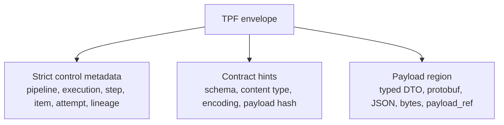

# Envelope And Data Policy

Envelope mode is a payload compatibility policy. It does not imply Kafka.

The same envelope can be used over local execution, REST, gRPC, SQS, Kafka, or file-backed tests.

## Recommendation

Keep typed DTO contracts as the normal TPF model. Add envelope compatibility only as an explicit boundary policy for onboarding, polyglot step hosts, and legacy or loose payload domains.

The control envelope must remain strict even when the payload is loose.

Do not allow arbitrary `Object` to become the whole runtime contract. Only the payload region may be loose.

## Why Envelope Mode Exists

Use envelope mode for:

1. Python or non-Java step hosts that should not depend on TPF internals,
2. external services that already accept generic document envelopes,
3. compatibility with platforms that use object-like payloads,
4. gradual migration from loose payloads to typed contracts,
5. exploratory AI/indexing pipelines where schemas are still changing.

Do not use it to avoid modeling stable business contracts. If the data shape is stable and correctness matters, typed DTOs and mapper validation remain the stronger TPF path.

## Independent Decisions

| Decision | Examples | Owner |
| --- | --- | --- |
| Dispatch policy | local, REST, gRPC, SQS, Kafka | Runtime boundary |
| Payload policy | typed DTO, protobuf message, JSON envelope, bytes envelope, payload reference | Data contract |
| Persistence policy | append-only record, cache entry, repository claim check, materialized output unit | Plugin/runtime store |
| Replay policy | require cache, prefer cache, recompute, replay from durable execution state | TPF runtime semantics |

Valid combinations include:

| Boundary | Payload policy |
| --- | --- |
| local step host | typed DTO or envelope |
| REST remote operator | typed protobuf-over-HTTP or envelope |
| gRPC step host | typed protobuf or envelope bytes |
| SQS transition worker | command/result envelope with typed serialized payload |
| Kafka checkpoint | typed event or envelope event |

If envelope mode requires Kafka, it becomes a Kafka feature. If envelope mode is independent from Kafka, it becomes a TPF compatibility policy.

## Data Shapes

| Shape | Safety | Use when |
| --- | --- | --- |
| Typed DTO | Strongest | Java/TPF-owned code or stable domain contracts |
| Generated protobuf | Strong | Non-Java step hosts can compile generated contracts |
| Envelope with schema hint | Medium | Payload evolves but schema/version is still declared |
| Envelope with JSON/bytes payload | Weakest | Compatibility and rapid onboarding matter more than compile-time safety |
| Envelope with payload reference | Medium | Payload is large and should be materialized out of line |

Payload references are a data policy, not a broker policy. They can point to a repository, object store, SQL-backed materialization provider, Redis-backed cache, or local test harness.

## Control Fields

A future envelope should reserve strict fields for TPF control semantics:

| Field group | Purpose |
| --- | --- |
| Pipeline identity | tenant, pipeline id, release version, contract version |
| Execution identity | execution id, step id, step index, attempt |
| Item identity | item id, parent item ids, lineage key, fan-in key |
| Boundary identity | boundary kind, dispatch protocol, step-host id when known |
| Correlation | correlation id, idempotency key, await interaction id when relevant |
| Replay/cache | pipeline version, cache policy, replay flag, checkpoint id |
| Payload metadata | payload encoding, schema hint, content type, payload hash |
| Payload location | inline payload, bytes, JSON, or payload reference |

The payload may be loose. These control fields may not be loose.

## Envelope Without Kafka

Envelope mode should be usable without Kafka:

1. **Local envelope host**: compatibility tests and gradual typing inside one process.
2. **REST envelope host**: non-Java services that do not want generated DTO classes yet.
3. **gRPC envelope host**: protobuf framing with loose payloads.
4. **SQS transition worker**: current command/result envelope shape with serialized payload metadata.

## Brokered Data Flow

For brokered execution, the record should carry a TPF envelope. The broker record key should derive from TPF semantics:

| Flow | Candidate key |
| --- | --- |
| one-to-one step | item id or idempotency key |
| one-to-many output | parent item id plus output index |
| many-to-one fan-in | fan-in key or document id |
| await request | interaction id or correlation id |
| checkpoint handoff | checkpoint id or business aggregate id |

The broker key should support ordering and grouping, but fan-in correctness remains a TPF responsibility.
