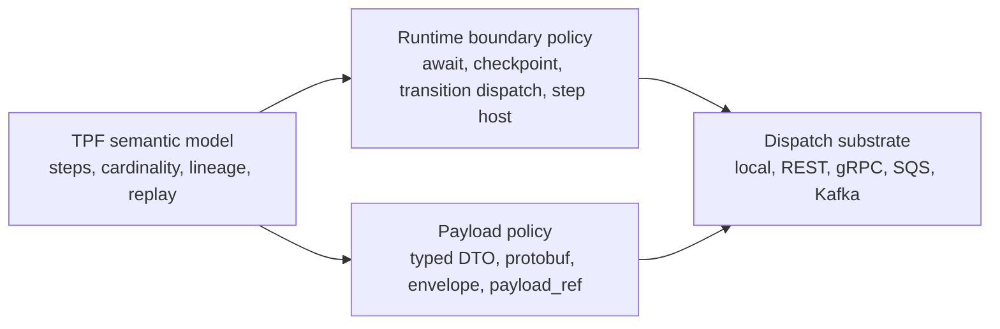

# Brokered Runtime Boundaries

This implementation-facing guide explains where Kafka-style brokerage fits in TPF without turning Kafka into a new pipeline semantic.

## Recommendation

Do not introduce a general "Kafka mode" for TPF.

Kafka, SQS, REST, gRPC, and local execution should be implementation choices under TPF-owned runtime boundaries. TPF must still own step identity, cardinality, lineage, replay metadata, retry/reject meaning, and declared DTO/envelope contracts.

The important separation is:

1. **TPF semantics** define what the pipeline means.
2. **Boundary policy** defines where execution crosses a runtime seam.
3. **Payload policy** defines how data is represented at that seam.
4. **Substrate policy** defines how bytes or envelopes move.

## Guide Map

1. [Boundary Taxonomy](/evolve/brokered-boundaries/boundary-taxonomy) maps broker concepts into TPF runtime boundaries.
2. [Dispatch Substrates](/evolve/brokered-boundaries/dispatch-substrates) explains why Kafka is a substrate, not a TPF mode.
3. [Envelope And Data Policy](/evolve/brokered-boundaries/envelope-and-data-policy) separates loose payloads from strict TPF control metadata.
4. [Adoption And Slices](/evolve/brokered-boundaries/adoption-and-slices) captures the value proposition and implementation ordering.

## Naming

Use **step host** for an external process, service, pod, or function that executes a TPF step boundary.

Keep **transition worker** only for the existing durable coordinator concept described in [Worker Protocols](/evolve/durable-coordinator/worker-protocols). Avoid using "worker" as a generic synonym in this guide because it clashes with existing runtime worker terminology.

## Core Guardrail

Kafka can provide durable delivery, consumer scaling, and operational familiarity. It must not define the pipeline topology, replay meaning, mapper validation, fan-in correctness, or step contract.
