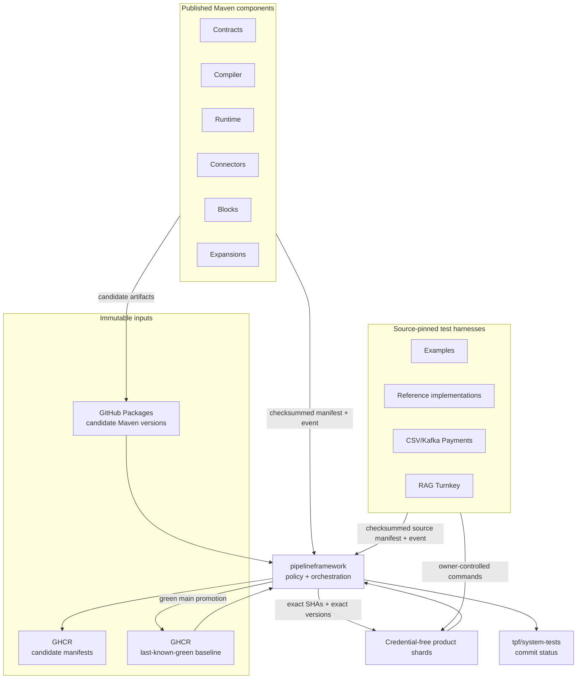
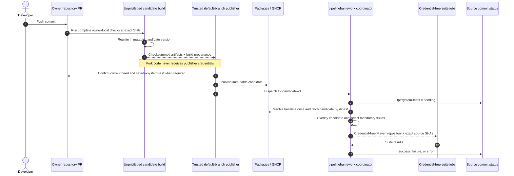
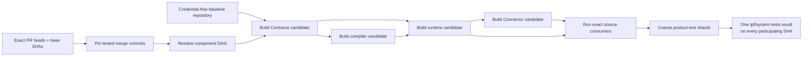
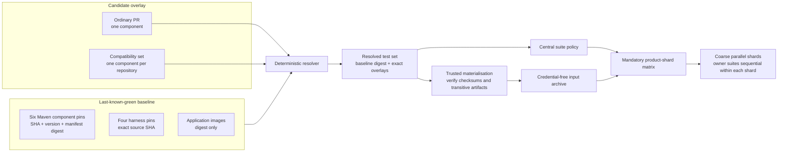
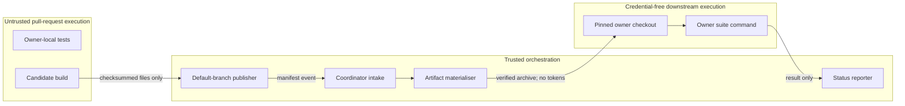

# Cross-repository system tests

The coordination repository tests independently released TPF repositories as one product without rebuilding them
as a source monorepo. The implementation lives under `system-tests/`; the durable architectural choice is recorded
in [ADR-0062](/decisions/0062-cross-repository-system-tests-use-immutable-overlays).

## System at a glance

The ten extracted repositories still own their code and tests. The coordination repository owns only the policy
that decides which of those tests must run together, plus the immutable record of what was tested.



The arrows do not form a new source reactor. Maven components cross repository boundaries as published artifacts;
test harnesses cross them as exact Git SHAs.

## Contracts

- `system-tests/components.yml` is the repository allowlist, exact Maven-coordinate ownership map and the central
  consumer version-property map. A suite owner cannot substitute another property or publish a partial component.
- `system-tests/policy.yml` maps a changed component to mandatory pull-request, post-merge and heavy suites, then
  groups selected suites into coarse product shards.
- `system-tests/schemas/candidate-event.schema.json` defines the nine-field `tpf-candidate-v1` dispatch payload.
- `system-tests/schemas/candidate-manifest.schema.json` records source, separate build/publisher workflow runs,
  Maven and image provenance, and optional additive suite hints.
- `system-tests/schemas/compatibility-candidate-manifest.schema.json` records exact PR-head identity, base SHA,
  tested merge SHA, dependency-version overrides, checksums and coordinator provenance for candidates bootstrapped
  as one dependency-ordered set.
- `system-tests/schemas/baseline-manifest.schema.json` pins the last-known-green components and test harnesses.
- `system-tests/schemas/suite-manifest.schema.json` lets each owner publish stable argument-array test entrypoints.

The `.yml` configuration files intentionally contain JSON, which is valid YAML and can be parsed with the Node
runtime already present on every runner. No workflow-only package installation is needed to interpret policy.

## Trust boundaries

The singleton candidate workflow has four security zones:

1. event intake accepts no credentials and rejects repositories, components, versions and SHAs outside the
   checked-in contract;
2. trusted retrieval uses a repository-scoped GitHub App token to read the publication run and post status;
3. trusted materialisation reads GitHub Packages into a run-isolated Maven repository, verifies every recorded
   checksum, then uploads a credential-free archive;
4. untrusted owner tests execute with contents-read only and cannot read package, dispatch or status credentials.

Compatibility sets preserve the same separation with a different middle stage. A trusted job resolves and hydrates
the last-known-green baseline without executing pull-request code. Baseline hydration is cached by immutable OCI
digest; restored or newly downloaded artifacts are checksum-verified and stripped of Maven remote-origin metadata
before the job uploads a credential-free repository.
A contents-read job then checks out each resolved merge commit (the exact PR head applied to its current base),
builds the Maven components as independent reactors in declared dependency order, and records checksummed
compatibility-candidate manifests. Thus downstream
PRs consume upstream PR artifacts without requiring an intermediate merge, snapshot publication, or package token.
Bootstrap installs candidate artifacts without rerunning owner test suites. The product shards reuse that single
hydrated repository, run the centrally selected tests, and only the final trusted reporter can write statuses.

Fork code is never executed in a privileged job. A fork pull request first runs its ordinary unprivileged owner
suite. Candidate publication is enabled only after a maintainer applies `safe-to-system-test`; the privileged
publisher may upload previously built outputs but must not invoke code from the fork.

## Repository setup

The organisation GitHub App used by the train needs only the operations it performs:

- Actions read and commit-status write on candidate repositories;
- Contents write on `pipelineframework` for `repository_dispatch`;
- no administrative permission.

Set `SYSTEM_TEST_APP_ID` as a variable and `SYSTEM_TEST_APP_PRIVATE_KEY` as a secret in repositories that publish or
coordinate candidates. Grant `pipelineframework` read access to each Maven package. Its own `GITHUB_TOKEN` performs
package reads; App installation tokens are not exposed to test jobs.

Before bootstrapping, run the six Maven producers on `main` once so that each component has an immutable candidate
manifest digest. Those seed runs may stop when baseline resolution finds no `main` tag; their published candidate
manifests are the inputs to the bootstrap, not evidence of a completed system-test train.

Bootstrap the first baseline through `TPF System Tests — Bootstrap Baseline`. The supplied JSON must already pin
full source SHAs, non-snapshot Maven versions or immutable candidate versions, candidate-manifest OCI digests and
container digests. The workflow pulls and validates every referenced component manifest before publishing, and
refuses to overwrite an existing `main` baseline.

## Pull-request flow



1. The owner repository runs `clean verify` and its owner-specific integration lanes.
2. Its unprivileged candidate build uses `26.9.4-pr.<number>.<sha12>` and uploads candidate files plus build
   metadata. It has no publication or cross-repository credential.
3. A trusted default-branch publisher validates those files without executing pull-request code, publishes them to
   that repository's GitHub Packages registry, records both workflow runs in the final checksummed manifest and
   dispatches `tpf-candidate-v1`.
4. `TPF System Tests — Candidate` first extracts only an allowlisted repository and lowercase full source SHA, then
   posts `tpf/system-tests=pending` before validating the rest of the event. A malformed event with a safe target
   therefore ends in `error`; an event without a safe target is rejected without writing to an untrusted repository.
   The workflow then verifies the current PR head and build/publication provenance, resolves the baseline tag once,
   and uses only the returned digest.
5. Selected owner suites run sequentially inside a bounded number of coarse product shards against the one
   materialised overlay. The aggregate reporter posts success, failure or error to the originating SHA.

For a coordinated change, run `TPF System Tests — Compatibility Set` with a stable set ID and two to ten pull-request
URLs. The coordinator resolves every exact head and tested merge commit, overlays the immutable baseline, builds
participating Maven components in dependency order, unions the centrally required suites, and reports the same aggregate result to
every participating SHA. It never requires a candidate to build against the old baseline first, and never falls
back to a branch name or older PR head.



## What a resolved test set contains

Every run starts with one baseline digest. A normal pull request replaces one component. A compatibility set may
replace several, but never more than one candidate for the same component.



This resolved set is the reproducibility boundary. Re-running it does not consult `main`, `latest`, a Maven
snapshot, or a moving container tag.

## Where credentials stop



Publication, package-read, dispatch and status-writing credentials exist only in the narrow trusted jobs that need
them. Downstream application and framework tests cannot access those credentials.

Branch protection must not require `tpf/system-tests` until the shadow rollout has produced at least two successful
runs and one deliberate regression failure for that repository.

## Test ownership and frequency

Owner-local unit, contract and integration suites continue on every pull request. The central pull-request gate adds
affected product compatibility, application smoke and reference coverage. Established ordinary HA lanes remain on
`main`; nightly and release trains add the complete compatibility matrix, HA scale, native builds, cloud deployment
and live-provider suites. Publisher hints may widen that set but cannot make it smaller.

Different candidate sets use isolated Actions jobs and Maven repositories. The singleton concurrency key is
repository plus pull request; a coordinated set uses its explicit set ID. New commits cancel only older runs for
the same pull request.

## Promotion and rollback

A successful `main` candidate is promoted only while its SHA is still that repository's default-branch head and the
baseline still has the digest used by its run. A superseded candidate remains valid green evidence for its SHA but
cannot move the baseline backwards. If another component candidate wins first, the coordinator dispatches the
current candidate again against the new baseline. Promotion publishes
a new immutable OCI manifest and moves `main` to it. Rollback moves `main` back to a previous manifest digest; no
Maven artifact, image or manifest is overwritten.

Formal BOM or release promotion requires a green full train. A green owner repository alone is necessary evidence,
not product compatibility evidence.

`TPF System Tests — Full Train` resolves the baseline tag once, records the resulting digest, and runs the complete
ordinary and heavy suite list from that immutable set. It is scheduled nightly and may also be started manually for
release evidence. Scheduled execution remains dormant until the repository variable
`SYSTEM_TEST_FULL_TRAIN_ENABLED=true` is set after baseline bootstrap and the shadow pilots.

Do not enable that variable until the reference-implementations repository exposes a trusted, exact-SHA relay to
its existing OIDC cloud workflows and the Connectors repository owns a real live-provider lane. Their current suite
entrypoints fail closed rather than reporting ordinary deterministic tests as cloud or live-provider evidence.
Likewise, CSV Payments and RAG Turnkey initially publish source-only candidate manifests: add image digests only
after their unprivileged builds can produce immutable OCI output that a trusted publisher can validate and upload
without executing pull-request code.

## Local validation

```bash
node --test system-tests/test/*.test.mjs
node system-tests/scripts/validate-config.mjs
```

These tests cover allowlisting, candidate identity, checksums, stale PR rejection, non-floating baseline pins,
deterministic overlays, suite selection and compare-and-swap promotion input.
