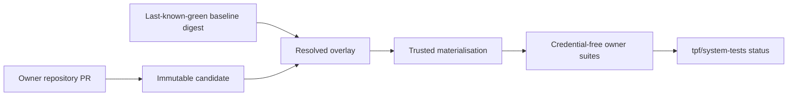

# Cross-repository system tests

The coordination repository tests independently released TPF repositories as one product without rebuilding them
as a source monorepo. The implementation lives under `system-tests/`; the durable architectural choice is recorded
in [ADR-0062](/decisions/0062-cross-repository-system-tests-use-immutable-overlays).



## Contracts

- `system-tests/components.yml` is the repository allowlist, exact Maven-coordinate ownership map and the central
  consumer version-property map. A suite owner cannot substitute another property or publish a partial component.
- `system-tests/policy.yml` maps a changed component to mandatory pull-request and heavy suites.
- `system-tests/schemas/candidate-event.schema.json` defines the nine-field `tpf-candidate-v1` dispatch payload.
- `system-tests/schemas/candidate-manifest.schema.json` records source, workflow, Maven and image provenance.
- `system-tests/schemas/baseline-manifest.schema.json` pins the last-known-green components and test harnesses.
- `system-tests/schemas/suite-manifest.schema.json` lets each owner publish stable argument-array test entrypoints.

The `.yml` configuration files intentionally contain JSON, which is valid YAML and can be parsed with the Node
runtime already present on every runner. No workflow-only package installation is needed to interpret policy.

## Trust boundaries

The candidate workflow has four security zones:

1. event intake accepts no credentials and rejects repositories, components, versions and SHAs outside the
   checked-in contract;
2. trusted retrieval uses a repository-scoped GitHub App token to read the publication run and post status;
3. trusted materialisation reads GitHub Packages into a run-isolated Maven repository, verifies every recorded
   checksum, then uploads a credential-free archive;
4. untrusted owner tests execute with contents-read only and cannot read package, dispatch or status credentials.

Fork code is never executed in a privileged job. A fork pull request first runs its ordinary unprivileged owner
suite. Candidate publication is enabled only after a maintainer applies `safe-to-system-test`; the privileged
publisher may upload previously built outputs but must not invoke code from the fork.

## Repository setup

The organisation GitHub App used by the train needs only the operations it performs:

- Actions read and commit-status write on candidate repositories;
- Contents write on `pipelineframework` for `repository_dispatch`;
- no administrative permission.

Set `SYSTEM_TEST_APP_ID` as a variable and `SYSTEM_TEST_APP_PRIVATE_KEY` as a secret in repositories that publish or
coordinate candidates. Grant `pipelineframework` read access to each Maven package. Its own `GITHUB_TOKEN` performs
package reads; App installation tokens are not exposed to test jobs.

Bootstrap the first baseline through `TPF System Tests — Bootstrap Baseline`. The supplied JSON must already pin
full source SHAs, non-snapshot Maven versions or immutable candidate versions, candidate-manifest OCI digests and
container digests. The workflow pulls and validates every referenced component manifest before publishing, and
refuses to overwrite an existing `main` baseline.

## Pull-request flow

1. The owner repository runs `clean verify` and its owner-specific integration lanes.
2. Its unprivileged candidate build uses `26.9.4-pr.<number>.<sha12>` and uploads a checksummed manifest.
3. A trusted publisher publishes those Maven files to that repository's GitHub Packages registry and dispatches
   `tpf-candidate-v1`.
4. `TPF System Tests — Candidate` posts `tpf/system-tests=pending`, verifies the current PR head and publication
   provenance, resolves the baseline tag once, and uses only the returned digest.
5. Selected owner suites run against the materialised overlay. The aggregate reporter posts success, failure or
   error to the originating SHA.

For a coordinated change, run `TPF System Tests — Compatibility Set` with a stable set ID and two to ten pull-request
URLs. The coordinator resolves every current head, locates its successful candidate publisher, overlays at most one
candidate per component, unions the centrally required suites, and reports the same aggregate result to every
participating SHA. It never falls back to a branch name or to an older PR head.

Branch protection must not require `tpf/system-tests` until the shadow rollout has produced at least two successful
runs and one deliberate regression failure for that repository.

## Test ownership and frequency

Owner-local unit, contract and integration suites continue on every pull request. The central pull-request gate adds
affected ordinary E2E and non-scale HA coverage. Nightly and release trains add the complete compatibility matrix,
HA scale, native builds, cloud deployment and live-provider suites. Publisher hints may widen that set but cannot
make it smaller.

Different candidate sets use isolated Actions jobs and Maven repositories. The singleton concurrency key is
repository plus pull request; a coordinated set uses its explicit set ID. New commits cancel only older runs for
the same pull request.

## Promotion and rollback

A successful `main` candidate is promoted only if the baseline still has the digest used by its run. If another
candidate wins first, the coordinator dispatches the candidate again against the new baseline. Promotion publishes
a new immutable OCI manifest and moves `main` to it. Rollback moves `main` back to a previous manifest digest; no
Maven artifact, image or manifest is overwritten.

Formal BOM or release promotion requires a green full train. A green owner repository alone is necessary evidence,
not product compatibility evidence.

`TPF System Tests — Full Train` resolves the baseline tag once, records the resulting digest, and runs the complete
ordinary and heavy suite list from that immutable set. It is scheduled nightly and may also be started manually for
release evidence.

## Local validation

```bash
node --test system-tests/test/*.test.mjs
node system-tests/scripts/validate-config.mjs
```

These tests cover allowlisting, candidate identity, checksums, stale PR rejection, non-floating baseline pins,
deterministic overlays, suite selection and compare-and-swap promotion input.
