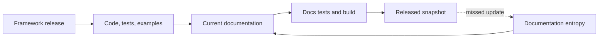

# Documentation Audit — September 2026

This internal audit records the current-documentation review performed after releases v26.7.1,
v26.8.1, v26.9.1, and v26.9.2. Frozen files under `docs/versions/` were deliberately excluded.

## Findings corrected in this change

| Finding | Correction |
| --- | --- |
| Architecture was still published as Design | Moved `docs/design` to `docs/architecture`, changed navigation, updated current links, and retained `/design/**` redirects. |
| Coffee Machine was presented under Value | Moved it to Architecture, updated its loader/components/tests, and retained `/value/coffee-machine/**` redirects. |
| The versions page still called v26.7.1 current | Updated the root documentation label to v26.9.2 and removed an unsupported semantic-versioning claim. |
| MCP import was described as snapshot-only | Marked the feature available from released v26.9.2. |
| v26.9.1 LLM Query token usage was documented only in the feature page | Added the histogram, span attributes, replay behaviour, telemetry gates, and LangChain4j runtime settings to the telemetry and All Settings references. |
| The public OpenAPI filter was buried in a REST extension page | Promoted it to a first-class Develop page, added customer-facing navigation and value links, and documented both properties in All Settings. |
| The Pipeline Template DSL was a 4,600-word undifferentiated reference | Made it a Functional Core Guide with task-focused pages for modelling, types, composition, and boundaries while retaining the exhaustive reference. |
| Public vocabulary depended on an agent instruction file | Added a reader-facing JSON glossary, inline tooltips, a generated glossary page, and tests; retained the richer agent glossary for authoring guardrails. |
| Glossary definitions rendered as unbounded single-line tooltips | Added theme-level wrapping, a readable desktop measure, and a viewport-contained mobile presentation. |
| Expanded Mermaid diagrams duplicated their source SVG IDs | Scoped every cloned SVG ID and reference to the lightbox, preventing Mermaid from corrupting the source or drawing overlapping geometry. |
| Blocks were buried in the DSL and release history | Added a Block Guide covering dependency import, capability binding, publication, and current shipped Blocks. |
| Expansion was conflated with cardinality | Defined Expansion as a package of related Blocks, Connectors, and supporting assets; retained `ONE_TO_MANY` as the canonical fan-out term. |
| Connector material was fragmented by provider | Added a Connector Guide and catalogue while retaining specialist references. |
| OAuth host connections occupied one very long extension page | Moved the full reference into a dedicated experimental Guide with configuration and operations journeys. |
| Example discovery depended on repository archaeology | Added a catalogue linking and briefing every README under `examples/`. |
| Section landing pages were almost empty | Reworked Architecture, Develop, Deploy, and Operate entry pages into navigable mental models. |
| The homepage still led with low-level quick-start and step-authoring journeys | Replaced the hero with “Build with AI. Run with guarantees.”, surfaced the Agent Skill as a CLI command, removed article/release furniture and generic callouts, and rebuilt the page around current capability proofs. |
| The GitHub README still centred low-level generation and Canvas scaffolding | Rebuilt it as a concise repository front door for typed AI applications, composable agentic loops, SaaS capability families, guarantees, modern proofs, and the Agent Skill authoring path. |
| Value pages described the pre-AI framework and lacked visual explanations | Added dedicated AI/agentic and SaaS-integration tracks, refreshed every existing value page, linked architectural objections into the Coffee Machine, and added a useful Mermaid model to every value page. |
| Integration positioning lagged the publication target | Presented MCP catalogue import plus the GraphQL and OpenAPI Expansions as one release capability set, while retaining “experimental” only for the OAuth host APIs and lifecycle that remain provisional. |

## Release coverage

| Release | Documentation themes checked |
| --- | --- |
| [v26.7.1](https://github.com/The-Pipeline-Framework/pipelineframework/releases/tag/v26.7.1) | Immutable queue-async control plane, transition-worker boundaries, branch-aware runtime/replay, Spring delegated steps, runtime performance and HA guidance. |
| [v26.8.1](https://github.com/The-Pipeline-Framework/pipelineframework/releases/tag/v26.8.1) | Canonical v3 types and representations, Await admission/recovery, object endpoints, connector provider kernel, Query/Command semantics, data architecture, Coffee Machine, and runtime safety. |
| [v26.9.1](https://github.com/The-Pipeline-Framework/pipelineframework/releases/tag/v26.9.1) | Remote operators, structural connectors, durable Query capture and Command effects, streaming Query, LLM and vector connectors, RAG examples, and first packaged reusable definitions. |
| [v26.9.2](https://github.com/The-Pipeline-Framework/pipelineframework/releases/tag/v26.9.2) | Block terminology and capability binding, GraphQL Blocks, pinned MCP operations, typed LLM clarification, schema constraints, provisional host connections, and replay/Command correctness fixes. |

## Shape and readability

After excluding frozen versions and `docs/guide/**` compatibility stubs, the site has 367 current
Markdown pages with a median length of roughly 350 words. The longest current user-facing references
remain:

- Complete Pipeline Template DSL reference — about 4,600 words, now reached through a five-page task-oriented Guide;
- All Settings — about 4,300 words;
- MCP Connector import — about 3,200 words;
- Object Ingest and Publish — about 3,100 words;
- OAuth full reference — about 2,800 words;
- Command connectors and observability metrics — about 2,400 words each.

These pages are references rather than linear tutorials. Their new or existing parent Guides should
remain the normal entry point; future edits should split a page only where the resulting children
have distinct reader tasks and stable navigation.

Very short files fall into three groups: intentional UI shells (Coffee Machine search/personas),
published-route compatibility stubs, and underspecified canonical pages. `develop/modularity.md`,
`operate/best-practices.md`, and several configuration summaries should be merged into their parent
Guide or expanded when their contract is next changed. Do not bulk-delete short files without first
classifying their URL role.

## Diagram debt

The major landing pages and the longest core references touched by this audit now contain Mermaid
diagrams. Significant diagram debt remains in detailed operation, connector, deployment, and Coffee
Machine pages. Add diagrams when they clarify a lifecycle, ownership boundary, or topology; do not
add decorative diagrams merely to improve a count. High-value next targets are queue-async recovery,
Command effect identity, Await operations, observability/replay, function-provider topology, and the
JPA Query capture lifecycle.

## Ongoing guardrail

Every semantic release should map changed compiler/runtime behaviour to: canonical architecture,
authoring, deployment, operations, examples, ADRs, and generated metadata where relevant. The docs
build and route checks must run before snapshotting. Release snapshots are outputs of that process,
never the place to repair current documentation.
