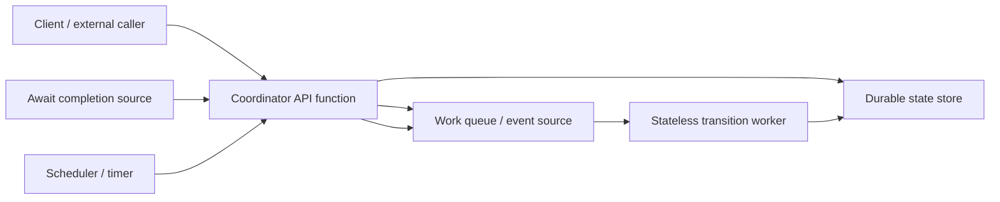
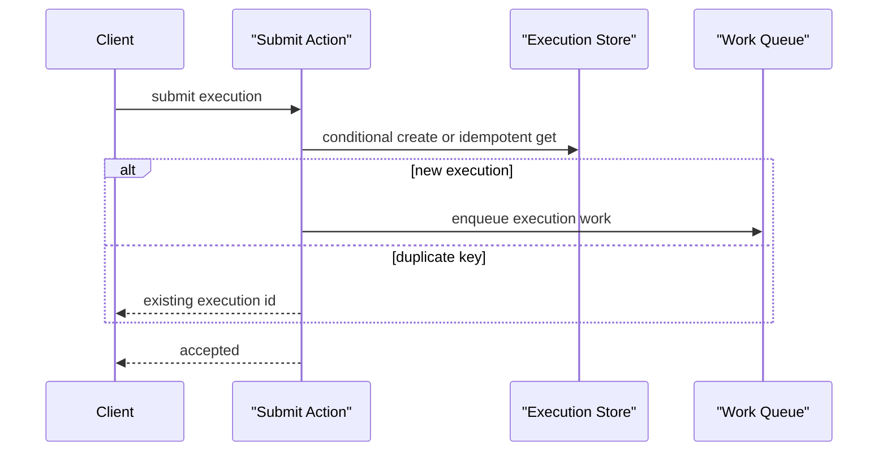
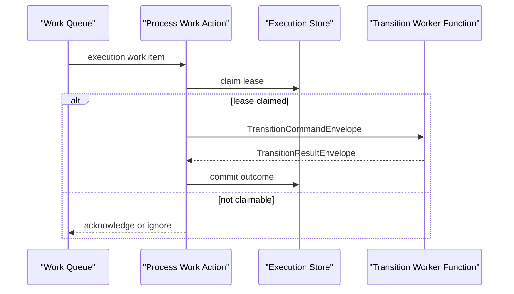
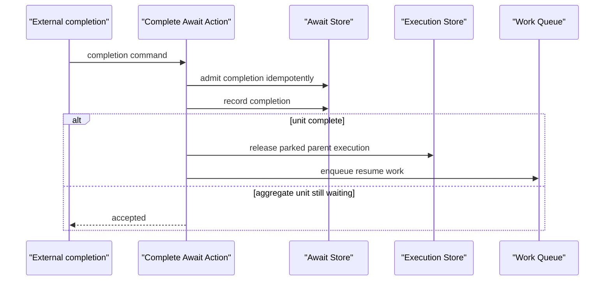
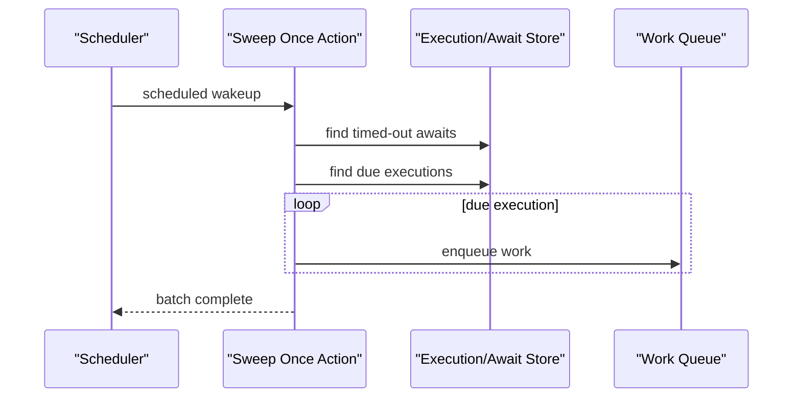
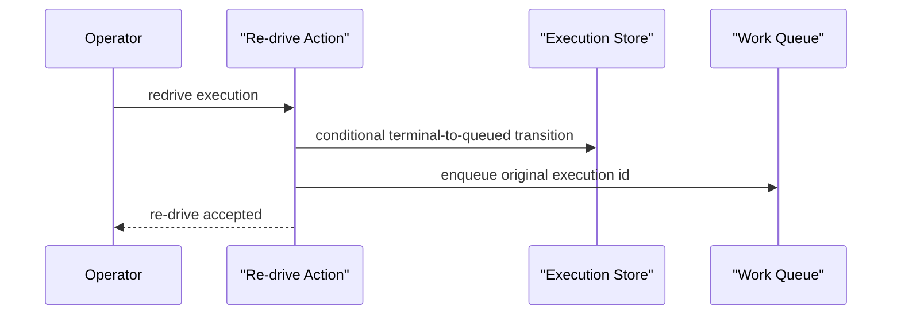

# All-Serverless Durable Coordinator

This design track asks one question: can TPF keep `QUEUE_ASYNC` semantics without a long-running coordinator process?

The answer is **probably yes**, but not by making a Lambda, Azure Function, or Cloud Run function "durable" by itself. The coordinator must be decomposed into single-shot actions that can be invoked by APIs, queues, event sources, and schedulers. Durable cloud services own wakeups and storage; TPF still owns execution semantics.

PR 1 provides the action contract: `PipelineControlPlane` exposes the existing bounded coordinator operations plus an explicit `sweepOnce` action with a structured result. PR 2 separates the compute-first sweep and SQS polling loops from the bounded actions they host. PR 3 proves those boundaries locally against AWS-shaped DynamoDB and SQS substrates without hosting the compute-first loops. The [durable workflow adapter spike](/evolve/durable-coordinator/durable-workflow-adapter-spike) then proves that an AWS Lambda durable execution can drive those actions without taking authority from TPF. Current `FUNCTION` support remains serverless invocation/adapter support; provider handlers and fully serverless hosting are still future work.

## Recommendation

Use one **TPF-native single-shot coordinator action model** with replaceable coordination hosts.

AWS Lambda Durable Functions is the preferred candidate AWS host because the deployed fault proof shows it can own mechanical liveness without taking semantic authority. Other provider engines remain candidates only if they preserve TPF's control-plane invariants:

1. execution identity and idempotent submit,
2. await unit identity and external completion admission,
3. pinned pipeline contract and release version,
4. worker identity and release compatibility checks,
5. DLQ/re-drive evidence and operator control,
6. at-least-once transition execution with stable business idempotency keys.

Provider handlers can now invoke the bounded SQS message actions without reproducing work-item, await-completion, or transition-worker semantics. A complete process-free deployment still needs a durable replacement for itemised await-continuation retry scheduling.

The durable workflow spike and deployed proof establish a deeper driver: AWS owns checkpoints, suspension, callback durability, and stream-triggered wake-up, while generation-fenced callback state remains mechanical. A replacement provider execution reconstructs from the TPF semantic checkpoint without redispatching work. Provider retry, DLQ, and re-drive primitives still do not replace TPF's contracts. See [AWS Durable Coordination Host](/evolve/durable-coordinator/aws-durable-coordination-host).

## Target Shape

This is the target hosting shape. The current compute-first runtime retains its sweeper and SQS polling loops as replaceable loop hosts. Each host adapts a bounded action and owns only receiving, acknowledgement, visibility, scheduling, concurrency, and backoff.

| Current compute-first role | All-serverless equivalent |
| --- | --- |
| Hosted control-plane resource | API/function handler for submit, status, result, await completion, admin, and re-drive |
| SQS work poller thread | Queue event-source invocation or explicit `processWorkItem` action |
| Queue sweeper thread | Scheduled `sweepOnce` invocation |
| Await completion poller | Provider event-source invocation or explicit `completeAwait` action |
| Transition worker process | Stateless function that handles one transition envelope |
| Worker lifecycle heartbeat | Explicit heartbeat action or platform-deployment registration action |

## AWS-Shaped Local Proof

The runtime integration proof uses LocalStack DynamoDB and SQS as durable substrates, but invokes the coordinator and message actions directly. A bounded test driver receives one event, calls one action, and acknowledges only an `ACKNOWLEDGE` disposition. It does not start the work, await-completion, transition-worker, or sweep loop hosts.

The proof covers:

1. submit, signed SQS transition dispatch, durable await suspension, process replacement, replay of the original work event, await completion, resume, and typed/raw result reads;
2. a synthetic scheduled wakeup that calls `sweepOnce(nowEpochMs)`, dispatches one due retry, and returns the structured sweep counts;
3. terminal worker failure, SQS DLQ publication, process replacement, operator re-drive, and successful completion while preserving the pinned pipeline, contract, and release identity.

This is deliberately an **AWS-shaped local proof**, not production AWS function support. DynamoDB and SQS behaviour is exercised through their AWS SDK contracts. The scheduled wakeup is an event-shaped call made by the test driver; it is not an EventBridge rule or handler. Lambda handlers, EventBridge integration, IAM, Terraform, and CloudFormation remain provider-hosting work.

## Single-Shot Action Sequences

### Submit

This action is already close to single-shot. It creates the execution and enqueues work before returning.

### Claim And Dispatch

This requires worker selection to be explicit and no accidental local fallback in the coordinator action.

### Await Completion

The normal parent-release path is mostly single-shot. Aggregate item continuations are not clean yet because current code can schedule in-process retry attempts.

### Sweep And Retry Wakeup

`PipelineControlPlane.sweepOnce(long nowEpochMs)` is now the explicit action boundary. It returns `Uni<CoordinatorSweepResult>` with the supplied timestamp, configured sweep limit, successfully admitted await timeout count, and successfully dispatched execution count. It processes await timeouts before querying and dispatching due executions. Any phase failure fails the `Uni`; dispatch attempts the complete due batch before reporting aggregated failures.

The compute-first lifecycle remains the default, but loop ownership has moved to `QueueAsyncSweepLoopHost`. It obtains the current time, invokes `sweepOnce`, subscribes once, discards the successful summary, and logs failure. `QueueAsyncCoordinator` now initialises providers without scheduling. The configured `pipeline.orchestrator.sweep-limit` remains authoritative.

### Re-drive

This is already close to single-shot. It must preserve pinned pipeline, contract, and release identity.

## `QueueAsyncCoordinator` Decomposability Audit

| Area | Current shape | Single-shot readiness | Required change |
| --- | --- | --- | --- |
| Submit | `executePipelineAsync` creates execution and enqueues work | Clean | Available through `PipelineControlPlane`; action invocation initializes providers without starting loops. |
| Status | `getExecutionStatus` reads durable record | Clean | No meaningful change. |
| Result | `getExecutionResult` / payload reads durable record | Clean | No meaningful change. |
| Re-drive | `redriveExecution` conditionally transitions terminal execution and enqueues work | Clean | Available through `PipelineControlPlane` with its existing explicit result. |
| Process work item | `processExecutionWorkItem` admits, claims, invokes worker, commits outcome | Mostly clean | Inject selected worker explicitly; require remote/function worker when running as serverless coordinator. |
| Await completion | `completeAwait` admits completion and releases parent execution | Partly clean | Keep parent release action; convert aggregate item continuations and retries into explicit queued actions. |
| Sweep | `sweepOnce(nowEpochMs)` is reactive and returns `CoordinatorSweepResult`; `QueueAsyncSweepLoopHost` owns the compute-first schedule | Clean | Add provider scheduler handlers in a later slice. |
| Await item continuation | Uses executor scheduling and fire-and-forget retry attempts | Not clean | Represent continuation attempts as durable work items or scheduler wakeups. |
| Work poller | `SqsWorkPoller` hosts receiving, acknowledgement, visibility, and backoff over `SqsWorkItemAction` | Clean message action | Reuse the action from a provider event-source handler. |
| Await completion poller | `SqsAwaitCompletionPoller` hosts bounded concurrent receives and acknowledgement over `SqsAwaitCompletionAction` | Clean message action | Reuse the action from a provider event-source handler. |
| SQS transition worker poller | `SqsTransitionWorkerPoller` hosts receiving and acknowledgement over `SqsTransitionWorkerAction` | Clean message action | Reuse the action from a provider event-source worker function. |

`PipelineControlPlane` is now the single-shot action contract for submit, status, typed/raw result, re-drive, work-item processing, await completion, pending-await queries, and one bounded sweep. `SqsWorkItemAction`, `SqsAwaitCompletionAction`, and `SqsTransitionWorkerAction` add receipt-independent message boundaries for provider event sources. Provider initialisation is separate from loop startup, so invoking an action does not start the periodic sweeper. The remaining process-owned semantic work is aggregate await-continuation retry scheduling; provider-specific hosting remains to be added.

## Provider Durable Workflow Shortcuts

Provider durable workflow engines may reduce implementation effort, but they are not drop-in replacements for TPF coordinator semantics.

The [adapter spike](/evolve/durable-coordinator/durable-workflow-adapter-spike) tests AWS Lambda Durable Functions with its Java local runner. It checkpoints submit, dispatch-to-await, callback wait, and resume/result operations around the existing TPF actions. Provider checkpoint loss replays through the stable TPF execution key without duplicating the signed worker transition. Await completion is admitted by TPF before a DynamoDB Stream wake-up completes the current generation's provider callback. A replacement durable execution can attach to the same parked TPF execution, and stale callback generations are ignored.

| Backend option | Value | TPF risk |
| --- | --- | --- |
| [AWS Lambda durable functions](https://docs.aws.amazon.com/lambda/latest/dg/durable-functions.html) | AWS documents checkpoint/replay, waits, retries, and long-running durable executions in Lambda code. Useful if TPF can compile coordinator logic into durable operations. | AWS owns replay/history semantics; TPF must map await units, release pinning, re-drive, and worker identity without creating a second inconsistent state machine. |
| [AWS Step Functions / durable functions comparison](https://docs.aws.amazon.com/lambda/latest/dg/durable-step-functions.html) | Mature AWS workflow orchestration with explicit state-machine visibility. | TPF pipeline semantics would need to compile into provider workflow definitions; provider history/retry/DLQ semantics may become authoritative. |
| [Azure Durable Functions](https://learn.microsoft.com/en-us/azure/durable-task/durable-functions/durable-functions-overview) | Azure documents stateful orchestrator/activity/entity functions, managed state, checkpoints, retries, recovery, and Java support. | Strong Azure fit, weaker portability if TPF semantics depend on Durable Functions-specific orchestration constraints. |
| [Google Cloud Workflows](https://cloud.google.com/workflows) | Serverless workflow definitions in YAML/JSON, HTTP/service orchestration, retries, callbacks, waits, and monitoring. | Good orchestration substrate, but it is workflow-definition-first rather than TPF Java runtime-first. TPF would likely become a compiler to Workflows for that backend. |

Decision rule: a provider durable workflow backend is acceptable only if TPF can either:

1. keep TPF execution/await/release records authoritative and use the provider engine as a wakeup/driver, or
2. prove a faithful mapping where provider workflow history becomes authoritative without losing TPF observability and re-drive semantics.

The first implementation path should not assume either mapping. Build the TPF-native single-shot action model first; it is useful for provider event sources, cloud functions, and future durable-workflow adapters.

## Implementation Slices After This Spike

1. **Single-shot coordinator actions — complete.** `PipelineControlPlane` is the action contract, including structured `sweepOnce`; provider readiness is separate from periodic sweep startup and compute-first behaviour is preserved.
2. **Loop hosting split — complete.** The sweeper and SQS pollers are compute-first loop hosts over bounded actions. Aggregate await-continuation retry scheduling remains explicitly deferred.
3. **AWS-shaped local proof — complete.** LocalStack DynamoDB/SQS integration invokes the bounded control-plane and message actions directly, including a synthetic scheduled `sweepOnce` wakeup, restart/event replay, await resume, retry, DLQ, and re-drive. It does not claim Lambda or EventBridge handler support.
4. **Provider function handlers.** Add AWS-first function handlers only after the action model is explicit.
5. **Durable workflow adapter spike — complete.** The AWS Lambda Durable Execution Java local runner proves an optional, reconstructable driver over the action model, including checkpoint loss, failed and duplicate wake-up, callback-generation fencing, provider-history replacement, Await completion, resume, and result. Production adoption remains deferred until the deployed callback-registration window and operator-history integration are proven.

## Current Decision

Extract a provider-neutral coordination-host seam over `PipelineControlPlane`. Keep native loop hosts as the portable reference implementation and package the AWS Durable proof behind the same seam. The mapping and deployed fault tests demonstrate that a provider durable execution can own substantial mechanical durability while remaining reconstructable from TPF state; provider history, retry/DLQ evidence, and provider re-drive remain non-authoritative.

The AWS proof is not current supported Lambda deployment. Provider packaging, release, security, quotas, and operations remain separate work.
