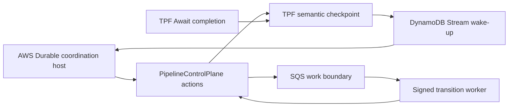

# AWS Durable Coordination Host

AWS Lambda Durable Functions is the preferred candidate AWS coordination host for `QUEUE_ASYNC`. This is an architecture decision backed by a deployed fault proof, not a declaration of current production support.

AWS owns mechanical orchestration liveness: durable checkpoints, suspension, callback wake-up, and mechanical retry timing. TPF remains authoritative for execution and Await identity, typed completion admission, parent release, release pinning, signed worker transitions, retry and DLQ evidence, results, and operator-authorised re-drive. The native coordinator remains the portable semantic reference, conformance implementation, and fallback.

## Coordination-Host Seam

`PipelineControlPlane` remains the single semantic action boundary. A coordination host decides when and how to invoke those bounded, idempotent actions; it does not define another execution model.

The portable seam therefore separates:

- TPF action inputs, semantic checkpoints, execution and Await identity, pinned release identity, and action results;
- host mechanics such as process scheduling, durable checkpoints, provider callbacks, provider history, and wake-up delivery;
- worker transport, which remains SQS in the proved AWS architecture for backpressure, redelivery, DLQ evidence, and uncertain remote outcomes.

AWS callback IDs, durable execution ARNs, provider history events, and callback generations are hosting details. They must not enter the provider-neutral semantic checkpoint.

## Deployed Evidence

The disposable proof deployed real Lambda Durable Functions, DynamoDB and Streams, SQS and DLQs, EventBridge, and Lambda workers. It exercised 22 fault scenarios, then ran the genuinely missing promotion evidence rather than repeating already-proved scenarios.

| Evidence | Result | What it proves |
| --- | --- | --- |
| Deployed 22-scenario fault suite | Passed | The complete catalogued suite passed with no duplicate semantic transitions. |
| Randomised callback and binding races | Passed | Ten seeded repetitions varied checkpoint failure, completion timing, duplicate delivery, callback uncertainty, and reconciliation. |
| Provider-history-loss recovery | Passed | A generation-fenced replacement completed from the retained TPF checkpoint after the old durable execution and readable history were unavailable. |
| History-expiry classification | Passed | The documented `ResourceNotFoundException` outcome enters the same closed-mechanical-state recovery path. |
| Terminal-Await result passthrough | Passed | A terminal Await returns the admitted result without a synthetic post-Await step or no-op worker dispatch. |
| Disposable cleanup | Passed | The proof stack and artifact bucket were absent after the run. |

One successful complete deployment is accepted as sufficient evidence for properties already covered by the 22-scenario suite. The promotion pass intentionally added only randomised race repetitions, history-loss/expiry recovery, and terminal-Await result passthrough. No architectural failure appeared in those additions.

## Callback Binding Conclusion

There is no transaction spanning TPF Await admission and AWS callback registration. The proof avoids a semantic dual-write:

1. `waitForCallback` checkpoints the provider callback before its submitter records an idempotent provider registration against the stable TPF checkpoint.
2. DynamoDB Streams and bounded reconciliation join that registration to the authoritative TPF Await identity.
3. Completion is admitted by TPF before callback success wakes the durable execution.
4. Generation fencing rejects stale callbacks and allows a replacement durable execution to attach after provider-history loss.

The callback binding is disposable mechanical state. It can wake a driver; it cannot complete an Await, release a parent, execute a transition, or alter a result. AWS should still confirm that public history callback discovery and history-based classification after an uncertain callback outcome are intended long-term integration contracts.

## Promotion Boundary

The proof implementation is deliberately non-production and non-published. Production support still requires the coordination-host seam, supported packaging, IAM and tenant isolation, quotas and alarms, version-retirement policy, disaster recovery, and operator runbooks.

Reject the AWS host if a supported implementation cannot preserve any of these invariants:

- provider replay never duplicates a TPF execution, Await admission, or signed transition;
- TPF state changes before provider wake-up;
- provider-history loss is recoverable from the TPF semantic checkpoint;
- retry, DLQ, uncertain-outcome, and re-drive evidence remain visible through TPF;
- provider identity remains correlation rather than semantic authority.

See [Durable Workflow Backend Adapter Spike](/evolve/durable-coordinator/durable-workflow-adapter-spike) for the wider provider mapping and [ADR-0069](/decisions/0069-aws-durable-hosts-mechanical-coordination) for the ownership decision.
