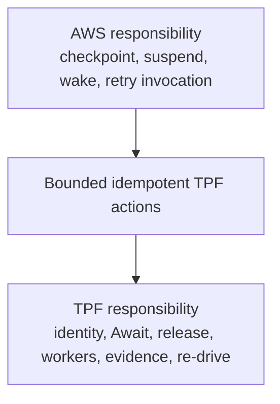

# AWS Engagement Brief: Durable TPF Coordination

## TPF And The Authority Boundary

The Pipeline Framework executes strongly typed application flows. Its durable semantics include stable execution identity, release pinning, signed worker identity, Await identity and typed completion admission, parent release, retry and DLQ evidence, inspection, and operator-controlled re-drive.

The candidate AWS architecture uses Lambda Durable Functions for orchestration liveness, checkpoint and replay, suspension, callback wake-up, and mechanical retry. TPF retains a reconstructable semantic checkpoint and every pipeline transition decision. The native coordinator remains the portable conformance implementation.

## What We Have Proved

- A local durable runner safely drives existing bounded `PipelineControlPlane` and SQS message actions.
- A deployed proof uses real Durable Lambda, DynamoDB and Streams, SQS and DLQs, EventBridge, and Lambda workers.
- Provider replay returns the same TPF execution and does not repeat a signed worker transition.
- TPF admits Await completion and releases the parent before provider callback completion.
- Registration-first and completion-first callback races converge through idempotent registration, streams, and bounded reconciliation.
- Generation fencing rejects stale callbacks and reconstructs a replacement execution after provider-history loss.
- The deployed 22-scenario fault suite passed, followed by ten seeded callback-race repetitions and focused history-loss, expiry-classification, and terminal-Await-result evidence.

## Questions For AWS Engineering

1. Does the `waitForCallback` submitter run only after callback registration is durably checkpointed, and is replaying an idempotent submitter side effect the supported recovery pattern?
2. Is active callback discovery through `GetDurableExecutionHistory` a supported long-term contract, including callback event ID, name, callback ID, and pagination?
3. After an uncertain `SendDurableExecutionCallbackSuccess` outcome, is history classification the recommended idempotency pattern? Is there a stronger status or idempotency API?
4. Could callback registration accept a caller correlation or idempotency key, avoiding a separate mechanical registration row and reconciliation join?
5. What response or lookup pattern definitively resolves an uncertain named durable-execution start through a qualified alias?
6. What is the recommended migration and urgent-fix path for executions pinned to numbered versions while parked for months?
7. Is unqualified discovery followed by validation of the numbered function ARN the intended replacement for alias-filtered listing?
8. Which duration, retention, operation-count, payload, checkpoint-rate, and concurrent parked-execution limits should shape this host?
9. Is there a supported way to expire or isolate one execution's retained history for disaster-recovery testing?
10. Can AWS validate a least-privilege split between durable checkpoint/action invocation, TPF DynamoDB/SQS access, and narrowly scoped callback/history access?
11. What disaster-recovery and export/restore guarantees apply to active durable executions and their history?
12. Which CloudWatch, EventBridge, and CloudTrail signals best diagnose callback loss, replay storms, and version-specific incidents?

## Product Gaps Versus TPF Semantics

Potential AWS integration gaps are first-class callback correlation, a dedicated idempotent complete-or-read callback operation, per-execution history-expiry testing, and a documented long-lived version migration path.

AWS cannot and should not replace typed Await validation, pipeline and release identity, signed worker authority, TPF retry/DLQ evidence, or the operator decision and checkpoint for re-drive. Those are TPF semantics rather than hosting mechanics.

The requested joint review is narrow: validate whether the public history and callback contracts are intended to support reconstructable mechanical bindings and history-based classification of uncertain delivery. If not, a small AWS correlation or idempotency primitive would materially reduce integration risk.
