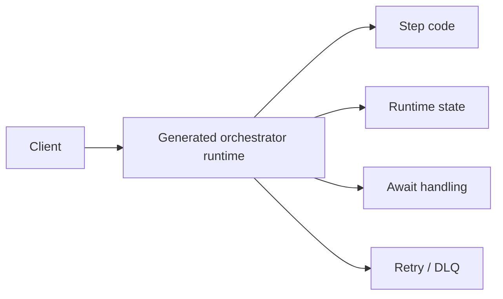
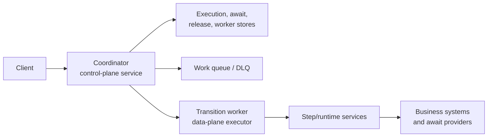
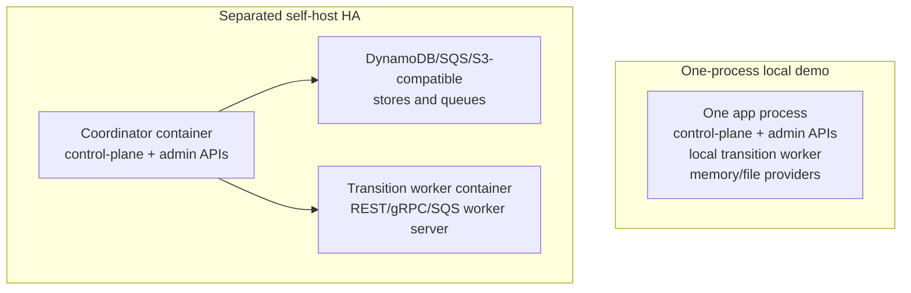
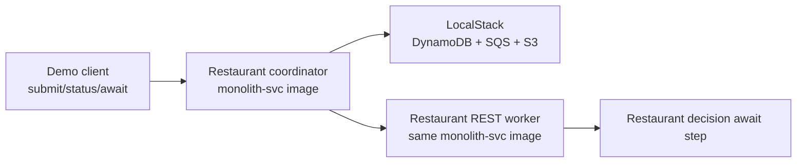
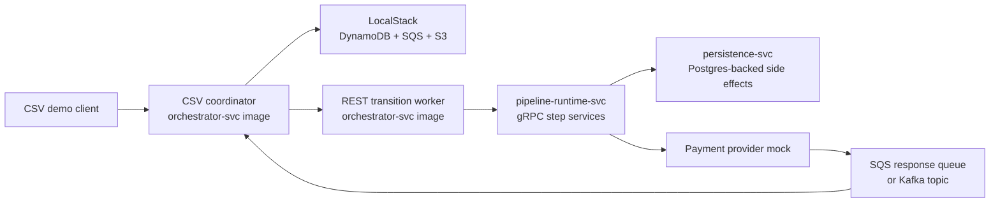
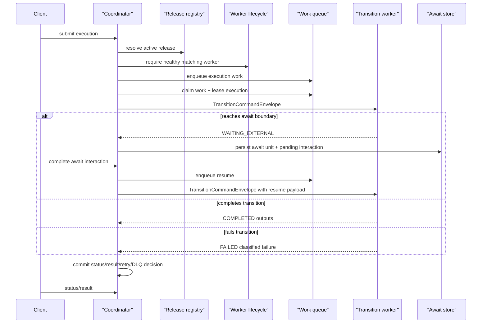

# Coordinator And Worker Topology

This page answers the practical question behind the self-host HA work: what happened to the old "orchestrator"?

The old orchestrator responsibility is now split into two runtime roles:

1. **Coordinator**: the durable control plane.
2. **Transition worker**: the data-plane executor for bounded pipeline continuations.

The code and config names still use `orchestrator` in places, for example `orchestrator-svc` and `pipeline.orchestrator.*`. Treat those as historical module/config names. In the self-host HA model, a process becomes a coordinator or a worker by configuration.

## Terms

| Term | Meaning |
| --- | --- |
| `orchestrator` | Historical/generated runtime namespace. It still appears in module names, config keys, generated metadata, and Maven topology docs. |
| Coordinator | Durable control-plane role. It owns execution records, await units, leases, retry/DLQ, re-drive, release activation, release pinning, worker lifecycle checks, and status/result APIs. |
| Transition worker | Data-plane role. It receives a pinned transition command, executes from the current continuation point to the next durable boundary, and returns `COMPLETED`, `WAITING_EXTERNAL`, or `FAILED`. |
| Step/runtime service | Generated business-step runtime that a transition worker may call through REST, gRPC, or local transport. |
| Durable substrate | External state/queue/blob systems such as DynamoDB, SQS, S3-compatible storage, Postgres, or Kafka. |

## Before And After

Before the split, "orchestrator" was a broad word for the generated runtime that drove the pipeline.



In the self-host HA model, those responsibilities are separated.



The coordinator is where durable orchestration lives. The worker is where business transitions run.

## Ownership

| Concern | Coordinator | Transition worker | Step/runtime service |
| --- | --- | --- | --- |
| Submit execution | yes | no | no |
| Execution record | yes | no | no |
| Await unit and pending interaction | yes | no | no |
| Lease claim and recovery | yes | no | no |
| Retry, DLQ, and re-drive | yes | no | no |
| Release activation and execution pinning | yes | no | no |
| Worker lifecycle admission | yes | reports identity/health | no |
| Business step execution | no | drives transition | yes |
| Mapper/type/business code | no | yes, through packaged pipeline code | yes |
| External side effects | no | possible through steps | yes |

## Role Versus Artifact

`orchestrator-svc` is a module or image name, not a guarantee that the process is the durable coordinator role.

| Artifact/module | Can run as coordinator? | Can run as worker? | Notes |
| --- | --- | --- | --- |
| `restaurant-approval/monolith-svc` | yes | yes | The container demo runs the same image in two modes. |
| `csv-payments/orchestrator-svc` | yes | yes | The CSV worker hosts the canonical pipeline order and delegates generated step calls to grouped runtime services. |
| `csv-payments/pipeline-runtime-svc` | no | step/runtime service | Hosts grouped gRPC step services and selected provider mock. |
| `csv-payments/persistence-svc` | no | supporting app service | Hosts persistence plugin/aspect behavior. |

The role is selected by configuration:

```properties
# Coordinator role
pipeline.orchestrator.control-plane.enabled=true
pipeline.orchestrator.admin.enabled=true
pipeline.orchestrator.worker.rest.base-url=http://worker:8181
pipeline.orchestrator.control-plane.require-remote-worker=true

# Worker role
pipeline.orchestrator.worker.rest.server-enabled=true
```

With no remote worker target, the local in-process worker is selected. That is useful for local demos. Separated self-host HA should set `pipeline.orchestrator.control-plane.require-remote-worker=true` so a coordinator process cannot silently execute transitions locally.

## One Process Versus Separated HA



The one-process path is intentionally batteries-included. It proves the programming model quickly, but it is not the HA topology. The separated path is the compute-first HA model.

## Restaurant Reference

Restaurant approval is the base self-host HA reference because it is the smallest human-await path.



The same `monolith-svc` image runs twice:

1. coordinator mode: durable state, release/admin APIs, worker admission, work dispatch;
2. worker mode: signed transition worker endpoint and restaurant pipeline code.

This is not a contradiction of "monolith" at runtime. `monolith-svc` describes the packaged artifact shape. The deployment still chooses whether to run one process or two role-specific processes from that artifact.

## CSV Payments Reference

CSV Payments is the advanced self-host HA reference. It proves stream input, provider-portable await completions, and generated step/runtime calls.



The default lane uses SQS await request/completion queues so the whole stack can run against the LocalStack-backed AWS-shaped substrate. The Kafka lane runs the same coordinator and worker topology with Kafka as the await provider substrate. That proves the await abstraction is not tied to one broker.

## Transition Sequence



Notice what does not happen in the transition hot path:

1. the coordinator does not dynamically load registered code;
2. the coordinator does not re-hash artifacts on every transition;
3. the worker does not own durable execution state;
4. active release changes do not affect already-pinned executions.

## Why This Split Matters

Self-host HA depends on keeping durable orchestration in the coordinator and business execution in workers. That gives TPF:

1. durable `QUEUE_ASYNC` execution without relying on a single app process surviving;
2. release pinning so retries and awaits resume against the version recorded on the execution;
3. worker identity checks so a coordinator only accepts work when a matching release is actually running;
4. provider-portable await transports such as SQS and Kafka;
5. a future path to managed operation of the same coordinator boundary.

`FUNCTION` support remains serverless invocation/adapter support. It is not the current durable HA model. An all-serverless durable coordinator would be a separate architecture backed by durable services such as DynamoDB, SQS, and EventBridge-style scheduling.

Future managed operation can run the same control-plane shape, but the current self-host references are local verification stacks, not production deployment packages and not managed-service promises.
