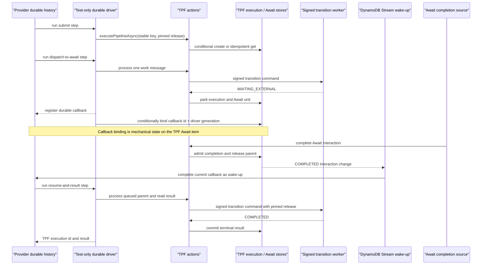

# Durable Workflow Backend Adapter Spike

This page records the original design/proof stage. For the current supported host and deployment contract, see [AWS Durable Coordination](/deploy/orchestrator-runtime/aws-durable); the accepted ownership decision is [ADR-0069](/decisions/0069-aws-durable-hosts-mechanical-coordination).

Provider workflow engines can drive TPF coordinator actions, but they should not become a second authority for pipeline execution.

The spike now has two stages. The first puts the AWS Lambda Durable Execution Java local runner around the AWS-shaped actions. The second pushes to the maximum currently safe delegation boundary: AWS owns the durable wait and wake-up machinery, while a compact TPF semantic checkpoint remains sufficient to reconstruct the driver after provider-history loss.

Its verdict is deliberately bounded, but stronger than the original outer-driver experiment:

- **prefer** an AWS durable execution as the candidate AWS `QUEUE_ASYNC` coordination host;
- **accept** a provider callback reference as generation-fenced mechanical state attached to a TPF Await interaction;
- **retain** the native coordinator as the portable semantic reference, conformance implementation, and fallback;
- **reject** moving TPF execution, Await, release, worker, DLQ, or re-drive authority into a provider history by default.

The [deployed proof evidence](/evolve/durable-coordinator/aws-durable-coordination-host) covers the registration-before-binding window: the suite injects a submitter failure after AWS has created the callback but before the mechanical registration write, and another after that write. Both cases converge to a generation-1 binding and successful execution. This is injected action failure, not a hard process-kill test or proof that AWS automatically replays the submitter. Race, provider-history-loss, and terminal-Await recovery were also exercised against real AWS services. No supported production handler or runtime dependency is added by that proof. The AWS implementation remains non-published and the existing TPF-native coordinator remains unchanged.

## Proof Boundary

The durable execution checkpoints calls to the existing bounded actions. It does not model a second pipeline state machine.



The integration proof exercises more than the successful path:

- losing the provider `submit` checkpoint returns the existing execution through the stable TPF execution key;
- losing the `dispatch-to-await` checkpoint after TPF commits `WAITING_EXTERNAL` does not repeat the signed worker transition;
- the Await completion is admitted by TPF before a DynamoDB Stream change attempts the provider callback;
- a failed wake-up remains retryable and a duplicate wake-up is acknowledged;
- a replacement provider execution attaches to the same TPF execution with a higher callback generation, without redispatching work;
- a stale stream event cannot wake the abandoned provider execution;
- a late replay of that abandoned execution observes the terminal TPF checkpoint and does not repeat the worker transition.

The replacement execution is the important result. Provider history is useful durability, but is not the only recovery source. The TPF execution status, step index, version, Await status, stable execution key, pinned release, and durable result form the semantic checkpoint from which another provider execution can safely continue.

The existing AWS-shaped scenarios remain the evidence for scheduled sweep, process replacement, event replay, retry, terminal failure, DLQ publication, and TPF operator re-drive. The durable runner does not redefine those behaviours.

## Semantic Mapping

| TPF concept | AWS Lambda Durable Functions primitive | Authority in the spike | Gap or constraint |
| --- | --- | --- | --- |
| Execution identity and idempotent submit | Durable execution history and named `submit` step | TPF execution record and execution key | Provider execution identity is only correlation. Replaying the provider step must still pass the stable TPF key. |
| Await unit and interaction | `waitForCallback` and provider callback ID | TPF Await unit, interaction, correlation ID, and completion admission | The local proof uses auxiliary callback/generation attributes on the Await item; the deployed proof keeps them in a separate mechanical binding table. The local runner alone does not prove the registration window; the deployed suite injects failure after AWS callback creation and recovers through history-based correlation repair. |
| Retry | Durable step checkpoint/replay | TPF owns transition retry, lease, and due-time semantics | Provider step retry must not become a second transition-attempt counter or bypass TPF admission. |
| DLQ evidence | Lambda invocation/event-source failure handling | TPF terminal record and DLQ publication | Provider failure destinations are trigger evidence, not TPF terminal execution evidence. |
| History | Provider checkpoint and operation history | TPF execution/Await records remain canonical | Operators would otherwise have two histories with different retention and vocabulary. |
| Re-drive | Reinvoke or start another provider execution | TPF conditional terminal-to-queued re-drive | A new provider execution or provider replay does not reproduce TPF expected-version, intent, pinned-release, and DLQ evidence semantics. |
| Release pinning | Values checkpointed by durable steps | TPF execution and signed transition envelopes | Provider code must carry the TPF identity; provider function versioning is not a substitute. |
| Worker identity | No equivalent coordinator invariant | TPF signed transition protocol and release validation | A provider activity identity must not authorise a TPF transition by itself. |
| Uncertain remote outcome | Durable step retry/failure | TPF coordinator state and transition protocol | Timeout or lost provider acknowledgement cannot be treated as confirmed worker failure. |

The local runner supplies in-process checkpoints and callback control without an AWS deployment, as described by the [AWS testing API](https://docs.aws.amazon.com/durable-execution/testing/api-reference/). AWS execution naming can make durable starts idempotent, but it does not replace TPF's execution key and conditional creation rules; see [durable execution idempotency](https://docs.aws.amazon.com/lambda/latest/dg/durable-execution-idempotency.html).

## Maximum Safe Delegation Proven So Far

The deeper proof supports an AWS-optimised coordinator without creating an AWS-specific TPF execution model.

| Capability | Safe owner in this design | What TPF retains |
| --- | --- | --- |
| Durable orchestration checkpoints | AWS Durable | Stable action inputs and idempotent semantic transitions |
| Suspension and callback registration | AWS Durable | Await identity, typed completion contract, admission status, deadline, and parent-release state |
| Wake-up delivery | DynamoDB Streams plus a bounded callback action | The completion record that makes the wake-up admissible |
| Driver recovery | AWS replay while history exists; replacement durable execution when it does not | Compact semantic checkpoint and stable execution key |
| Work dispatch and backpressure | SQS in the proved architecture | Work-item identity, signed transition protocol, release and worker identity |
| Retry and DLQ | AWS may retry bounded calls mechanically; TPF remains authoritative for semantic attempts | Attempt count, uncertain outcome, terminal evidence, and re-drive decision |
| Result and operator history | TPF | Canonical status, result, Await evidence, DLQ evidence, and re-drive lineage |

This means scheduled polling for completed Awaits can disappear from the AWS hosting shape. It does **not** yet prove that SQS worker queues, TPF retry scheduling, due-execution sweeps, leases, or DLQs can disappear. Those mechanisms still enforce backpressure, uncertain-outcome handling, retry policy, and operator evidence in the exercised design.

The provider callback binding is intentionally small and mechanical:

```text
provider_callback_id
provider_driver_generation
```

It is conditionally replaced only by a newer generation (or replayed by the same callback in the same generation). A stream wake-up compares its event with the current binding before completing a callback. The binding therefore grants permission to wake the current driver; it does not grant permission to complete an Await, release a parent, execute a transition, or alter a result.

## Crash-Point Findings

| Crash or duplicate | Observed recovery |
| --- | --- |
| AWS creates callback; submitter fails before mechanical registration is written | Provider history supplies the callback and checkpoint; stream/reconciliation repair joins them to the TPF Await, and the deployed test reaches a generation-1 binding and success. |
| Mechanical registration commits; submitter fails before its checkpoint | The retained registration can be joined to the TPF Await; the deployed test reaches a generation-1 binding and success. |
| Provider loses `submit` checkpoint after TPF create | Replay returns the same TPF execution. |
| Provider loses dispatch checkpoint after TPF worker transition | The driver reads TPF state and skips redispatch. |
| Await completion commits, wake-up delivery fails | Stream event remains retryable; TPF parent is already `QUEUED`. |
| Stream event is delivered twice | Completed callback is acknowledged without repeating TPF work. |
| Provider history is abandoned while Await is parked | A new driver generation attaches to the same execution and Await. |
| Old generation's stream event arrives late | Generation comparison acknowledges it without waking the old callback. |
| Abandoned driver is woken after replacement reaches terminal state | It reads the terminal TPF checkpoint and returns the existing result without another worker transition. |

The registration-before-binding window was open in the local runner and was subsequently exercised by the deployed `bothBindingOrdersAndDelayedStreamsConverge` test (catalogue scenarios 8 and 9). In `ProofDurableHostActionAdapter.registerCallback`, `bind-before-provider-binding` throws inside the callback submitter before `bindings.register`; `bind-after-provider-binding` throws after that write. AWS has already supplied the callback ID in both cases. These names refer to mechanical registration writes, not TPF completion admission.

If registration is missing, the Await stream handler reconstructs it from public provider history and the stable TPF checkpoint, then conditionally binds it to the authoritative Await interaction. An unresolved stream record remains retryable; the proof reconciler can also reconstruct missing bindings and attempt wake-up. TPF must admit completion before wake-up, and generation fencing remains in force. The tests establish convergence with those repair paths enabled; they do not isolate which path wins or prove submitter replay alone. Production conformance must retain this failure coverage against the supported host, with reconciliation as exceptional repair and the AWS callback/history contract still subject to provider validation.

## Provider Comparison

| Provider option | Useful mapping | Why it remains deferred |
| --- | --- | --- |
| AWS Lambda Durable Functions | Java checkpoints, replay, waits, callbacks, and a local runner fit both a thin driver and a reconstructable semantic-checkpoint driver over TPF actions. | The deployed proof exercises callback registration/correlation repair; supported-host conformance and operational-history integration remain production gates. |
| AWS Step Functions | Callback task tokens and Standard Workflow re-drive provide strong hosted orchestration primitives. | [Step Functions re-drive](https://docs.aws.amazon.com/step-functions/latest/dg/redrive-executions.html) preserves successful provider steps and resets provider retry counts; that is not TPF's conditional execution re-drive contract. |
| Azure Durable Functions | Orchestrators and [external events](https://learn.microsoft.com/en-us/azure/azure-functions/durable/durable-functions-external-events) can suspend and wake hosted work. | Orchestrator instance, event, replay, and activity identities would need an explicit mapping without displacing TPF Await and execution identities. |
| Google Cloud Workflows | [Callback endpoints](https://cloud.google.com/workflows/docs/creating-callback-endpoints), waits, retries, and hosted history can drive HTTP actions. | The definition-first workflow becomes a second execution model unless it remains a thin action driver. |

AWS Lambda Durable Functions was selected for the coded spike because its Java local runner can exercise checkpoint loss, replay, and callback wake-up without adding IAM, infrastructure templates, or a production Lambda handler. The other engines are compared at the semantic boundary rather than through additional provider-specific code.

## Recommended AWS Proof Architecture

For the next deployed proof, keep the architecture exercised here:

```text
AWS Durable driver
    -> PipelineControlPlane actions
    -> TPF execution and Await records in DynamoDB
    -> SQS work and signed transition actions

TPF Await COMPLETED update
    -> DynamoDB Stream
    -> bounded callback wake-up action
    -> current AWS Durable callback generation
```

This is deeper than a thin outer driver because AWS owns checkpointing, suspension, callback durability, and wake-up retries. It is still one TPF execution model because every semantic decision is an idempotent TPF transition and a replacement driver reconstructs from TPF records.

Direct durable invocation of transition workers, removal of SQS, and delegation of semantic retry/re-drive are separate experiments. They should not be inferred from this result.

## Coordination-Host Gate

An AWS coordination-host implementation is acceptable only when it can demonstrate all of the following:

1. provider execution and callback identifiers remain correlations, or replace TPF authority through a deliberately adopted and complete mapping;
2. callback registration and the TPF Await interaction are replay-safe or reconcilable across the deployed registration/binding crash window;
3. provider replay cannot duplicate TPF transition execution or mutate pinned release identity;
4. retry, DLQ, uncertain outcome, and re-drive evidence remain visible through TPF's operator contract;
5. provider history loss or expiry does not remove the records needed to operate or re-drive a TPF execution.

The deployed fault proof demonstrates those properties for the experimental AWS host, including injected registration-window failure with stream/history/reconciliation repair enabled. That makes AWS Durable the preferred candidate AWS hosting strategy, not current production Lambda support. The next implementation boundary is a provider-neutral coordination-host seam over the existing `PipelineControlPlane`, followed by ordinary release, security, quota, and operations work. The TPF-native compute-first coordinator remains the semantic reference and fallback.
