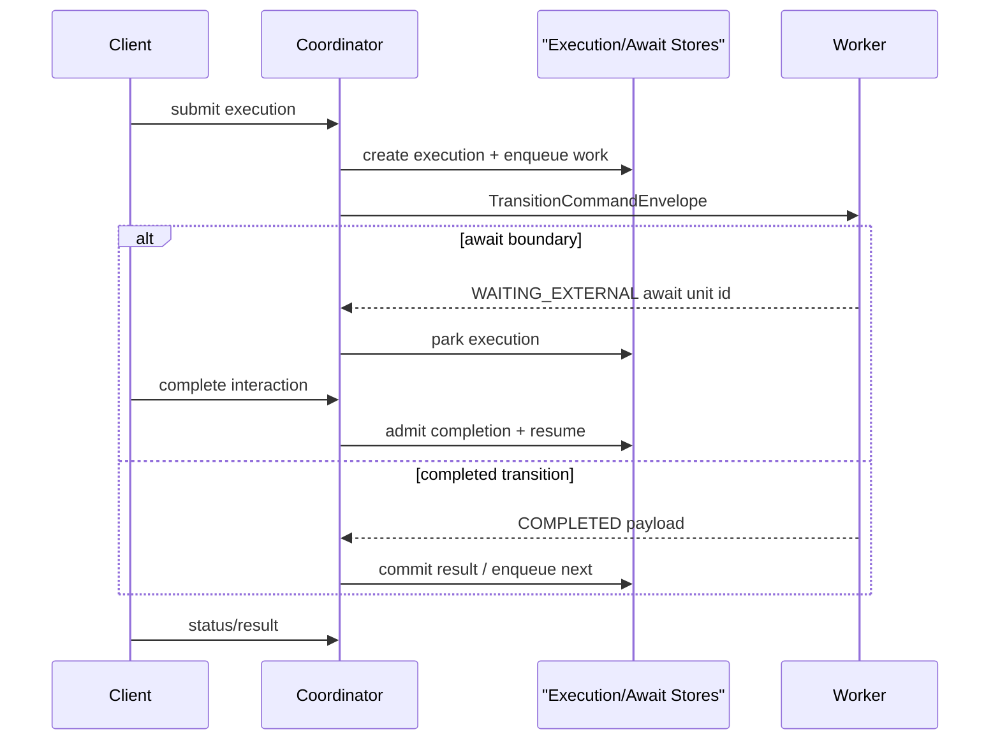

# Durable Coordinator

The durable coordinator is the self-hostable control-plane boundary for `QUEUE_ASYNC` execution.

It owns execution state, leases, retry/DLQ, await units, release activation, worker dispatch, and status/result APIs. Step code still runs in workers: local in-process workers, REST workers, gRPC workers, or SQS request/reply workers.

If you are trying to understand what happened to the old "orchestrator", start with [Coordinator And Worker Topology](/evolve/durable-coordinator/coordinator-worker-topology). The short version is that `orchestrator-svc` and `pipeline.orchestrator.*` remain historical module/config names, while self-host HA splits runtime responsibility into a coordinator role and one or more transition worker roles.

This section is implementation-facing. Application usage remains in [Orchestrator Runtime](/deploy/orchestrator-runtime/). The first runnable reference is `examples/restaurant-approval/self-host`.

## Current Shape

| Area | Current state |
| --- | --- |
| Execution state | `ExecutionRecord` with leases, attempts, status, result, pinned pipeline/contract/release identity |
| Await state | `AwaitUnitRecord` plus pending/completion interaction records |
| Worker boundary | portable command/result envelopes over local, REST, gRPC, or SQS |
| Contract/release identity | generated `META-INF/pipeline/pipeline-contract.json`, release descriptor registration, activation, execution pinning, and worker identity validation |
| Self-host path | compute-first HA references using restaurant approval and CSV Payments |

## Guides

1. [Coordinator And Worker Topology](/evolve/durable-coordinator/coordinator-worker-topology) explains the role split behind `orchestrator-svc`, coordinator processes, and transition workers.
2. [Worker Protocols](/evolve/durable-coordinator/worker-protocols) explains local, REST, gRPC, and SQS transition workers.
3. [Step-Aware Invocation Runtime](/evolve/durable-coordinator/boundary-invocation-model) explains the shared invocation seam used by pipeline steps and transition workers.
4. [Brokered Runtime Boundaries](/evolve/brokered-boundaries/) is the entry point for Kafka/SQS-style substrates under TPF-owned semantics.
5. [Boundary Taxonomy](/evolve/brokered-boundaries/boundary-taxonomy) maps broker concepts into TPF runtime boundaries.
6. [Dispatch Substrates](/evolve/brokered-boundaries/dispatch-substrates) separates substrate policy from transport, platform, and payload policy.
7. [Envelope And Data Policy](/evolve/brokered-boundaries/envelope-and-data-policy) separates loose payloads from strict TPF control metadata.
8. [Contract And Release Identity](/evolve/durable-coordinator/bundle-contract) explains generated contracts, release activation, and execution pinning.
9. [Pipeline Contract And Release Model](/evolve/durable-coordinator/pipeline-contract-release-model) describes contract/release descriptors, artifacts, deployment plans, and drift detection.
10. [Runtime Boundaries And Performance](/evolve/durable-coordinator/runtime-boundaries-performance) explains runtime mapping, patterns, package boundaries, and hot-path guardrails.
11. [Local APIs](/evolve/durable-coordinator/local-apis) documents the current default-disabled control-plane and admin APIs.
12. [Self-Hosted Deployment](/evolve/durable-coordinator/self-hosted-deployment) gives the production-ish self-host topology, configuration, and operator runbooks.
13. [Self-Hosted HA Roadmap](/evolve/durable-coordinator/self-hosted-ha-roadmap) records the milestone closeout and deferred hardening.
14. [Self-Hosted Milestone](/evolve/durable-coordinator/self-hosted-milestone) gives the adoption entry points and current proof matrix.

## Limits

The current coordinator path does not dynamically load registered JAR code. Workers must already host matching pipeline code and validate active `pipelineId + contractVersion + releaseVersion` identity.

The Dynamo release registry provides multi-coordinator release metadata, while the file-backed registry remains local/dev oriented. Minimal worker lifecycle gates new hosted submissions. Single-execution re-drive is present. Bulk DLQ-message replay and append-only execution/await state are deferred hardening work, not blockers for the current compute-first self-host HA milestone.
