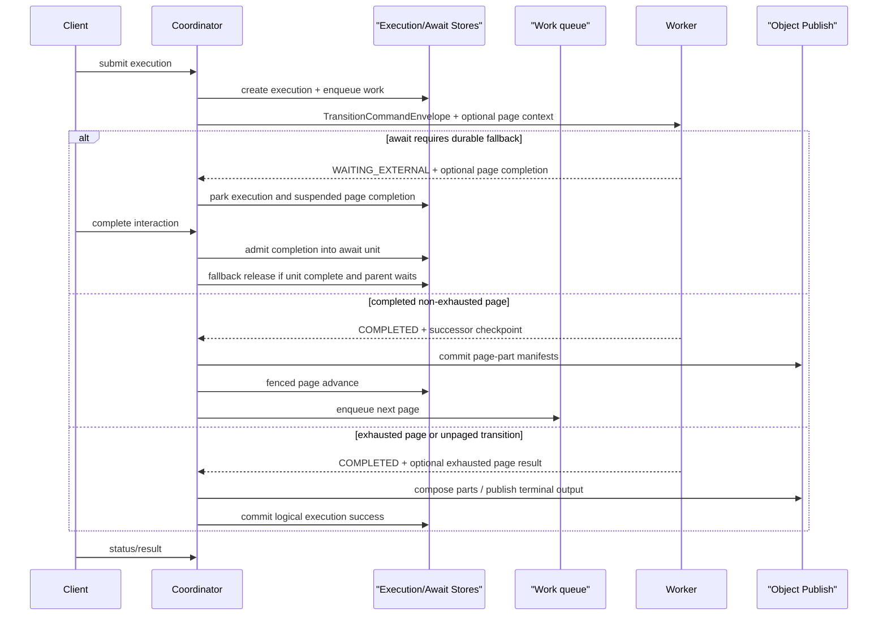

# Durable Coordinator

The durable coordinator is the self-hostable control-plane boundary for `QUEUE_ASYNC` execution.

It owns execution state, leases, retry/DLQ, await units, release activation, worker dispatch, and status/result APIs. Step code still runs in workers: local in-process workers, REST workers, gRPC workers, or SQS request/reply workers.

If you are trying to understand what happened to the old "orchestrator", start with [Coordinator And Worker Topology](/evolve/durable-coordinator/coordinator-worker-topology). The short version is that `orchestrator-svc` and `pipeline.orchestrator.*` remain historical module/config names, while self-host HA splits runtime responsibility into a coordinator role and one or more transition worker roles.

This section is implementation-facing. Application usage remains in [Orchestrator Runtime](/deploy/orchestrator-runtime/). The first runnable reference is [`pipelineframework-examples/restaurant-approval/self-host`](https://github.com/The-Pipeline-Framework/pipelineframework-examples/tree/main/restaurant-approval/self-host).

The current self-host HA path is compute-first. PR 1 provides a control-plane contract of bounded single-shot actions, including a structured `sweepOnce` result. PR 2 makes the periodic sweeper and SQS pollers replaceable loop hosts over those actions, without starting loops on direct action invocation. PR 3 proves direct action invocation locally against LocalStack DynamoDB and SQS. The [durable workflow adapter spike](/evolve/durable-coordinator/durable-workflow-adapter-spike) and [deployed fault proof](/evolve/durable-coordinator/aws-durable-coordination-host) establish AWS Lambda Durable Functions as the preferred candidate AWS coordination host while TPF retains semantic authority. Those pages record the proof stage; current supported packaging and operations are documented in [AWS Durable Coordination](/deploy/orchestrator-runtime/aws-durable).

## Current Shape

| Area | Current state |
| --- | --- |
| Execution state | `ExecutionRecord` with leases, attempts, status, result, pinned pipeline/contract/release identity, and optional page state |
| Await state | `AwaitUnitRecord` plus pending/completion interaction records |
| Worker boundary | portable command/result envelopes over local, REST, gRPC, or SQS |
| Contract/release identity | generated `META-INF/pipeline/pipeline-contract.json`, release descriptor registration, activation, execution pinning, and worker identity validation |
| Self-host path | compute-first HA references using restaurant approval and CSV Payments |

```mermaid
sequenceDiagram
    participant Client
    participant Coordinator
    participant Store as "Execution/Await Stores"
    participant Work as "Work queue"
    participant Worker
    participant Publish as "Object Publish"

    Client->>Coordinator: submit execution
    Coordinator->>Store: create execution + enqueue work
    Coordinator->>Worker: TransitionCommandEnvelope + optional page context
    alt await requires durable fallback
        Worker-->>Coordinator: WAITING_EXTERNAL + optional page completion
        Coordinator->>Store: park execution and suspended page completion
        Client->>Coordinator: complete interaction
        Coordinator->>Store: admit completion into await unit
        Coordinator->>Store: fallback release if unit complete and parent waits
    else completed non-exhausted page
        Worker-->>Coordinator: COMPLETED + successor checkpoint
        Coordinator->>Publish: commit page-part manifests
        Coordinator->>Store: fenced page advance
        Coordinator->>Work: enqueue next page
    else exhausted page or unpaged transition
        Worker-->>Coordinator: COMPLETED + optional exhausted page result
        Coordinator->>Publish: compose parts / publish terminal output
        Coordinator->>Store: commit logical execution success
    end
    Client->>Coordinator: status/result
```

An eligible live itemized await remains in the active transition worker and follows a `COMPLETED` branch when its terminal stream finishes. For a paged source, `COMPLETED` means that one page can advance or finalise; it does not by itself mean that the logical execution succeeded. `WAITING_EXTERNAL` is the outcome for an await that requires durable fallback, not a mandatory outcome for every await boundary.

## Guides

1. [Coordinator And Worker Topology](/evolve/durable-coordinator/coordinator-worker-topology) explains the role split behind `orchestrator-svc`, coordinator processes, and transition workers.
2. [Worker Protocols](/evolve/durable-coordinator/worker-protocols) explains local, REST, gRPC, and SQS transition workers.
3. [Step-Aware Invocation Runtime](/evolve/durable-coordinator/boundary-invocation-model) explains the shared invocation seam used by pipeline steps and transition workers.
4. [Circuit-Breaker Invocation Admission](/evolve/durable-coordinator/circuit-breakers) records the scope guarantee and transport-boundary admission seam.
5. [Brokered Runtime Boundaries](/evolve/brokered-boundaries/) is the entry point for Kafka/SQS-style substrates under TPF-owned semantics.
6. [Boundary Taxonomy](/evolve/brokered-boundaries/boundary-taxonomy) maps broker concepts into TPF runtime boundaries.
7. [Dispatch Substrates](/evolve/brokered-boundaries/dispatch-substrates) separates substrate policy from transport, platform, and payload policy.
8. [Envelope And Data Policy](/evolve/brokered-boundaries/envelope-and-data-policy) separates loose payloads from strict TPF control metadata.
9. [Contract And Release Identity](/evolve/durable-coordinator/bundle-contract) explains generated contracts, release activation, and execution pinning.
10. [Pipeline Contract And Release Model](/evolve/durable-coordinator/pipeline-contract-release-model) describes contract/release descriptors, artifacts, deployment plans, and drift detection.
11. [Runtime Boundaries And Performance](/evolve/durable-coordinator/runtime-boundaries-performance) explains runtime mapping, patterns, package boundaries, and hot-path guardrails.
12. [All-Serverless Durable Coordinator](/evolve/durable-coordinator/all-serverless-coordinator) records the single-shot coordinator actions, replaceable compute-first loop hosts, AWS-shaped local proof, and remaining provider work for FUNCTION/all-serverless HA.
13. [Durable Workflow Backend Adapter Spike](/evolve/durable-coordinator/durable-workflow-adapter-spike) maps provider identities, callbacks, retries, history, DLQ, and re-drive onto the TPF-native action model and records the production-adoption gaps.
14. [AWS Durable Coordination Host](/evolve/durable-coordinator/aws-durable-coordination-host) records the deployed fault evidence, ownership boundary, and promotion gates.
15. [AWS Engagement Brief](/evolve/durable-coordinator/aws-engagement-brief) captures the remaining callback, history, limits, and recovery questions for AWS engineering.
16. [Local APIs](/evolve/durable-coordinator/local-apis) documents the current default-disabled control-plane and admin APIs.
17. [Self-Hosted Deployment](/evolve/durable-coordinator/self-hosted-deployment) gives the production-ish self-host topology, configuration, and operator runbooks.
18. [Self-Hosted HA Roadmap](/evolve/durable-coordinator/self-hosted-ha-roadmap) records the milestone closeout and deferred hardening.
19. [Self-Hosted Milestone](/evolve/durable-coordinator/self-hosted-milestone) gives the adoption entry points and current proof matrix.
20. [AWS Durable Production Completion Plan](/evolve/durable-coordinator/aws-durable-production-plan) records the merged host audit, remaining support gates, proof disposition and bounded implementation sequence.

## Limits

The current coordinator path does not dynamically load registered JAR code. Workers must already host matching pipeline code and validate active `pipelineId + contractVersion + releaseVersion` identity.

The Dynamo release registry provides multi-coordinator release metadata, while the file-backed registry remains local/dev oriented. Minimal worker lifecycle gates new hosted submissions. Single-execution re-drive is present. Bulk DLQ-message replay and append-only execution/await state are deferred hardening work, not blockers for the current compute-first self-host HA milestone.
