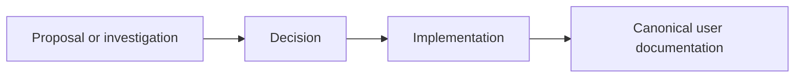

# Evolve

Internal architecture, compiler/runtime design notes, migration records, and framework evolution
material live here. These pages explain how TPF changed or may change; they are not the current
application contract.

- [Quarkus 3.39 migration and validation](/evolve/quarkus-3.39-migration)
- [Architecture reference](/evolve/architecture-reference)
- [Framework release process](/evolve/framework-release-process)
