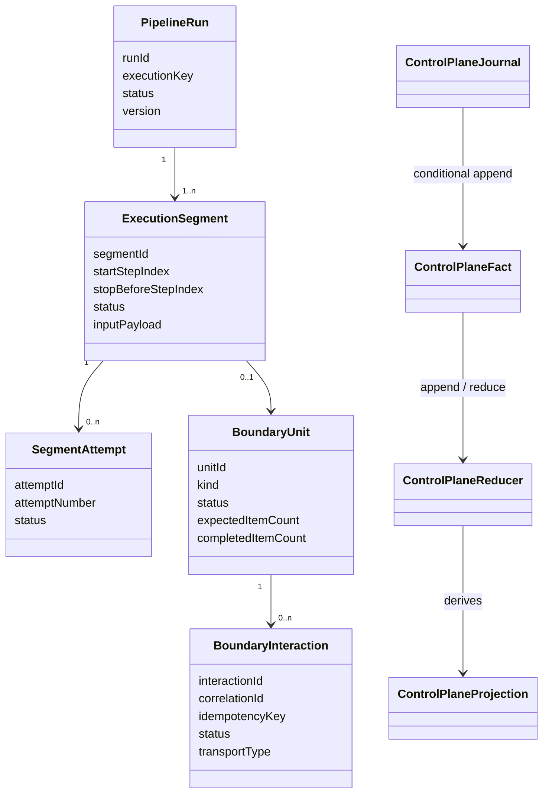
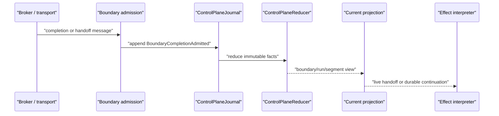

# Queue-Async Immutable Boundaries

Queue-async should be modeled as immutable facts flowing through reducers, not as one mutable execution record being marked from state to state.

This page describes the target internal model introduced for the first in-memory slice. The current `ExecutionStateStore`, `AwaitUnitStore`, and `AwaitInteractionStore` remain compatibility projections until the Dynamo append-only storage design in issue #396 replaces their update-oriented implementations.

## Core Model

`PipelineRunner` remains the synchronous segment runner. Queue-async adds durable boundaries between those synchronous segments:

1. A `PipelineRun` is the logical submitted run.
2. An `ExecutionSegment` is one synchronous step range between async boundaries.
3. A `SegmentAttempt` is one worker attempt for a segment.
4. A `BoundaryUnit` is an async handoff boundary: await, checkpoint handoff, or terminal publication.
5. A `BoundaryInteraction` is the transport-facing correlation/idempotency item within the boundary.

The model is intentionally append-only. A timeout is not "mark this execution timed out"; it is an `InteractionTimedOut` fact. Reducers derive the current run, segment, boundary, and due-work projections from that fact stream.

## Fact Flow

The first slice introduces facts such as:

- `RunSubmitted`
- `SegmentAttemptStarted`
- `SegmentCompleted`
- `SegmentSuspended`
- `BoundaryInteractionDispatched`
- `BoundaryDispatchCompleted`
- `BoundaryCompletionAdmitted`
- `InteractionTimedOut`
- `ContinuationSegmentCreated`
- `TerminalPublicationCompleted`
- `RunSucceeded`
- `RunFailed`

These facts are immutable. The in-memory `ControlPlaneJournal` appends them conditionally by expected projection version, assigns monotonically increasing event sequences, and rebuilds projections through `ControlPlaneReducer`.

Duplicate completions and terminal publications are handled by fact keys. Retrying the same append is a no-op when the fact key already exists; retrying a different fact against a stale version fails with an append conflict.

## Boundary Admission

Await completion and checkpoint handoff are the same architectural shape: a transport message admits a correlated payload into a TPF-owned boundary.

`BoundaryAdmissionFacts` is deliberately transport-agnostic. Kafka await completions and Kafka checkpoint handoffs should produce the same `BoundaryCompletionAdmitted` fact shape after their protocol-specific decoding.

## Relationship To Existing Stores

The existing stores are still update-oriented compatibility projections:

- `ExecutionStateStore`
- `AwaitUnitStore`
- `AwaitInteractionStore`

They remain in the hot path until the control-plane journal is integrated. The new package draws the semantic boundary first so the next storage work can replace update verbs with append-only writes without inventing the model inside the Dynamo implementation.

The next storage slice should implement the Dynamo append-only design tracked by issue #396. It must answer the table/index and stale-candidate questions there before replacing production store providers.
