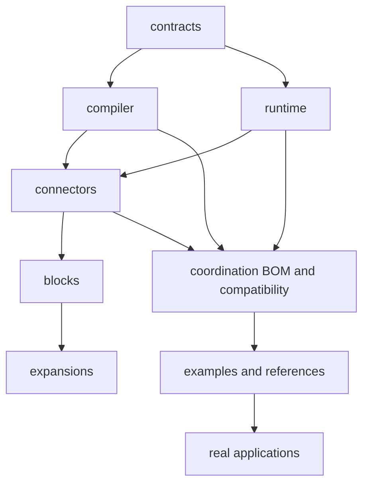

# Repository Split Migration and Test Assessment

TPF is now distributed across repositories with separate ownership and release lifecycles. This guide explains how
to migrate development work and test evidence without recreating the former monorepo through CI or local source
paths.

## Repository map

| Former surface | Current owner |
| --- | --- |
| Semantic model, DSL and shared runtime/API/SPI/protocol contracts | `pipelineframework-contracts` |
| Compiler API and implementation | `pipelineframework-compiler` |
| Quarkus runtime/deployment, Spring adapter and foundational plugins | `pipelineframework-runtime` |
| Connectors, import tooling, representation providers and host adapters | `pipelineframework-connectors` |
| Packaged Blocks | `pipelineframework-blocks` |
| Expansion distribution POMs | `pipelineframework-expansions` |
| Learning examples and proofs | `pipelineframework-examples` |
| Checkout/TPFGo, Search and QuickBooks | `pipelineframework-reference-implementations` |
| CSV Payments | `csv-kafka-payments` |
| Turnkey RAG application | `rag-turnkey` |
| Product BOM, cross-artifact compatibility, docs and release coordination | `pipelineframework` |

Public Maven coordinates were kept stable where ownership moved. Consumers should import `pipelineframework-bom`
and use released coordinates; they should not add relative paths to sibling repositories.

## Migrating a change

1. Choose the repository that semantically owns the behaviour.
2. Make its unit/contract tests green in that repository.
3. Publish or consume the required snapshot in dependency order.
4. Run the smallest downstream compatibility suite that crosses the changed boundary.
5. Run application or reference E2E only when the change reaches those behaviours.
6. Update the product BOM only after the required released-artifact compatibility evidence is green.

For a coordinated local change, use repository-local Maven caches and snapshots. Do not create a composite source
reactor: that would hide missing publication metadata and recreate source-level atomicity.

## Where the E2E tests live

- Quarkus and Spring runtime smoke coverage is in `pipelineframework-runtime`; both Spring smoke modules are part of
  its canonical reactor.
- Connector integration tests, including database/provider Testcontainers tests, are in
  `pipelineframework-connectors`.
- Learning-proof integration tests are in `pipelineframework-examples`, including GraphQL, OpenAPI callback, RAG,
  stdio object and Restaurant Approval paths.
- Checkout/TPFGo and Search E2E workflows are in `pipelineframework-reference-implementations`; its CI composes
  reusable sync, queue-async HA, resource, Lambda and topology workflows.
- CSV application, self-hosted HA and scale tests are in `csv-kafka-payments`.
- RAG application contract tests are in `rag-turnkey`.
- `pipelineframework` retains only released-artifact transport compatibility tests.

## Current regression entry points

| Repository | Current automatic gate | Assessment |
| --- | --- | --- |
| contracts | Canonical `clean verify` on pull requests | Owner tests run |
| compiler | Canonical `clean verify` on pull requests | Owner tests run |
| runtime | Canonical `clean verify` on pull requests | Runtime and both Spring smoke modules run |
| connectors | `clean verify -DskipTests` plus publication checks | Test sources exist, but PR tests are incorrectly skipped; tracked by [#932](https://github.com/The-Pipeline-Framework/pipelineframework/issues/932) |
| Blocks | Canonical `clean verify` on pull requests | Owner tests run |
| Expansions | Distribution verification and dependency resolution | Appropriate for the current POM-only distributions |
| examples | Canonical `clean verify` plus Restaurant Approval workflows | Focused example integration tests run |
| reference implementations | Composed Checkout/TPFGo, Search and QuickBooks workflows | E2E ownership is explicit |
| CSV/Kafka Payments | Maven reactor plus self-hosted HA and scale workflows | Several former variant/native lanes are missing; tracked by #929 |
| RAG Turnkey | Canonical `verify` on pull requests | Current contract tests run |
| coordination | BOM resolution and transport-completeness tests | Cross-artifact seam only; not full E2E |

## Extraction audit

The audit on 23 September 2026 compared test-source files deleted by the physical extraction commits with the
current standalone repositories by content hash and filename:

- 580 test-source files were removed from the former monorepo surfaces;
- 566 have byte-identical successors;
- 11 have same-named successors with extraction-related edits;
- three have no successor.

The missing sources are:

1. `CurrentAuthoredSurfacesGuardTest` — its docs/web UI and examples responsibilities now have separate owner-local
   guards. `pipelineframework` guards current documentation and the web UI, while `pipelineframework-examples`
   guards authored YAML and Java ([#931](https://github.com/The-Pipeline-Framework/pipelineframework/issues/931));
2. `CsvPaymentsTelemetryDashboardContractTest`;
3. its test-only `ObservabilityObligations` model — both belong in `csv-kafka-payments`
   ([#929](https://github.com/The-Pipeline-Framework/pipelineframework/issues/929)).

File preservation alone is not CI preservation. The Spring workflows were consolidated into the runtime reactor,
TPFGo gates moved into the reference-implementation workflow composition, and the CSV HA/scale workflows moved to
the application repository. However, CSV's former monolith, alternate pipeline-runtime, provider-rejection, Tempo
verification and native-build lanes do not currently have equivalent owner-repository workflows. Issue #929 tracks
their restoration or an explicit decision to retire a lane.

The former root Sonar/JaCoCo workflow and targeted coverage helper cannot measure source that now lives elsewhere.
Removing them from the coordination repository is correct, but equivalent compiler/contracts/runtime/Connector
coverage has not yet been established in the owner repositories. [#933](https://github.com/The-Pipeline-Framework/pipelineframework/issues/933)
tracks that migration without reintroducing a coverage Maven profile or a composite source reactor.

## Cross-repository regression gap

Each repository currently verifies its own checkout, but publishing a new upstream snapshot does not automatically
run all downstream repositories. Therefore an upstream repository can be green while a downstream behavioural
regression remains undiscovered.

Until [#930](https://github.com/The-Pipeline-Framework/pipelineframework/issues/930) provides an automated
compatibility train, use this manual order after a boundary-changing snapshot:

1. contracts;
2. compiler and runtime;
3. connectors;
4. Blocks and Expansions;
5. coordination BOM/compatibility tests;
6. examples;
7. reference implementations;
8. affected real applications.

Fetch fresh dependencies and record the tested component versions. Heavy HA, cloud and native lanes may be
scheduled, but they must be named as outstanding evidence rather than silently treated as covered.

## Assessment

The physical source split is complete, and the overwhelming majority of tests moved with their owners. The testing
migration is not yet complete: three test sources and several distinct CSV CI variants need owner-local successors,
Connector pull-request CI currently skips its transferred tests, and the released-artifact compatibility train is
still manual. Owner-repository coverage reporting also remains to be restored. PRs and releases should not claim
comprehensive cross-repository regression coverage until those follow-ups are closed.
