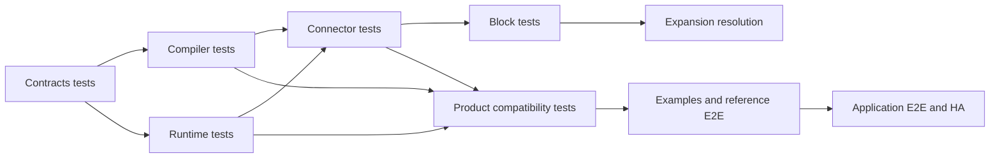

# Testing Guidelines

TPF testing follows semantic ownership across repositories. The split makes each test suite smaller and more
focused, but it also makes the distinction between owner-local verification and cross-repository compatibility
explicit.

The arrows describe downstream compatibility obligations, not source aggregation. A downstream repository consumes
published artifacts selected by the BOM; it does not rebuild upstream source.

## Owner-local verification

Every behaviour has one repository that owns its primary tests:

- `pipelineframework-contracts`: model invariants, protocol validation, serialization and runtime API/SPI contracts;
- `pipelineframework-compiler`: parsing, validation, semantic projection, diagnostics and generated artifacts;
- `pipelineframework-runtime`: Quarkus and Spring integration, execution behaviour, stores and foundational plugins;
- `pipelineframework-connectors`: connector/provider/importer/host behaviour and external-system integration tests;
- `pipelineframework-blocks`: compilation and behaviour of packaged Blocks;
- `pipelineframework-expansions`: distribution resolution and dependency composition;
- `pipelineframework-examples`: learning proofs and their focused integration tests;
- `pipelineframework-reference-implementations`: production-shaped Checkout/TPFGo, Search and QuickBooks E2E paths;
- `csv-kafka-payments` and `rag-turnkey`: application-specific tests, topology tests, operational proofs and E2E suites.

Spring smoke modules belong to `pipelineframework-runtime`, not the examples catalogue. Application dashboards,
fixtures and deployment-topology assertions belong to their application repository.

## Cross-artifact compatibility

`pipelineframework` owns the product BOM and `framework/transport-completeness-tests`. For `26.9.4-SNAPSHOT`, that
module checks compatibility between the compiler, runtime and Connector artifacts selected by the product BOM. It
currently establishes:

- compiler generation with real Connector-owned contributed protocol types;
- REST, gRPC and function representation generation across those types;
- Query and Command client generation against Connector records;
- runtime queue serialization of nested and repeated contributed values.

It is deliberately not an omnibus E2E suite. It cannot replace Quarkus/Spring smoke tests, provider integration
tests, deployment-topology tests, native builds, HA scenarios or application journeys.

## Naming and lifecycle

- Name Surefire unit, contract and in-process framework tests `*Test`.
- Name Failsafe integration, external-infrastructure and packaged-runtime tests `*IT`.
- Run owner-local `clean verify` on pull requests unless a documented heavy lane is deliberately scheduled or
  restricted to `main`.
- Keep test configuration declarative. Do not introduce Maven profiles, environment-selected source universes or
  compiler excludes to create different test reactors.
- `central-publishing` is the only Maven profile exception. It may attach and sign publishable artifacts; it must
  not change the test or module topology.

## Required CI layers

| Layer | Trigger | Purpose |
| --- | --- | --- |
| Owner verification | Every pull request | Prove the changed repository in isolation |
| Owner integration/smoke | Pull request or documented `main` lane | Prove the owning runtime/provider topology |
| Product compatibility | BOM/component change | Prove released artifacts compose |
| Downstream compatibility train | Fresh upstream snapshots | Detect source-compatible but behaviourally incompatible changes |
| Heavy E2E/HA/native | Scheduled, `main`, or manually approved | Prove expensive deployment and operational paths |

An upstream repository being green is necessary but not sufficient for product compatibility. The compatibility
train must fetch fresh snapshots (`-U` where appropriate), record the exact component versions and run downstream
tests in dependency order. Do not use a warm developer cache as release evidence.

The migration audit records current exceptions. In particular, a Maven lifecycle that includes `-DskipTests` is
not owner verification merely because it reaches `verify`; skipped tests must be reported and restored explicitly.

## Coverage

Coverage belongs to each source-owning repository. There is no meaningful line-coverage aggregate for a repository
that merely consumes released binaries. JaCoCo or another coverage tool may be configured statically in an owner
reactor, but coverage must not introduce an alternate module graph or become a reason to move E2E tests away from
their behavioural owner.

## Choosing a test

1. Pure model or business logic: add an owner-local `*Test`.
2. Compiler or generated-artifact behaviour: add a compiler test and, when a released boundary is involved, a
   coordination compatibility fixture.
3. Runtime DI/configuration/serialization: add an owner-local runtime `*Test` or smoke test.
4. External infrastructure or a packaged deployment: add an owner-local `*IT` and its CI lane.
5. A full user or operator journey: add it to the relevant example, reference implementation or real application.
6. A change spanning repositories: add the narrow owner test first, then identify the smallest downstream
   compatibility/E2E lane that proves the released contract.

See [Repository Split Migration and Test Assessment](/evolve/repository-split-migration) for the migration inventory
and the gaps found during the split audit.
