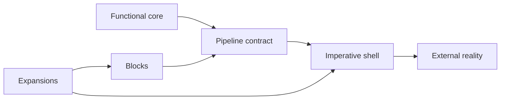

# Glossary

Use these definitions when reading or writing about TPF. They keep domain contracts, runtime
mechanics, boundary semantics, and packaging concepts distinct. The same JSON source drives the
inline term tooltips throughout the current documentation.

<GlossaryIndex />

For architectural context, continue with [Functional Core, Imperative Shell](/architecture/fcis).
