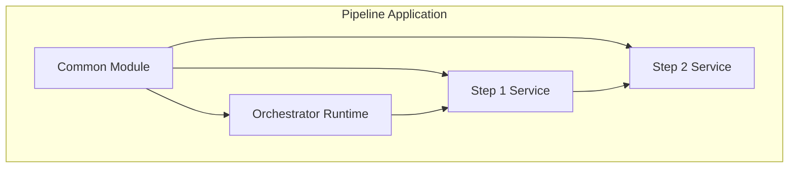

# Application Structure

This guide explains how to structure applications using The Pipeline Framework, following the patterns demonstrated in the CSV Payments reference implementation. The application structure is broken down into several key components that promote modularity and separation of concerns.

<Callout type="tip" title="Multiple Persistence Options">
The framework offers multiple persistence models including reactive (Panache) or virtual thread-based persistence models, allowing you to choose the best approach for your use case.
</Callout>

<Callout type="tip" title="Immutable Architecture">
The Pipeline Framework follows an immutable architecture where no database updates occur during pipeline execution - only appends/preserves. This ensures complete data integrity and provides a complete audit trail of all transformations.
</Callout>

<Callout type="tip" title="Visual Design with Canvas">
The Pipeline Framework includes a visual canvas designer at <a href="https://app.pipelineframework.org" target="_blank">https://app.pipelineframework.org</a> that allows you to visually plan and configure your application structure. You can create and connect services on the canvas, which then generates the corresponding configuration for your application.
</Callout>

## Overview

Applications built with The Pipeline Framework follow a modular architecture with clear separation of concerns. The framework promotes a clean division between:

1. **Orchestrator Runtime**: Coordinates the overall pipeline execution
2. **Backend Services**: Implement individual pipeline steps
3. **Common Module**: Shared domain objects, DTOs, and mappers
4. **Framework**: Provides the pipeline infrastructure

## Project Structure Overview

A typical pipeline application follows this structure. Note that the deployment module is not typically included as a module in the application's parent POM since it's used at build time with provided scope:

```text
my-pipeline-application/
├── pom.xml                           # Parent POM
├── common/                           # Shared components
│   ├── pom.xml
│   └── src/
│       └── main/java/
│           └── com/example/app/common/
│               ├── domain/           # Domain entities
│               ├── dto/              # Data transfer objects
│               └── mapper/           # Shared mappers
├── orchestrator-svc/                 # Pipeline orchestrator
│   ├── pom.xml
│   └── src/
│       └── main/java/
│           └── com/example/app/orchestrator/
│               ├── service/         # Pipeline execution service
│               └── OrchestratorApplication.java
├── step-one-svc/                     # First pipeline step
│   ├── pom.xml
│   └── src/
│       └── main/java/
│           └── com/example/app/stepone/
│               ├── service/         # Step implementation
│               └── mapper/          # Step-specific mappers
├── step-two-svc/                     # Second pipeline step
│   ├── pom.xml
│   └── src/
│       └── main/java/
│           └── com/example/app/steptwo/
│               ├── service/        # Step implementation
│               └── mapper/          # Step-specific mappers
└── pipeline-framework/              # Framework modules
    ├── runtime/                     # Runtime components (dependency)
    └── deployment/                  # Build-time components (provided scope)
```

## Architecture Diagram



## Key Components

### Common Module
The shared components module contains code that is used across all services in the pipeline application. This includes domain entities, data transfer objects, and shared mappers.

[Learn about Common Module Structure](./common-module-structure)

### Backend Services
Backend services implement individual pipeline steps with specific processing logic. Each service focuses on a single responsibility and can be independently configured.

[Learn about Code a Step](/guide/development/code-a-step)

### Orchestrator Runtime
The orchestrator runtime coordinates the overall pipeline execution, managing the flow of data through the pipeline steps and handling input/output operations.

[Learn about Orchestrator Runtime](/guide/development/orchestrator-runtime)

### Dependency Management
Proper dependency management is crucial for maintaining clean, modular pipeline applications. This includes parent POM configurations and service-specific dependencies.

[Learn about Dependency Management](/guide/build/dependency-management)

### Configuration
Configure pipeline behavior through application properties and environment-specific profiles to support different deployment scenarios.

[Learn about Configuration](/guide/application/configuration)

### Best Practices
Follow industry-standard practices for designing and implementing pipeline applications to ensure maintainability and reliability.

[Learn about Best Practices](/guide/operations/best-practices)
