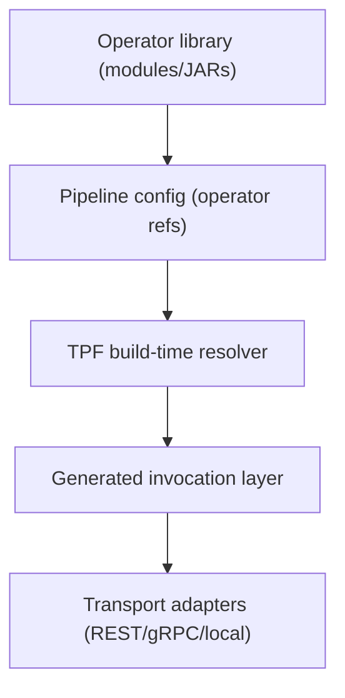

# Operators Architecture

## Architecture Snapshot

## Architectural Contract

- Operator references are declared in YAML as `fully.qualified.Class::method`.
- Resolution is build-time and index-driven (Jandex), not reflection-driven.
- Invalid operator contracts fail fast during build.

## Why This Design

- Deterministic builds: class/method/type failures are caught before runtime.
- Strong governance: platform teams can enforce operator shape and exposure policy centrally.
- Upgrade safety: normalization and category metadata provide stable downstream signals.

## Integration Pattern

1. Keep domain logic in dedicated services/modules.
2. Expose selected methods as operator entrypoints.
3. Bind pipeline sequencing in YAML.
4. Let TPF generate invocation and transport layer artifacts from build metadata.

## Example Topology Decision

- Team A owns a mature fraud library in a shared JAR.
- Team B wires it into a pipeline via `operator: com.acme.fraud.FraudOps::score`.
- Platform keeps transport and deployment concerns in TPF while the fraud team keeps logic ownership.

## Current Scope and Near-Term Evolution

- Current: unary operator invocation path is prioritized for delivery speed and platform safety.
- Next: expanded streaming/remote/polyglot pathways can build on the same metadata model.

## Design Considerations

- Prefer explicit method signatures and generic return types (`Uni<T>`/`Multi<T>` with type args).
- Avoid overload ambiguity for operator methods.
- Keep operator methods public and dependency-injection friendly.

## Related

- [Operators](/guide/build/operators)
- [Pipeline Compilation](/guide/build/pipeline-compilation)
- [Runtime Layouts](/guide/build/runtime-layouts/)
