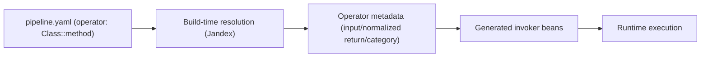

# Operators (YAML Build-Time)

This guide describes operator syntax and build-time behavior for pipeline authors.

Audience-specific companion pages:
- [Business Value View](/value/operators-value)
- [Architecture View](/guide/build/operators-architecture)
- [Developer View](/guide/development/operators)
- [Operations View](/guide/operations/operators)
- [Maintainer Internals](/guide/evolve/operators-internals)

## End-to-End Shape



## Operator Step Syntax

Use `operator` (or legacy alias `delegate`) in `fully.qualified.Class::method` format.
`delegate` is retained for backwards compatibility, may be removed in a future major release, and new configs should use `operator`.
Migration hint: replace `delegate: "fully.qualified.Class::method"` with `operator: "fully.qualified.Class::method"`.

```yaml
steps:
  - name: "Enrich Payment"
    operator: "com.acme.payment.PaymentOperators::enrich"
```

Rules:
- Exactly one `::` separator.
- Class and method segments must be non-blank.
- `operator` and `delegate` may both be set only when the values are identical; otherwise they must not both be set.

## Minimal Working Example

```java
package com.acme.payment;

import io.smallrye.mutiny.Uni;

public class PaymentOperators {
    public Uni<PaymentEnriched> enrich(PaymentIn input) {
        return Uni.createFrom().item(new PaymentEnriched(input.id()));
    }
}
```

```yaml
steps:
  - name: "Enrich Payment"
    operator: "com.acme.payment.PaymentOperators::enrich"
```

## Optional Flags

Delegated steps support:
- `exposeRest` (boolean, default `false`)
- `exposeGrpc` (boolean, default `false`)

Example:

```yaml
steps:
  - name: "Enrich Payment"
    operator: "com.acme.payment.PaymentOperators::enrich"
    exposeRest: true
    exposeGrpc: false
```

## Build-Time Resolution

At build time, TPF:
1. Parses delegated step references from YAML.
2. Resolves class/method from Jandex index (no reflection).
3. Validates method uniqueness and supported signature.
4. Infers operator category (`NON_REACTIVE` or `REACTIVE`).
5. Normalizes return type to reactive shape (`Uni<T>` or `Multi<T>` metadata). For Step 5, `Multi` normalization is recorded as metadata, but the Phase 1 invoker generator still rejects `Multi` and fails the build.

Validation fails fast when:
- class not found,
- method not found,
- multiple matching methods,
- method parameter count is unsupported,
- reactive type arguments are missing.

## Phase 1 Invoker Scope

Current generated invokers support unary operators only:
- input must be unary (not `Multi<T>`),
- normalized output must be `Uni<T>`.
- operator classes must be available on the build/runtime classpath (typically as project modules or JAR dependencies).

Streaming input/output shapes are intentionally out of scope for this phase and fail with descriptive build errors.

## Related

- [Pipeline Compilation](/guide/build/pipeline-compilation)
- [Configuration Reference](/guide/build/configuration/)
