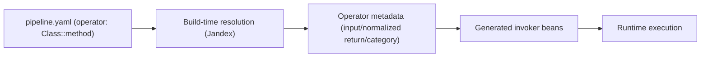

# Operators

This guide describes operator syntax and behavior for pipeline authors.

## End-to-End Shape



## Operator Step Syntax

Use `operator` in `fully.qualified.Class::method` format.

```yaml
steps:
  - name: "Enrich Payment"
    operator: "com.acme.payment.ExternalPaymentLibrary::enrich"
```

Rules:
- Exactly one `::` separator.
- Class and method segments must be non-blank.

Unary chain example (from the AI SDK PoC):

```yaml
steps:
  - name: "Chunk Document"
    operator: "com.example.ai.sdk.service.DocumentChunkingUnaryService::process"
  - name: "Embed Chunk"
    operator: "com.example.ai.sdk.service.ChunkEmbeddingService::process"
  - name: "Search Similar"
    operator: "com.example.ai.sdk.service.SimilaritySearchUnaryService::process"
  - name: "Build Prompt"
    operator: "com.example.ai.sdk.service.ScoredChunkPromptService::process"
  - name: "LLM Complete"
    operator: "com.example.ai.sdk.service.LLMCompletionService::process"
```

In the repo, this is captured as a real pipeline config at `ai-sdk/config/pipeline.yaml`.

Example:

```yaml
steps:
  - name: "Enrich Payment"
    operator: "com.acme.payment.ExternalPaymentLibrary::enrich"
```

## Build-Time Resolution

At build time, TPF:
1. Parses operator step references from YAML.
2. Resolves class/method from Jandex index (no reflection).
3. Validates method uniqueness and supported signature.
4. Infers operator category (`NON_REACTIVE` or `REACTIVE`).
5. Normalizes return type to reactive shape (`Uni<T>` or `Multi<T>` metadata).

Validation fails fast when:
- class not found,
- method not found,
- multiple matching methods,
- method parameter count is unsupported,
- reactive type arguments are missing.

## Invocation Scope

Current generated invokers support unary operators only:
- input must be unary (not `Multi<T>`),
- normalized output must be `Uni<T>`,
- operator classes must be available on the build/runtime classpath (typically as project modules or JAR dependencies).

Streaming input/output shapes currently fail with descriptive build errors.

## Related

- [Pipeline Compilation](/guide/build/pipeline-compilation)
- [Configuration Reference](/guide/build/configuration/)
- [Operator Reuse Strategy](/guide/design/operator-reuse-strategy)
- [Developing with Operators](/guide/development/operators)
- [Operator Runtime Operations](/guide/operations/operators)
- [Operator Generation Internals](/guide/evolve/operators-internals)
