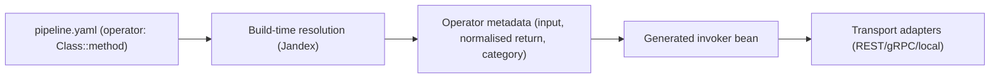

# Operators

Operators let you compose pipelines directly from existing Java methods declared in `pipeline.yaml`.

## End-to-End Shape


```mermaid
flowchart LR
  A["pipeline.yaml (operator: Class::method)"] --> B["Build-time resolution (Jandex)"]
  B --> C["Operator metadata (input, normalised return, category)"]
  C --> D["Generated invoker bean"]
  D --> E["Transport adapters (REST/gRPC/local)"]
```

## Operator Syntax

Use `operator` in `fully.qualified.Class::method` format.

```yaml
steps:
  - name: "Enrich Payment"
    operator: "com.acme.payment.ExternalPaymentLibrary::enrich"
```

Rules:
- Exactly one `::` separator.
- Class and method segments must be non-blank.
- Method must resolve uniquely in the indexed class hierarchy.

## Working Example

```yaml
steps:
  - name: "Chunk Document"
    operator: "com.example.ai.sdk.service.DocumentChunkingUnaryService::process"
  - name: "Embed Chunk"
    operator: "com.example.ai.sdk.service.ChunkEmbeddingService::process"
  - name: "Store Vector"
    operator: "com.example.ai.sdk.service.VectorStoreService::process"
  - name: "Search Similar"
    operator: "com.example.ai.sdk.service.SimilaritySearchUnaryService::process"
  - name: "Build Prompt"
    operator: "com.example.ai.sdk.service.ScoredChunkPromptService::process"
  - name: "LLM Complete"
    operator: "com.example.ai.sdk.service.LLMCompletionService::process"
```

This exact chain is available in [`ai-sdk/config/pipeline.yaml`](/ai-sdk/config/pipeline.yaml).

## Build-Time Contract

At build time, TPF:
1. Parses operator references from YAML.
2. Resolves class/method via Jandex (no reflection-based operator lookup).
3. Validates method contract (visibility, ambiguity, parameter shape).
4. Classifies operator category (`NON_REACTIVE` or `REACTIVE`).
5. Normalises return metadata to reactive shape (`Uni<T>` / `Multi<T>`).
6. Generates invocation beans for executable operators.

Validation fails fast in the following cases:
- class or method cannot be resolved,
- method contracts are invalid,
- unsupported return generic forms are used: nested generics (`List<List<Foo>>`), wildcard returns (`List<?>`, `List<? extends Foo>`), raw types (`List`), unresolved type variables (`T`), or generic arrays (`T[]`).

Simple concrete parameterised returns such as `List<Foo>` and `Map<String, Foo>` are supported.

## Current Invocation Scope

Generated invokers currently support unary execution:
- input: unary (not `Multi<T>`),
- output: unary `Uni<T>` path.

Streaming operator invocation is planned, but unary covers the current production path.

## Transport Orthogonality

Operator category does not select transport.

- REST transport: allowed for operator steps.
- gRPC transport: requires protobuf descriptors and mapper-compatible bindings for delegated/operator paths (see [Application Configuration](/guide/application/configuration)).
- Mapper-compatible bindings mean generated protobuf/service bindings must match delegated/operator routing conventions (field/service naming).
- This ensures RPC requests map to the intended operator implementation.
- `NON_REACTIVE` and `REACTIVE` categories follow the same transport prerequisites.

## Related

- [Pipeline Compilation](/guide/build/pipeline-compilation)
- [Application Configuration](/guide/application/configuration)
- [Developing with Operators](/guide/development/operators)
- [Operator Runtime Operations](/guide/operations/operators)
- [Operator Playbook](/guide/operations/operators-playbook)
- [Operator Troubleshooting](/guide/operations/operators-troubleshooting)
- [Operator Internals](/guide/evolve/operators-internals)
