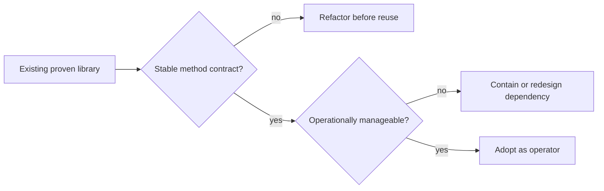

# Operator Reuse Strategy

This guide helps teams decide when to reuse existing libraries as operators in TPF pipelines.

## Decision Lens

## Why Reuse Operators

- Preserve validated domain logic.
- Reduce rewrite scope during migration.
- Keep ownership with domain teams while standardizing orchestration.

## Typical Fit

| Library Type | Typical Fit | Notes |
| --- | --- | --- |
| Rules/validation engines | High | Works well as unary operator methods. |
| Enrichment calculators | High | Clear input/output contracts. |
| Data transforms | High | Good for deterministic step boundaries. |
| AI client wrappers | Medium | Useful with explicit DTO/domain contracts. |
| Legacy facades | Medium | Good transition strategy, watch dependencies. |
| Heavy streaming engines | Lower (current) | Operator invoker generation is unary-focused today. |

## Readiness Checklist

- Library is packaged as a dependency (module/JAR).
- Public operator methods have unambiguous signatures.
- Contracts are versioned and testable.
- Classpath/index visibility is guaranteed at build time.
- For instance methods, class is CDI-manageable.

## Transport and Contract Notes

- Operator category (`NON_REACTIVE`/`REACTIVE`) should not drive transport selection.
- REST and local adapter paths can be composed around operator invokers.
- gRPC paths add prerequisites (descriptor + mapper-compatible bindings for delegated/operator flows).

## Portfolio Planning Pattern

1. Reuse core compute logic now.
2. Standardize orchestration/transport in TPF.
3. Incrementally replace internals where ROI is clear.

## Related

- [Operators](/guide/build/operators)
- [Operators Architecture](/guide/build/operators-architecture)
- [Runtime Topology Strategy](/guide/design/runtime-topology-strategy)
