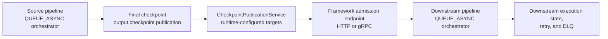

# Orchestrator Runtime

The orchestrator runtime coordinates step execution for a pipeline and exposes generated transport entrypoints.

## Runtime Modes

TPF supports two orchestrator runtime modes:

1. `SYNC` (default): in-process request/response execution.
2. `QUEUE_ASYNC`: queue-driven async job execution with durable execution state providers.

Set mode with:

```properties
pipeline.orchestrator.mode=SYNC
# or
pipeline.orchestrator.mode=QUEUE_ASYNC
```

## Transport Surfaces

Generated orchestrator endpoints are transport-native:

1. REST:
   - `POST /pipeline/run`
   - `POST /pipeline/run-async`
   - `GET /pipeline/executions/{executionId}`
   - `GET /pipeline/executions/{executionId}/result`
   - `POST /pipeline/ingest`
   - `GET /pipeline/subscribe`
2. gRPC:
   - `Run`
   - `RunAsync`
   - `GetExecutionStatus`
   - `GetExecutionResult`
   - `Ingest`
   - `Subscribe`
3. Function/Lambda:
   - `PipelineRunFunctionHandler`
   - `PipelineRunAsyncFunctionHandler`
   - `PipelineExecutionStatusFunctionHandler`
   - `PipelineExecutionResultFunctionHandler`

## Checkpoint Publication

Checkpoint publication is the reliable cross-pipeline handoff path for TPF orchestrators.

The source pipeline publishes its final checkpoint under a logical `publication` name.
The downstream pipeline declares an input subscription for that same logical name.
Runtime bindings decide where the publication is delivered; the pipeline IDL stays logical and does not embed concrete URLs, queue names, or broker topics.



Declare reliable handoff in `pipeline.yaml`:

```yaml
input:
  subscription:
    publication: "checkout.orders.ready.v1"
    mapper: "com.example.pipeline.mapper.ReadyOrderMapper"

output:
  checkpoint:
    publication: "checkout.orders.dispatched.v1"
    idempotencyKeyFields: ["orderId", "customerId", "readyAt"]
```

Runtime binding shape:

```properties
pipeline.handoff.bindings."<publication>".targets.<targetId>.kind=HTTP|GRPC

# HTTP targets
pipeline.handoff.bindings."<publication>".targets.<targetId>.base-url=...
pipeline.handoff.bindings."<publication>".targets.<targetId>.path=/pipeline/checkpoints/publish
pipeline.handoff.bindings."<publication>".targets.<targetId>.encoding=PROTO|JSON

# gRPC targets
pipeline.handoff.bindings."<publication>".targets.<targetId>.host=...
pipeline.handoff.bindings."<publication>".targets.<targetId>.port=9000
pipeline.handoff.bindings."<publication>".targets.<targetId>.plaintext=false
```

Quote publication keys when they contain dots or other characters that would otherwise be treated as nested property segments.

Operational model:

1. Build-time validation checks checkpoint boundary declarations and mapper compatibility.
2. Publication is generated into existing orchestrator ownership; there is no separate connector runtime or deployment role.
3. Subscriber admission is handled by framework-owned HTTP and gRPC checkpoint publication endpoints, not by runtime subscription discovery.
4. Protobuf-over-HTTP and gRPC use the same framework-owned checkpoint protobuf envelope for transport-native admission.
5. When incoming dispatch metadata already carries an idempotency key, publication preserves it. Otherwise, the runtime derives a deterministic handoff key from `output.checkpoint.idempotencyKeyFields`.
6. After downstream async admission succeeds, downstream retry, DLQ, and execution-state ownership remain fully orchestrator-owned on the subscriber side.

Current requirements and limits:

1. Reliable checkpoint handoff is supported only for `QUEUE_ASYNC` orchestrators.
2. `FUNCTION` pipelines do not support checkpoint publication or subscription.
3. Publication is defined at the final checkpoint boundary, not as a live mid-step tap.
4. Live `Subscribe` remains an observer surface and is not the reliable checkpoint handoff path.
5. TPF does not provide broker-backed publication targets such as `SQS` or `KAFKA` in this path.
6. TPF does not provide a generic publication re-drive consumer or a publication-specific durable plane.

Related guides:

- [Error Handling and Recovery](/guide/operations/error-handling)
- [Operators Playbook](/guide/operations/operators-playbook)
- [Runtime Layouts and Build Topologies](/guide/build/runtime-layouts/)

## Queue-Async Semantics

In `QUEUE_ASYNC` mode:

1. committed execution state transitions are exactly-once (OCC/conditional-write guarded),
2. dispatch and operator invocation are at-least-once,
3. duplicate invocation can occur and must be handled with idempotency keys,
4. streaming outputs are rejected for async execution in the current 26.2.x release line,
5. persisted protobuf payload metadata stores `_tpf_message` as the protobuf schema full name.

## Queue-Async Control Plane

Runtime provider choices:

1. `ExecutionStateStore`: `memory` (dev), `dynamo` (durable).
2. `WorkDispatcher`: `event` (in-process), `sqs` (durable queue).
3. `DeadLetterPublisher`: `log` (built-in fallback), `sqs` (durable DLQ).

Failure channel split:

1. Execution-level terminal failures use orchestrator DLQ (`DeadLetterPublisher`).
2. Step-level recover-and-continue failures use Item Reject Sink (`pipeline.item-reject.*`, `rejectItem` / `rejectStream`).

Execution lifecycle (one transition per worker claim):

```text
Submit(run-async)
  -> createOrGetExecution (dedupe key + execution row)
  -> enqueue work item
  -> worker claimLease (OCC + lease expiry)
  -> execute transition
  -> commit transition (markSucceeded / scheduleRetry / markTerminalFailure)
  -> enqueue next transition OR finalize terminal state
```

Recovery points:

1. crash before commit: queue redelivery replays the transition.
2. crash after commit before next enqueue: due sweeper re-dispatches.
3. worker death while leased: lease expiry allows takeover.

These guarantees are deterministic for orchestrator state, not for external side effects; downstream step boundaries must accept at-least-once invocation.

## Queue-Async HA Baseline

Use this as a minimum production baseline for queue-driven HA:

```properties
pipeline.orchestrator.mode=QUEUE_ASYNC
pipeline.orchestrator.state-provider=dynamo
pipeline.orchestrator.dispatcher-provider=sqs
pipeline.orchestrator.dlq-provider=sqs
pipeline.orchestrator.queue-url=https://sqs.eu-west-1.amazonaws.com/123456789012/tpf-work
pipeline.orchestrator.dlq-url=https://sqs.eu-west-1.amazonaws.com/123456789012/tpf-dlq
pipeline.orchestrator.idempotency-policy=CLIENT_KEY_REQUIRED
pipeline.orchestrator.strict-startup=true
```

Operational expectations for this baseline:

1. state transitions remain OCC-guarded and lease-claimed,
2. queue delivery and operator invocation remain at-least-once,
3. terminal dead-letter events are durable, not process-local log-only.

CI confidence for this baseline:

1. `SYNC` remains the default runtime mode and the fast baseline configuration.
2. `QUEUE_ASYNC` remains opt-in and requires explicit durable provider configuration.
3. the durable HA gate exercises the checkout `deliver-order` recovery path against `dynamo` + `sqs` semantics with `DynamoDB Local` + `ElasticMQ`.
4. this gate covers:
   - worker kill takeover,
   - sweeper redispatch,
   - duplicate submit determinism,
   - durable DLQ publication.

## Generated Structure

```text
orchestrator-svc/
├── src/main/java/<base>/orchestrator/service/
│   ├── PipelineRunResource.java
│   ├── OrchestratorGrpcService.java
│   ├── PipelineRunFunctionHandler.java
│   ├── PipelineRunAsyncFunctionHandler.java
│   ├── PipelineExecutionStatusFunctionHandler.java
│   └── PipelineExecutionResultFunctionHandler.java
└── src/main/resources/application.properties
```
