# Annotation Processor Architecture

This page links to the split guide:

- [Annotation Processor Guide: Overview](/guide/evolve/annotation-processor/)
- [Phases and Flow](/guide/evolve/annotation-processor/phases-and-flow)
- [Models and Bindings](/guide/evolve/annotation-processor/models-and-bindings)
- [Generation and Rendering](/guide/evolve/annotation-processor/generation-and-rendering)
- [Current Architecture](/guide/evolve/annotation-processor/current-architecture)

```mermaid
flowchart LR
    A["PipelineStepProcessor"] --> B["PipelineCompiler"]
    B --> P1["Discovery"]
    P1 --> P2["Model Extraction"]
    P2 --> P3["Runtime Mapping"]
    P3 --> P4["Semantic Analysis"]
    P4 --> P5["Target Resolution"]
    P5 --> P6["Binding Construction"]
    P6 --> P7["Generation"]
    P7 --> P8["Infrastructure"]
```

Related:

- [Compiler Pipeline Architecture](compiler-pipeline-architecture.md)
