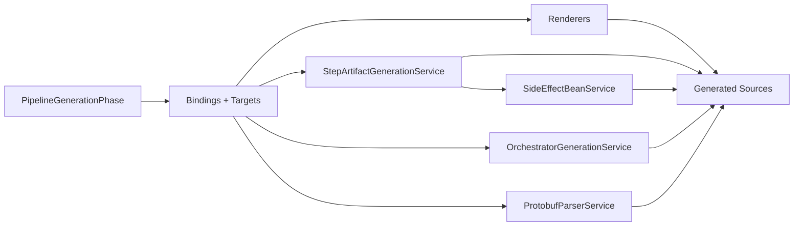

# Current Architecture

This page summarizes the current structure of the annotation processor in `framework/deployment`.

## Active Compiler Path

The canonical processor path is:

1. `PipelineDiscoveryPhase`
2. `ModelExtractionPhase`
3. `PipelineRuntimeMappingPhase`
4. `PipelineSemanticAnalysisPhase`
5. `PipelineTargetResolutionPhase`
6. `PipelineBindingConstructionPhase`
7. `PipelineGenerationPhase`
8. `PipelineInfrastructurePhase`

This chain is wired in `PipelineStepProcessor.init(...)` and executed by `PipelineCompiler`.

## Active Components

Active in canonical path:

- `PipelineStepProcessor`
- `PipelineCompiler`
- `PipelineCompilationContext`
- the eight phases listed above

## Phase Collaborators

Each phase with complex orchestration delegates to focused, stateless collaborators injected via constructor:

| Phase | Collaborators |
| --- | --- |
| PipelineDiscoveryPhase | `DiscoveryPathResolver`, `DiscoveryConfigLoader`, `TransportPlatformResolver` |
| ModelExtractionPhase | `PipelineStepIRExtractor`, `ModelContextRoleEnricher` |
| PipelineTargetResolutionPhase | `ClientRoleTargetResolutionStrategy`, `ServerRoleTargetResolutionStrategy` |
| PipelineBindingConstructionPhase | `GrpcRequirementEvaluator`, `StepBindingConstructionService` |

## Retained Non-Canonical Phases

The canonical chain is the only active execution path. Some earlier phase-style classes are retained for compatibility/reference and are not part of `PipelineStepProcessor.init(...)`:

- `ConfigurationLoadingPhase`
- `TargetResolutionPhase`
- `BindingResolutionPhase`

## Generation Dispatch Model

The generation subsystem contains:

- per-target generator abstractions (`TargetGenerator`, `GenerationRequest`, concrete `*TargetGenerator` classes)
- domain services (`StepArtifactGenerationService`, `SideEffectBeanService`, `ProtobufParserService`, `OrchestratorGenerationService`)
- the generation phase orchestrator (`PipelineGenerationPhase`)

## Package Map

- `processor/`: processor facade and compiler orchestration
- `processor/ir/`: semantic and binding model types
- `processor/phase/`: phase implementations and generation services/policies
- `processor/extractor/`: annotation -> IR extraction
- `processor/config/`: YAML and option loaders
- `processor/renderer/`: JavaPoet renderers
- `processor/util/`: path, metadata, naming, binding helpers
- `processor/mapping/`: runtime mapping resolver/model
- `processor/validator/`: validation helpers

## Guardrails

- Keep semantic IR transport-agnostic.
- Keep transport-specific realization in bindings/renderers/services.
- Keep policy decisions centralized (semantic analysis + generation policy).
- Keep phase responsibilities isolated and explicit.
