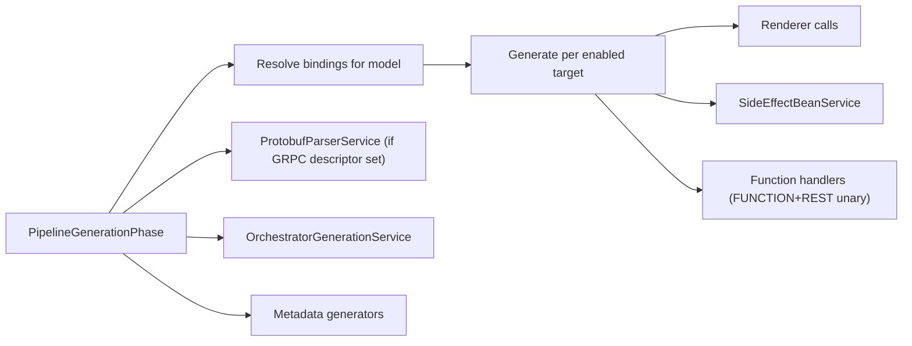

# Generation and Rendering

## Generation Entry

`PipelineGenerationPhase` is the generation orchestrator phase.

It consumes:

- `stepModels`
- `rendererBindings`
- descriptor set
- platform/transport flags
- role/output path context

It emits:

- target-specific source artifacts
- orchestrator artifacts
- metadata (`roles`, `platform`, `order`, `telemetry`, client properties)

## Renderers

Representative renderer classes:

- `GrpcServiceAdapterRenderer`
- `ClientStepRenderer`
- `LocalClientStepRenderer`
- `RestResourceRenderer`
- `RestClientStepRenderer`
- `RestFunctionHandlerRenderer`
- `Orchestrator*Renderer` family

## Domain Services Used During Generation

- `SideEffectBeanService`
- `ProtobufParserService`
- `OrchestratorGenerationService`
- `GenerationPathResolver`
- `GenerationPolicy`

## Target-Generator Abstraction

`TargetGenerator` and concrete implementations exist and are maintained:

- `GrpcServiceTargetGenerator`
- `ClientStepTargetGenerator`
- `LocalClientStepTargetGenerator`
- `RestResourceTargetGenerator`
- `RestClientStepTargetGenerator`

Generation request contract:

- `GenerationRequest`

## Dispatch Model

Generation currently uses a hybrid dispatch model:

- Dedicated `TargetGenerator` classes are present and tested.
- `PipelineGenerationPhase` still contains substantial in-phase generation orchestration.

This is the current architecture in this version of the framework.

## Generation Flow

## Naming and Path Utilities

Utilities keeping naming/path rules consistent:

- `RestPathResolver`
- `ResourceNameUtils`
- `DtoTypeUtils`

These are important for keeping renderer and generator outputs aligned.
