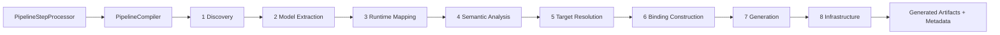

# Annotation Processor Guide

This guide describes the current annotation processor architecture in `framework/deployment`.

It focuses on the phased compiler path that replaced the old monolithic processor.

## Architecture Overview

The processor is organised as a compiler-style phase pipeline:

```mermaid
flowchart LR
    A["PipelineStepProcessor"] --> B["PipelineCompiler"]
    B --> P1["1 Discovery"]
    P1 --> P2["2 Model Extraction"]
    P2 --> P3["3 Runtime Mapping"]
    P3 --> P4["4 Semantic Analysis"]
    P4 --> P5["5 Target Resolution"]
    P5 --> P6["6 Binding Construction"]
    P6 --> P7["7 Generation"]
    P7 --> P8["8 Infrastructure"]
    P8 --> O["Generated Artifacts + Metadata"]
```

## Guide Contents

- [Phases and Flow](./phases-and-flow.md)
- [Models and Bindings](./models-and-bindings.md)
- [Generation and Rendering](./generation-and-rendering.md)
- [Current Architecture](./current-architecture.md)

## Entry Points

- `PipelineStepProcessor`: annotation processor facade.
- `PipelineCompiler`: phase orchestrator.
- `PipelineCompilationContext`: mutable phase handoff contract.

## Current Internal-Service Handling

Internal `service:` steps can now be authored against reactive service interfaces, materializing blocking service interfaces, or the incremental blocking iterator service interface.

- Model extraction classifies the authored service contract family and validates YAML cardinality against it.
- Model extraction emits build-time warnings for materializing blocking streaming contracts and points users toward `BlockingIteratorService` for incremental `1 -> N` cases.
- Target resolution adds a generated reactive bridge target for blocking-authored internal services.
- Transport renderers still target reactive service contracts. They inject the generated bridge instead of the authored blocking service directly.
- The generated bridge adapts `List`-based blocking contracts with materializing helpers and adapts `BlockingIteratorService` with iterator-to-`Multi` offload helpers.

This keeps REST, gRPC, and LOCAL generation on one transport contract family while still allowing synchronous user code in internal services, and preserves FUNCTION as a platform-generation path.

## Scope

This guide is canonical documentation for the current framework implementation.
