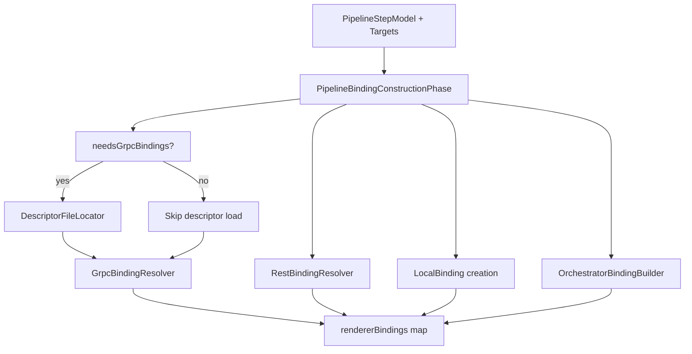

# Models and Bindings

## Core Semantic Model

`PipelineStepModel` is the primary IR unit.

It captures semantic step intent (name, package, type mappings, streaming shape, execution mode, deployment role, generation targets) without transport-specific adapter implementation details.

Related IR types:

- `StreamingShape`
- `GenerationTarget`
- `ExecutionMode`
- `DeploymentRole`
- `TypeMapping`

## Compilation Context Contract

`PipelineCompilationContext` is the phase handoff object and contains:

- discovered models: `stepModels`, `aspectModels`, `orchestratorModels`
- mapping state: `runtimeMapping`, `runtimeMappingResolution`
- mode state: transport + platform
- binding state: `rendererBindings`
- infra state: output roots, module dir/name
- generation state: descriptor set, plugin/orchestrator flags

## Binding Types

Bindings are transport/rendering realization objects:

- `GrpcBinding`
- `RestBinding`
- `LocalBinding`
- `OrchestratorBinding`

Bindings are produced in `PipelineBindingConstructionPhase` and stored in `rendererBindings` by key:

- `<service>_grpc`
- `<service>_rest`
- `<service>_local`
- `orchestrator`

## Binding Construction Flow

## Mapping + Role Interplay

- Runtime mapping can filter which step models remain for a module.
- Target resolution then derives target sets from `(deploymentRole, transportMode)`.
- Binding construction only builds bindings required by those targets.

This keeps expensive binding work scoped to relevant artifacts.
