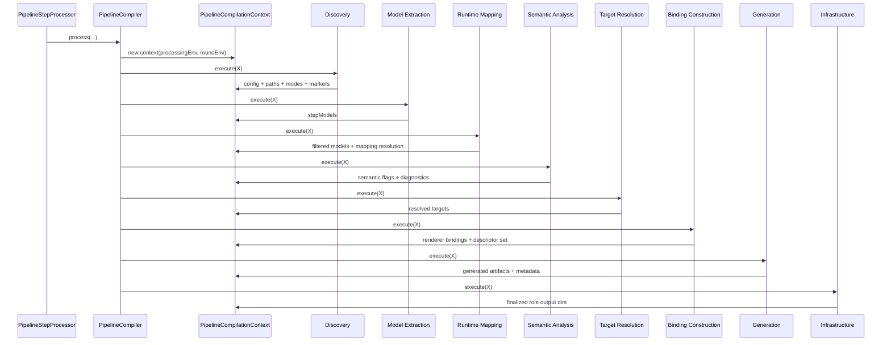

# Phases and Flow

## Ordered Phase Chain

Configured in `PipelineStepProcessor.init`:

1. `PipelineDiscoveryPhase`
2. `ModelExtractionPhase`
3. `PipelineRuntimeMappingPhase`
4. `PipelineSemanticAnalysisPhase`
5. `PipelineTargetResolutionPhase`
6. `PipelineBindingConstructionPhase`
7. `PipelineGenerationPhase`
8. `PipelineInfrastructurePhase`

## Responsibility Matrix

| Phase | Primary Responsibility | Key Outputs in Context |
| --- | --- | --- |
| Discovery | Load config, resolve module paths, detect plugin/orchestrator markers | module paths, platform/transport mode, aspect/template/orchestrator models |
| Model Extraction | Build `PipelineStepModel` IR from annotations and template-derived steps | `stepModels` |
| Runtime Mapping | Apply runtime placement/module filtering | filtered `stepModels`, mapping resolution |
| Semantic Analysis | Policy checks and semantic constraints | orchestrator flag, diagnostics |
| Target Resolution | Map role+transport to target sets | updated `enabledTargets`, `resolvedTargets` |
| Binding Construction | Build renderer-facing bindings | `rendererBindings`, descriptor set |
| Generation | Emit sources/metadata | generated artifacts + metadata resources |
| Infrastructure | Ensure output directories and filesystem context | role directories under generated-sources root |

## Data Flow

## Notes

- The phase chain is explicit and deterministic.
- Failures are reported with phase names via `PipelineCompiler`.
- Each phase is intended to keep concern boundaries strict.
