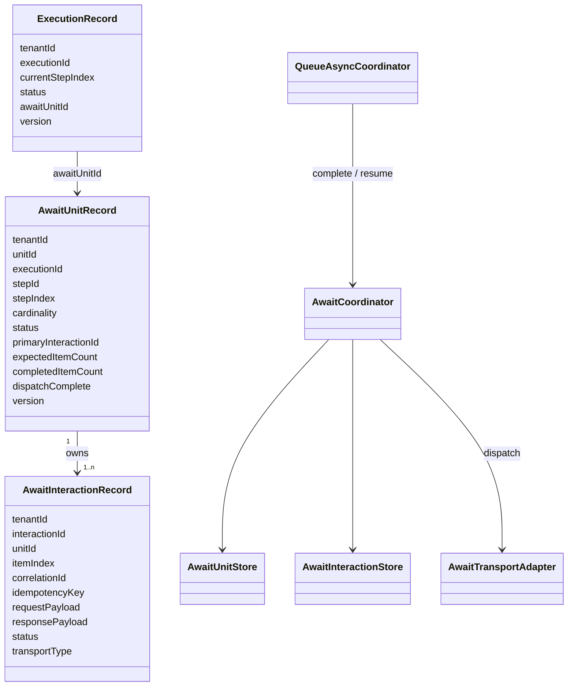

# Await Unit Runtime

Await units are the durable suspend/resume model for `kind: await` steps. The unit is the interaction boundary TPF owns: it records what was dispatched, what completion is required, and what payload should be replayed when the owning execution resumes.

This guide is implementation-facing. Application-facing usage lives in [Await Boundaries](/guide/development/orchestrator-runtime/await).

## Guide Pages

1. [Model](/guide/evolve/await-unit-runtime/) explains the durable records and cardinality semantics.
2. [Sequences](/guide/evolve/await-unit-runtime/sequences) shows unary, stream, aggregate, timeout, and resume flows.
3. [Patterns](/guide/evolve/await-unit-runtime/patterns) explains the architectural patterns and why the unit model fixed the design.
4. [Operations And Debt](/guide/evolve/await-unit-runtime/operations-and-debt) covers checkpoint handoff, limitations, and tracked follow-up work.

## Core Model

The key split is:

1. `AwaitUnitRecord`: one durable interaction unit for an authored await step at a specific execution and step index.
2. `AwaitInteractionRecord`: one externally visible interaction that can be queried, dispatched, completed, timed out, or correlated by transport.
3. `ExecutionRecord.awaitUnitId`: the parked continuation pointer used while the execution is `WAITING_EXTERNAL`.

`AwaitUnitRecord` is the source of truth for completion of the authored await boundary. `AwaitInteractionRecord` is the transport-facing projection. That distinction prevents execution state, dispatch strategy, and step cardinality from collapsing into one ambiguous record.

## Cardinality As Unit Shape

Cardinality defines the unit TPF must durably replay.

| Authored cardinality | Unit shape | Interactions | Resume input |
| --- | --- | --- | --- |
| `ONE_TO_ONE` on one input | one input, one output | one primary interaction | scalar output |
| `ONE_TO_ONE` over a stream | one unit owning ordered item interactions | one interaction per input item | ordered list/stream of completed item outputs |
| `ONE_TO_MANY` | one input, many output items | one primary interaction | materialized output unit replayed as a stream |
| `MANY_TO_ONE` | many input items, one output | one primary interaction after input materialization | scalar output |
| `MANY_TO_MANY` | many input items, many output items | one primary interaction after input materialization | materialized output unit replayed as a stream |

The unit, not an ad hoc dispatch mode, decides what gets snapshotted and replayed. For aggregate cardinalities, v1 materializes the input and/or output unit. If downstream replay fails halfway through a materialized output unit, TPF restarts replay of that whole output unit. It does not claim exactly-once progress inside the unit.
