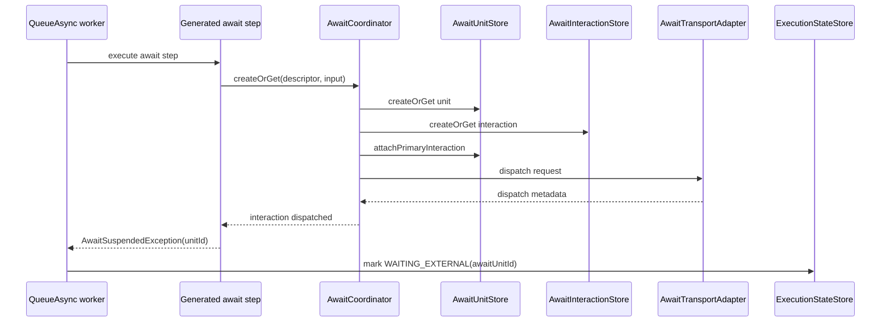
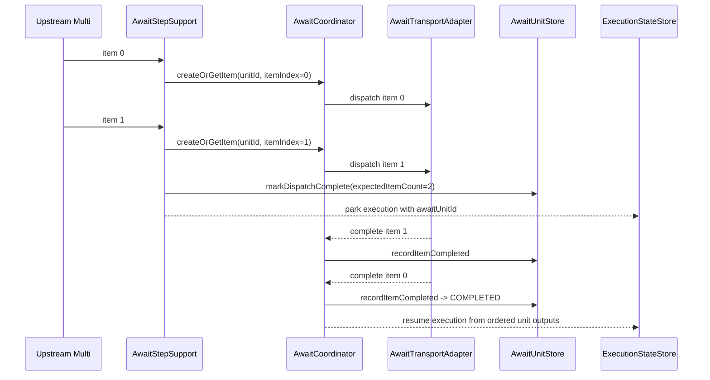
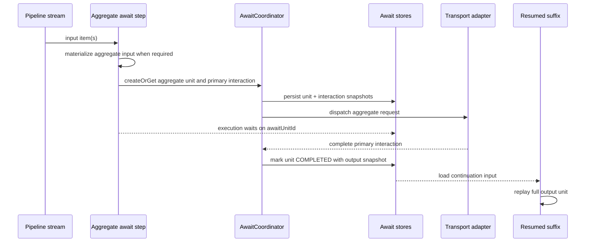
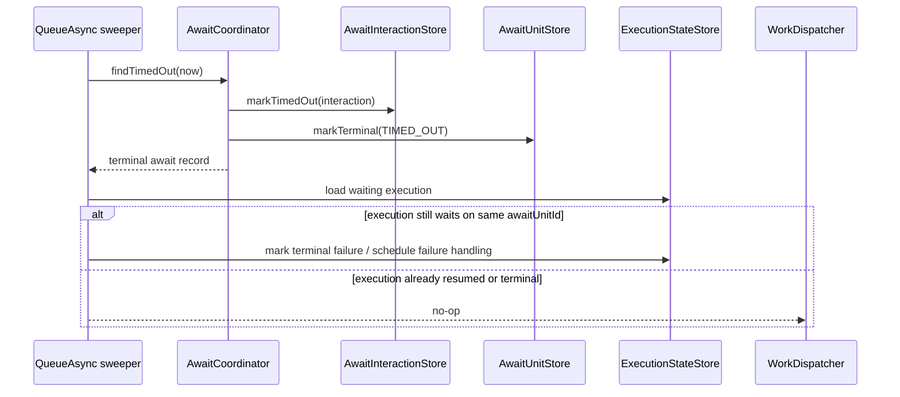

# Await Unit Sequences

These diagrams show how the await unit model parks and resumes `QUEUE_ASYNC` executions.

## Unary Await

Suspension is normal control flow. It should not be logged as a failed step or routed through recovery as an exception.

## One-To-One Over Stream

`ONE_TO_ONE` over a `Multi` is a stream of unary awaits inside one owning unit. This is the model used by `csv-payments`: each `PaymentRecord` is one input unit and each provider completion is one output unit.

Completion may arrive out of order. Replay preserves input order by reading completed item interactions by `itemIndex`.

## Aggregate Unit

`ONE_TO_MANY`, `MANY_TO_ONE`, and `MANY_TO_MANY` are aggregate interaction units. The runtime materializes the relevant side of the boundary so replay has one stable unit to restart.

This deliberately avoids partial-output checkpointing inside the interaction unit. TPF owns retry/replay of the unit as a whole.

## Timeout And Resume

Completion admission follows the opposite path: complete the interaction, update the unit, and resume the execution only when the unit is complete.
