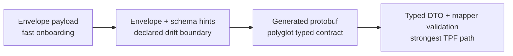

# Adoption And Slices

This page captures the product value and implementation ordering for brokered boundary work.

## Value Proposition

Brokered boundaries are attractive because many organisations already trust Kafka operationally. They have teams, dashboards, retention policies, ACLs, incident playbooks, and scaling patterns around it.

The TPF value proposition is not "you no longer need brokers." It is:

- Application teams do not have to encode pipeline semantics as topic naming, offset handling, Redis key conventions, and sidecar logic.
- Platform teams can keep trusted broker infrastructure where it is useful.
- TPF keeps the execution model explicit: authored steps, typed or envelope contracts, deterministic lineage, replay topology, and generated/runtime validation.
- Self-hosted TPF deployments can keep backing broker/cache choices explicit while preserving one TPF model for application code.

This lowers adoption risk for enterprise users without weakening the core TPF model.

## Adoption Ramp

Platform teams can start with a loose envelope where adoption matters, then move stable domains toward generated protobuf or typed DTO contracts.

## Candidate Slices

Prefer these implementation slices if this work becomes active:

1. Kafka-backed checkpoint publication/subscription.
2. Kafka-backed await transport.
3. Kafka-backed transition-worker dispatcher using the existing command/result envelope.
4. Protobuf-backed external step-host contract generation for non-Java implementations.
5. Optional envelope compatibility lane with strict TPF control metadata and loose payload.
6. Brokered step-host dispatch only after the earlier boundary types are proven.

Avoid starting with a broad "Kafka transport" PR. That would mix unrelated risks and blur TPF semantics.

## Non-Goals

Envelope and brokered boundary work should not:

1. replace typed TPF as the default,
2. make mapper pair validation irrelevant for typed paths,
3. hide drift by treating all payloads as arbitrary objects,
4. turn Kafka offsets into TPF replay state,
5. force users to operate Kafka when local, REST, gRPC, or SQS runtime boundaries are enough,
6. introduce a second workflow engine inside TPF.

## Guardrails

Preserve these invariants:

1. Typed TPF remains the default path.
2. Envelope compatibility is explicit and weaker than typed DTO mode.
3. Dispatch policy is independent from payload policy.
4. Broker-backed dispatch does not move core validation from build time to runtime when typed contracts are available.
5. Kafka, SQS, REST, gRPC, and local substrates are implementation choices under TPF-owned boundaries.
6. Replay viewer and telemetry interpret TPF events, not broker offsets.
7. Runtime layout and build topology remain distinct from broker topology.
