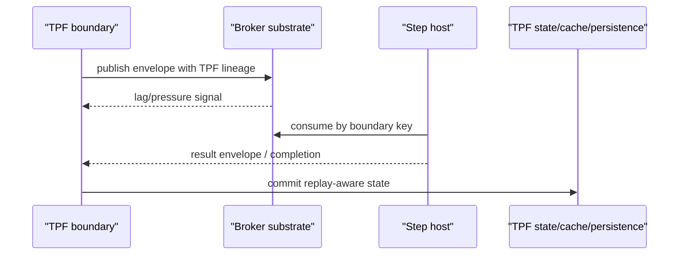

# Dispatch Substrates

Dispatch substrate is the mechanism used to move a TPF command, payload, or envelope across a boundary.

It is not the same decision as transport mode, platform mode, runtime layout, or payload policy.

## Substrate Matrix

| Substrate | Best fit | Caution |
| --- | --- | --- |
| Local | tests, demos, monoliths, low-friction adoption | no crash-surviving handoff by itself |
| REST | simple request/response step hosts and transition workers | immediate call semantics; not durable buffering |
| gRPC | efficient typed request/response and protobuf contracts | still immediate unless paired with await/checkpoint semantics |
| SQS | durable coordinator dispatch and DLQ-oriented cloud deployments | weaker ordering/grouping model than Kafka |
| Kafka | enterprise broker backbone, durable fan-out/fan-in pressure boundaries, checkpoint streams | do not treat offsets as TPF replay semantics |

## Not `transport: KAFKA`

Do not flatten Kafka into the same top-level decision as REST or gRPC.

REST and gRPC are immediate call transports. Kafka is a brokered dispatch substrate with different timing, correlation, retry, and ownership implications.

Prefer boundary-specific configuration shapes:

```yaml
kind: await
await:
  transport:
    type: kafka
```

```yaml
checkpoint:
  publish:
    target:
      kind: kafka
```

The checkpoint snippet is illustrative only. Current supported checkpoint handoff target configuration uses `pipeline.handoff.bindings.<publication>.targets.<target>.*`, and broker-backed `KAFKA` publication targets are not supported yet.

```properties
pipeline.orchestrator.dispatcher-provider=kafka
```

These examples are design direction, not committed public API.

## Relationship To Existing Work

This guide extends existing boundary seams:

- [Step-Aware Invocation Runtime](/guide/evolve/durable-coordinator/boundary-invocation-model) defines shared invocation points for step, transition-worker, and transport-boundary execution.
- [Worker Protocols](/guide/evolve/durable-coordinator/worker-protocols) already model transition-worker command/result envelopes over local, REST, gRPC, and SQS.
- [Await Unit Runtime](/guide/evolve/await-unit-runtime/) defines durable suspend/resume semantics that can use different transports.
- [Checkpoint Handoff](/guide/development/orchestrator-runtime/checkpoint-handoff) is the natural user-facing shape for pipeline-to-pipeline publication.
- [Runtime Core Decoupling](/guide/evolve/runtime-core-decoupling) keeps runtime-adapter concerns out of core semantics.

Kafka should extend these seams. It should not introduce an independent workflow engine inside TPF.

## Pressure And Replay



Broker retention can help recover delivery. TPF replay still needs step identity, contract version, item lineage, fan-in completion, and cache/persistence policy.
