# Compiler Pipeline Architecture

This page documents the canonical compiler pipeline used by the annotation processor in `framework/deployment`.

For detailed internals, use the split guide:
- [Annotation Processor Guide](/guide/evolve/annotation-processor/)
- [Phases and Flow](/guide/evolve/annotation-processor/phases-and-flow)
- [Models and Bindings](/guide/evolve/annotation-processor/models-and-bindings)
- [Generation and Rendering](/guide/evolve/annotation-processor/generation-and-rendering)
- [Current Architecture](/guide/evolve/annotation-processor/current-architecture)

## Pipeline Overview

```mermaid
flowchart LR
    A["PipelineStepProcessor"] --> B["PipelineCompiler"]
    B --> P1["1 Discovery"]
    P1 --> P2["2 Model Extraction"]
    P2 --> P3["3 Runtime Mapping"]
    P3 --> P4["4 Semantic Analysis"]
    P4 --> P5["5 Target Resolution"]
    P5 --> P6["6 Binding Construction"]
    P6 --> P7["7 Generation"]
    P7 --> P8["8 Infrastructure"]
    P8 --> O["Generated Sources + Metadata"]
```

## Canonical Phase Chain

1. `PipelineDiscoveryPhase`
2. `ModelExtractionPhase`
3. `PipelineRuntimeMappingPhase`
4. `PipelineSemanticAnalysisPhase`
5. `PipelineTargetResolutionPhase`
6. `PipelineBindingConstructionPhase`
7. `PipelineGenerationPhase`
8. `PipelineInfrastructurePhase`

This chain is wired by `PipelineStepProcessor` and executed by `PipelineCompiler`.

## Responsibilities by Layer

- Discovery and model extraction: collect annotated elements and build IR models.
- Runtime mapping and semantic analysis: derive transport/runtime behavior and policy decisions.
- Target resolution and binding construction: map each model to generation targets and renderer-ready bindings.
- Generation and infrastructure: emit transport artifacts and metadata to the proper module/output paths.

## Architecture Guardrails

- Keep semantic IR transport-agnostic.
- Keep transport-specific logic in bindings/renderers/generation services.
- Keep policy decisions centralized in semantic analysis and generation policy components.
- Keep phase boundaries explicit; avoid cross-phase leakage.

## Related Compatibility Pages

- [Annotation Processor Architecture (Compat)](/guide/evolve/annotation-processor-architecture)
