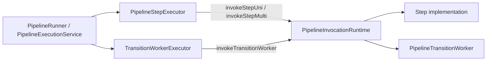

# Step-Aware Invocation Runtime

The durable coordinator now has two explicit invocation entrypoints that must not drift into separate runtime models:

| Runtime entrypoint | What it executes | Current proof point |
| --- | --- | --- |
| `invokeStepUni` / `invokeStepMulti` | a pipeline step, including generated client steps and hand-written services | `PipelineStepExecutor` |
| `invokeTransitionWorker` | a bounded queue-async continuation dispatched by the coordinator | `TransitionWorkerExecutor` |

The important correction is that worker execution is not the only boundary worth modeling. Every pipeline step already crosses a framework-managed invocation seam where TPF installs pipeline context, await context, replay telemetry, cache policy, and failure handling.

## Runtime Shape

`PipelineInvocationRuntime` is a small internal wrapper. It is not a public protocol and it does not introduce new config keys.

For step invocation, the runtime owns context installation and restoration. Existing step telemetry, replay capture, cache policy, and cardinality handling remain in `PipelineStepExecutor`.

For transition-worker invocation, the runtime owns invocation lifecycle and duration timing. Admission, leases, retry/DLQ, await parking, and result commits remain in `QueueAsyncCoordinator`.

## Why This Slice Exists

The earlier worker-only policy proposal was too narrow. It would have created new names for worker mechanics while postponing the real step infrastructure.

This slice instead proves the shared model on both sides:

1. `PipelineStepExecutor` routes step execution through the shared invocation runtime.
2. `TransitionWorkerExecutor` routes worker execution through the same runtime.
3. Public configuration remains unchanged.
4. Generated REST/gRPC client renderers remain unchanged.

That gives TPF one internal vocabulary for framework-managed invocation without pretending that steps and workers have the same ownership rules.

## Ownership Boundaries

| Concern | Owner |
| --- | --- |
| Step cardinality, cache policy, replay telemetry, per-step parallelism | `PipelineStepExecutor` |
| Pipeline and await context installation during invocation | `PipelineInvocationRuntime` |
| Worker admission and saturation before lease claim | `QueueAsyncCoordinator` + `TransitionWorkerExecutor` |
| Worker duration and execution lifecycle | `PipelineInvocationRuntime` |
| Execution retry budget, DLQ, await parking, and terminal state | `QueueAsyncCoordinator` |
| Worker protocol wire shape and signatures | REST/gRPC/SQS worker adapters |

## What Did Not Change

No public config was renamed or added:

| Existing config | Status |
| --- | --- |
| `pipeline.defaults.*` | unchanged |
| `pipeline.step.*` | unchanged |
| `pipeline.max-concurrency` | unchanged |
| `pipeline.orchestrator.worker.*` | unchanged |

No generated client code was rewritten. Generated REST and gRPC client steps still implement ordinary `Step*` interfaces and are covered because they pass through `PipelineStepExecutor`.

## Follow-Up Direction

Future work can decide whether generated transport clients need more explicit boundary metadata, but that should be driven by a concrete need such as transport-level auth, timeout standardization, or per-boundary observability.

Do not add another worker-only abstraction layer unless it also explains how step execution benefits.
