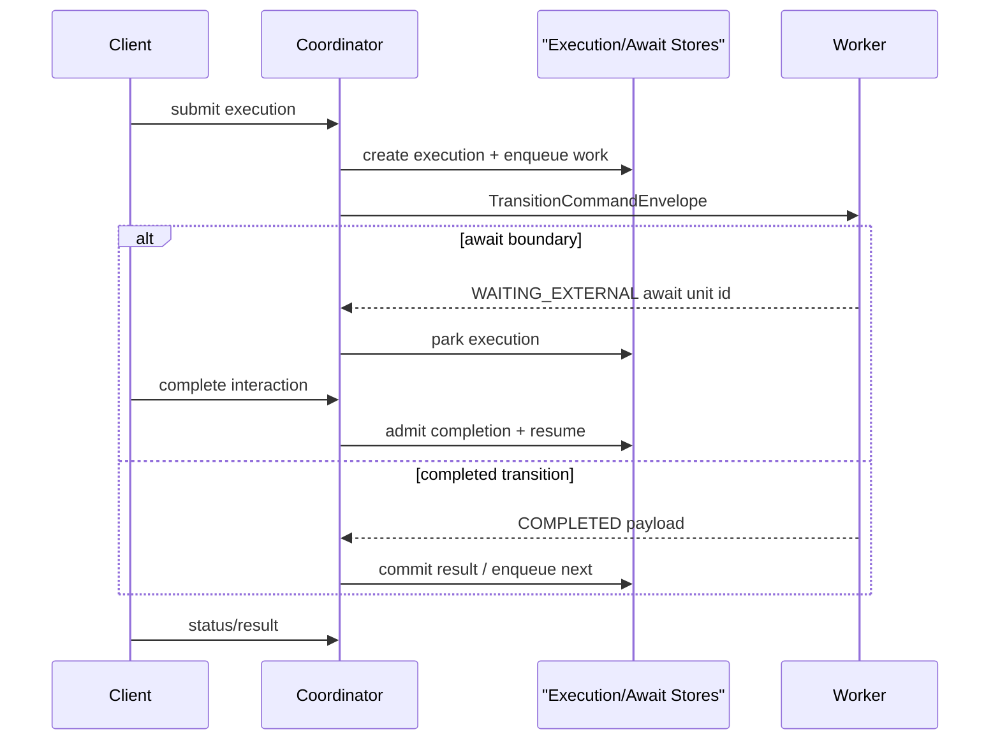

# Durable Coordinator

The durable coordinator is the self-hostable control-plane boundary for `QUEUE_ASYNC` execution.

It owns execution state, leases, retry/DLQ, await units, release activation, worker dispatch, and status/result APIs. Step code still runs in workers: local in-process workers, REST workers, gRPC workers, or SQS request/reply workers.

This section is implementation-facing. Application usage remains in [Orchestrator Runtime](/guide/development/orchestrator-runtime/). The first runnable reference is `examples/restaurant-approval/self-host`.

## Current Shape

| Area | Current state |
| --- | --- |
| Execution state | `ExecutionRecord` with leases, attempts, status, result, pinned pipeline/contract/release identity |
| Await state | `AwaitUnitRecord` plus pending/completion interaction records |
| Worker boundary | portable command/result envelopes over local, REST, gRPC, or SQS |
| Contract/release identity | generated `META-INF/pipeline/pipeline-contract.json`, release descriptor registration, activation, execution pinning, and worker identity validation |
| Self-host path | batteries-included local coordinator using the restaurant approval example |

## Guides

1. [Worker Protocols](/guide/evolve/durable-coordinator/worker-protocols) explains local, REST, gRPC, and SQS transition workers.
2. [Step-Aware Invocation Runtime](/guide/evolve/durable-coordinator/boundary-invocation-model) explains the shared invocation seam used by pipeline steps and transition workers.
3. [Contract And Release Identity](/guide/evolve/durable-coordinator/bundle-contract) explains generated contracts, release activation, and execution pinning.
4. [Pipeline Contract And Release Model](/guide/evolve/durable-coordinator/pipeline-contract-release-model) describes contract/release descriptors, artifacts, deployment plans, and drift detection.
5. [Runtime Boundaries And Performance](/guide/evolve/durable-coordinator/runtime-boundaries-performance) explains runtime mapping, patterns, package boundaries, and hot-path guardrails.
6. [Local APIs](/guide/evolve/durable-coordinator/local-apis) documents the current default-disabled control-plane and admin APIs.
7. [Self-Hosted Deployment](/guide/evolve/durable-coordinator/self-hosted-deployment) gives the production-ish self-host topology, configuration, and operator runbooks.
8. [Self-Hosted Milestone](/guide/evolve/durable-coordinator/self-hosted-milestone) tracks what remains after the current self-host proof.

## Limits

The current coordinator path does not dynamically load registered JAR code. Workers must already host matching pipeline code and validate active `pipelineId + contractVersion + releaseVersion` identity.

The Dynamo release registry provides multi-coordinator release metadata, while the file-backed registry remains local/dev oriented. Built-in DLQ replay, worker lifecycle, and append-only execution/await state remain follow-up runtime substrate work.
