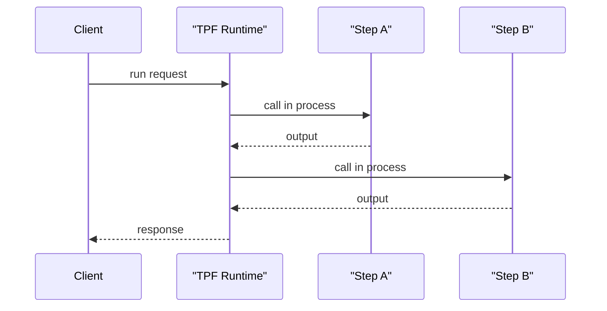
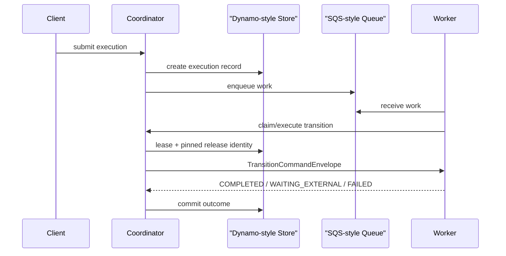
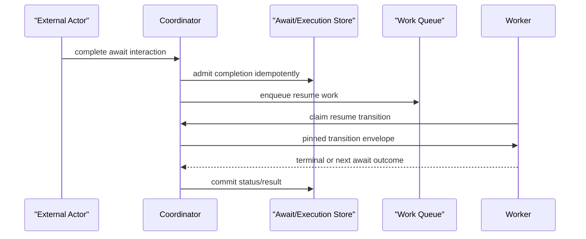
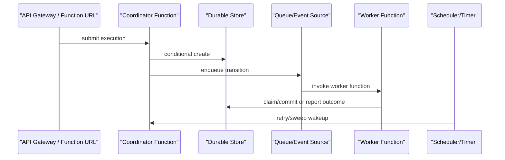

# Runtime Boundaries And Performance

TPF has more than one runtime shape because latency, durability, and operations are different optimization targets.

The release runtime and durable coordinator work add control-plane concepts, but they do not make every execution cross a new network or artifact boundary. The relevant performance question is always: **where is the durable boundary, and how often does the pipeline cross it?**

For the role split behind the terms coordinator, transition worker, and `orchestrator-svc`, start with [Coordinator And Worker Topology](/guide/evolve/durable-coordinator/coordinator-worker-topology).

## Runtime Mode Positioning

Durability is an explicit boundary cost, not a free upgrade over synchronous execution.

| Need | Best current TPF shape | Why |
| --- | --- | --- |
| Lowest-latency request/response | `SYNC` with local/in-process steps, often one process | No durable-store claim, queue dispatch, worker protocol hop, or external resume boundary. |
| Local development and demos | One-process `QUEUE_ASYNC` with local worker | Proves durable semantics locally without a remote worker hop, but memory/event providers are not crash-surviving HA. |
| Crash-surviving self-host HA | `COMPUTE + QUEUE_ASYNC` coordinator with durable stores and remote workers | Pays coordination cost for execution records, leases, await resume, release pinning, DLQ/re-drive, and operator visibility. |
| Human/external await | `COMPUTE + QUEUE_ASYNC` | Await is naturally durable and asynchronous; low single-request latency is not the primary goal. |
| Serverless invocation packaging | Current `FUNCTION` | Useful for provider handler packaging and stateless invocation paths, not TPF-owned durable HA. |
| Future all-serverless HA | Separate design track | Would likely be slower than compute-first HA because wakeups, timers, queues, and claims are provider events/functions. |

Use `SYNC` for hot request paths where the caller needs an immediate answer and the pipeline can tolerate normal process-level failure semantics. Use `QUEUE_ASYNC` when accepting work durably and recovering it matters more than shaving coordination hops.

## Latency-Hop Diagrams

### `SYNC` Local/In-Process



This is the lowest-hop path. It is the right default for low-latency request/response work and for pipelines whose recovery story is handled outside the TPF durable coordinator.

### Compute-First `QUEUE_ASYNC`



This path is slower than `SYNC` by design. It adds durable admission, queue dispatch, lease ownership, worker invocation, and outcome commit. Those costs buy crash recovery and operator control.

### Remote Await Resume



Await is a durable external boundary. It should be used where the business process really waits for a human, broker, webhook, provider, or other external completion.

### Future All-Serverless HA



This is not the current runtime. It would remove the always-on coordinator process, but would add provider event routing, function startup, external timers, and stricter state-machine boundaries. It is an operations model, not a low-latency model.

## Boundary Sizing Guidance

Durable boundaries should be coarse enough to justify their cost.

Good durable boundaries:

1. accepting work that must survive process death,
2. waiting on a human or external provider,
3. publishing to a downstream pipeline,
4. crossing a team/service ownership boundary,
5. isolating expensive or failure-prone side effects.

Poor durable boundaries:

1. every tiny helper method,
2. cheap deterministic transformations inside one service,
3. hot-path request validation that must return in low milliseconds,
4. loops where each item requires a separate remote coordinator round trip without a recovery reason.

The transition worker contract should continue to support "run from the current continuation point to the next durable boundary." That lets a worker execute local step sequences without asking the coordinator to arbitrate every method call.

## Runtime Mapping

Runtime layout and worker selection stay orthogonal.

| Shape | Worker selection | Intended use |
| --- | --- | --- |
| One-process monolith | no remote worker target, so the local in-process worker is selected | local development, demos, first self-host proof |
| Coordinator + REST/gRPC worker | `pipeline.orchestrator.worker.rest.base-url` or `pipeline.orchestrator.worker.grpc.endpoint` configured | production-ish self-host control/data-plane separation |
| Coordinator + SQS worker | `pipeline.orchestrator.worker.sqs.request-queue-url` configured | brokered worker boundary where request/reply queues fit |

The coordinator does not infer worker selection from `pipeline.platform`, `runtimeLayout`, or `monolith`. A monolith can still run the local worker for batteries-included demos. A separated deployment should configure a remote worker target explicitly.

`orchestrator-svc` remains a generated module/artifact name in several examples. It can run as the coordinator role, the transition worker role, or both in one local process depending on configuration.

Operators that want to prevent accidental local-worker fallback can enable:

```properties
pipeline.orchestrator.control-plane.require-remote-worker=true
```

When the control-plane API is enabled and this flag is true, startup fails unless exactly one REST, gRPC, or SQS worker target is configured.

## Patterns In Play

The release runtime uses a small set of explicit patterns:

| Pattern | Runtime role |
| --- | --- |
| Release registry | stores release records and activation history per tenant and pipeline |
| Activation and pinning | new executions use the active release; existing executions keep their recorded release identity |
| Artifact descriptor | records immutable artifact identity without making the coordinator a deployer |
| Capability gate | verifies the selected worker reports compatible pipeline, contract, release, and optional artifact identity |
| Worker lifecycle gate | verifies a matching lifecycle record is healthy before accepting new hosted executions |
| Control-plane facade | keeps submission, status, await, result, lease, retry, and DLQ ownership on the coordinator side |
| Worker protocol adapter | local, REST, gRPC, and SQS workers execute the same portable transition envelope contract |

`pipeline-contract.json` plus the active release is the worker compatibility identity. Optional artifact id/digest checks tighten the match when the release descriptor and worker both expose artifact identity.

## Performance Posture

The relevant cost boundary is not class count. It is where work runs.

| Path | Work performed | Performance expectation |
| --- | --- | --- |
| Admin registration | parse release descriptor, inspect local/JAR artifact, compute checksum, copy/upload coordinator-managed blobs, record immutable external artifact references | off hot path; can perform blocking file/network work |
| Activation | append activation metadata and validate stored artifact identity | operator path; not per transition |
| Hosted submit | read active release, verify stored artifact metadata, check worker capability and lifecycle, create execution | one-time admission cost per execution |
| Transition dispatch | claim lease, build pinned transition envelope, invoke selected worker, commit outcome | hot path; must not hash artifacts or scan registries |
| Await resume | use release identity pinned on the execution record | hot path; independent of the currently active release |

Guardrail: artifact hashing and full registry scans must stay out of transition execution. Transition envelopes carry recorded identity; they do not re-validate the release descriptor on every step.

The current submit path does availability and lifecycle checks before accepting hosted work. That is intentional admission work. If this becomes too expensive, the next optimization is caching worker capabilities and lifecycle views with a short TTL, not moving validation into transitions.

## Low-Latency Guidance

If the deployment target is explicitly low-latency, choose the runtime shape before choosing the deployment platform.

1. Prefer `SYNC` for request/response hot paths.
2. Prefer `LOCAL` transport or in-process steps when the step call itself is small.
3. Avoid remote transition workers for tiny steps unless isolation matters more than latency.
4. Avoid `FUNCTION` for hot paths unless the workload already accepts provider cold starts, gateway overhead, and provider retry semantics.
5. Keep `QUEUE_ASYNC` for durable work where the caller can accept an execution id and poll, subscribe, or receive a later result.

For high-throughput durable processing, the goal is not "lowest single execution latency." The goal is predictable throughput under durable admission, bounded in-flight work, lease recovery, and visible operator state. Co-locate coordinator and workers in the same region/network, make transitions coarse enough to amortize the durable hop, and keep artifact/release validation outside the transition hot path.

## Benchmark Posture

Do not use these docs as a benchmark claim. The repo should eventually measure at least these lanes:

1. `SYNC` local/in-process baseline,
2. `QUEUE_ASYNC` one-process local worker,
3. `QUEUE_ASYNC` coordinator plus REST worker,
4. `QUEUE_ASYNC` coordinator plus SQS worker,
5. future all-serverless durable coordinator proof, if implemented.

Each benchmark should report latency percentiles, throughput, queue lag, transition duration, and retry/DLQ behaviour separately. A single "TPF latency" number would hide the important boundary choice.

## Package Boundaries

The runtime package is split by responsibility:

| Package | Responsibility |
| --- | --- |
| `org.pipelineframework.orchestrator` | execution records, stores, queue-async coordinator, transition envelopes, protocol clients, and existing config |
| `org.pipelineframework.orchestrator.release` | contract/release descriptors, release registry, release registrar, and release admin resource |
| `org.pipelineframework.orchestrator.worker` | worker capability, availability, and lifecycle checks |

This split is intentionally bounded. It does not move the transition worker protocols or durable execution records because those remain core queue-async runtime concerns.

## Current Limits

1. The one-process monolith remains valid for local/dev proof, not as the recommended separated deployment.
2. Worker lifecycle is a minimal submit-admission gate, not fleet routing or autoscaling.
3. File-backed release registry is still local/single-coordinator oriented; Dynamo release metadata is the HA path.
4. Local release artifact storage is still local/single-coordinator oriented; S3-compatible release artifact storage is the multi-coordinator path only for blob artifacts that the coordinator manages directly.
5. Runtime worker-reported artifact digest drift remains a follow-up; current capability checks cover pipeline, contract, release, and configured artifact identity.
