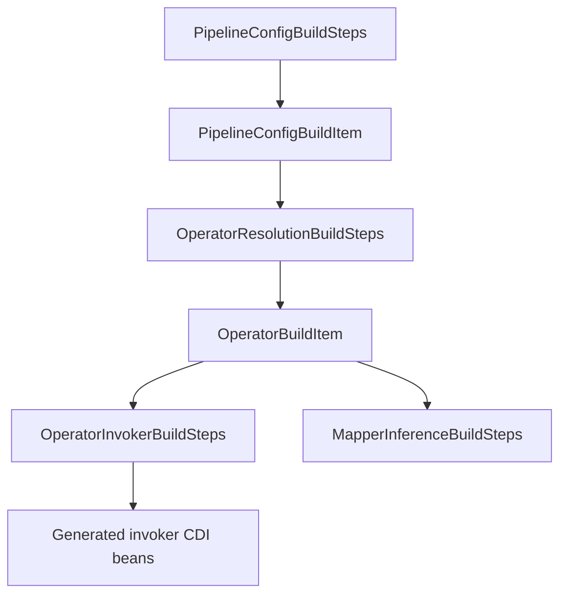

# Operator Invocation Internals

## Build-Time Processing Flow



## Core Build Items

- `PipelineConfigBuildItem`: parsed YAML operator step config.
- `OperatorBuildItem`: resolved class/method/input/normalized return/category metadata.

## Resolution Contract (Current)

- Resolve operator classes/methods from Jandex only.
- Reject ambiguous signatures and unsupported method shapes at build time.
- Normalize return metadata to reactive shape for downstream generation.

## Invocation Contract (Current)

- Invocation code is generated with Gizmo.
- No reflection or runtime method-name lookups.
- Generator enforces unary constraints and clear deployment-time failures.

## Generated Bean Shape

The invoker is generated as a CDI bean that calls the resolved operator method directly.
The Java below shows the generated equivalent for each operator category.

### Non-Reactive Operator Category

```java
package org.pipelineframework.generated.operator;

import jakarta.enterprise.context.ApplicationScoped;
import jakarta.inject.Inject;
import io.smallrye.mutiny.Uni;
import org.pipelineframework.service.ReactiveService;

@ApplicationScoped
public class EnrichPaymentOperatorInvoker implements ReactiveService<PaymentIn, PaymentOut> {

    @Inject
    PaymentOperators target;

    @Override
    public Uni<PaymentOut> process(PaymentIn input) {
        PaymentOut result = target.enrich(input);
        return Uni.createFrom().item(result);
    }
}
```

### Reactive Operator Category

```java
package org.pipelineframework.generated.operator;

import jakarta.enterprise.context.ApplicationScoped;
import jakarta.inject.Inject;
import io.smallrye.mutiny.Uni;
import org.pipelineframework.service.ReactiveService;

@ApplicationScoped
public class ScorePaymentOperatorInvoker implements ReactiveService<PaymentIn, PaymentScore> {

    @Inject
    PaymentScoringOperators target;

    @Override
    public Uni<PaymentScore> process(PaymentIn input) {
        return target.score(input);
    }
}
```

## Change-Safety Notes

- Keep resolution and invocation concerns separated (`OperatorResolutionBuildSteps` vs `OperatorInvokerBuildSteps`).
- Preserve fail-fast `DeploymentException` messages; they are user-facing diagnostics.
- When adding new reactive shapes, update both:
  - classification/normalization logic
  - invoker adaptation and validation boundaries

## Related

- [Operators](/guide/build/operators)
- [Compiler Pipeline Architecture](/guide/evolve/compiler-pipeline-architecture)
