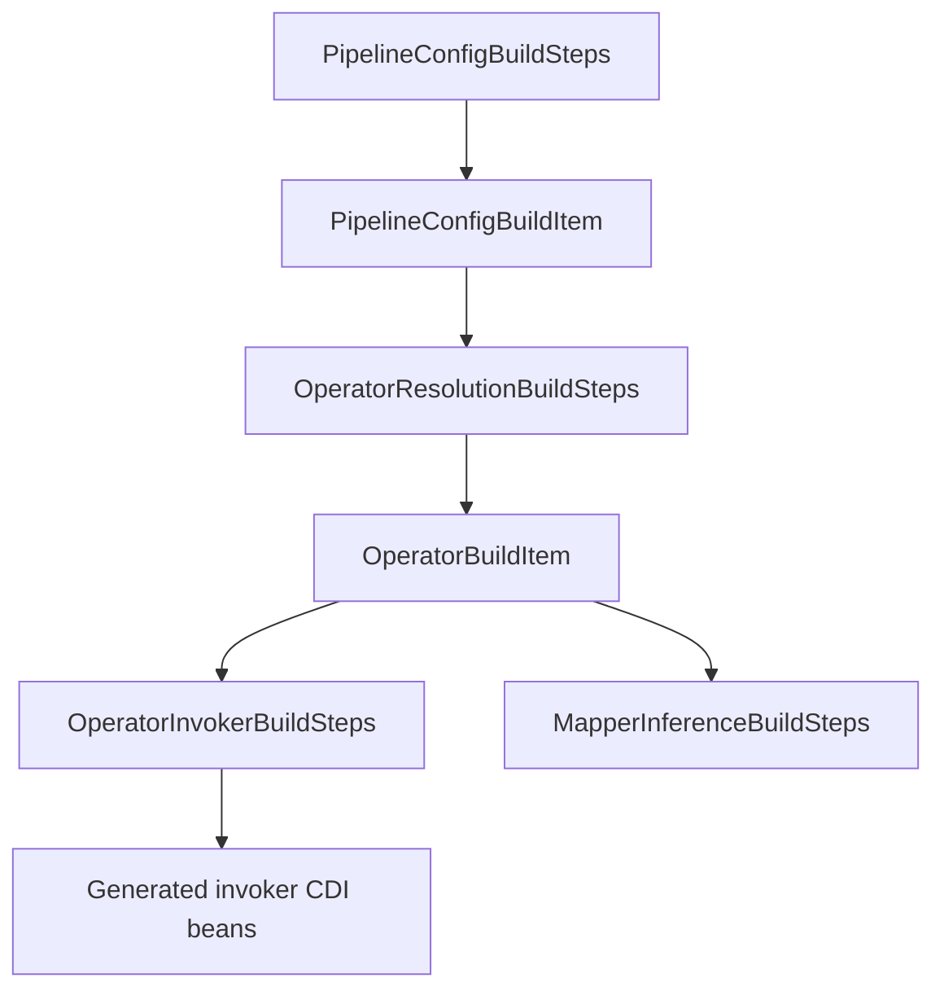

# Operators: Maintainer Internals

This page is for TPF maintainers evolving operator resolution and invocation internals.

## Build-Time Processing Flow

## Core Build Items

- `PipelineConfigBuildItem`: parsed YAML operator step config.
- `OperatorBuildItem`: resolved class/method/input/normalized return/category metadata.

## Resolution Contract (Current)

- Resolve operator classes/methods from Jandex only.
- Reject ambiguous signatures and unsupported method shapes at build time.
- Normalize return metadata to reactive shape for downstream generation.

## Invocation Contract (Current)

- Invocation code is generated with Gizmo.
- No reflection or runtime method-name lookups.
- Phase-1 generator enforces unary constraints and clear deployment-time failures.

## Change-Safety Notes

- Keep resolution and invocation concerns separated (`OperatorResolutionBuildSteps` vs `OperatorInvokerBuildSteps`).
- Preserve fail-fast `DeploymentException` messages; they are user-facing diagnostics.
- When adding new reactive shapes, update both:
  - classification/normalization logic
  - invoker adaptation and validation boundaries

## Related

- [Operators (YAML Build-Time)](/guide/build/operators)
- [Compiler Pipeline Architecture](/guide/evolve/compiler-pipeline-architecture)
