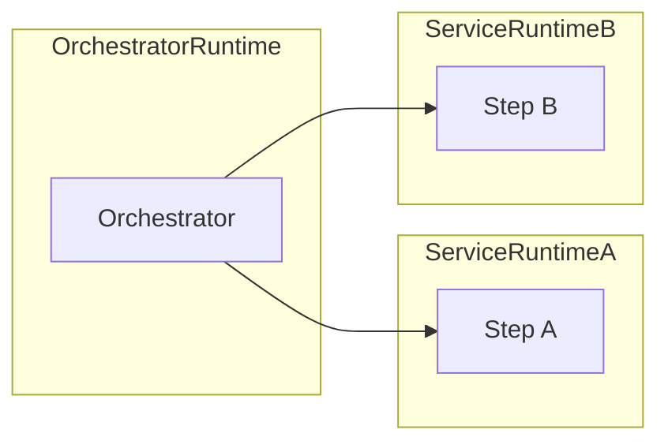
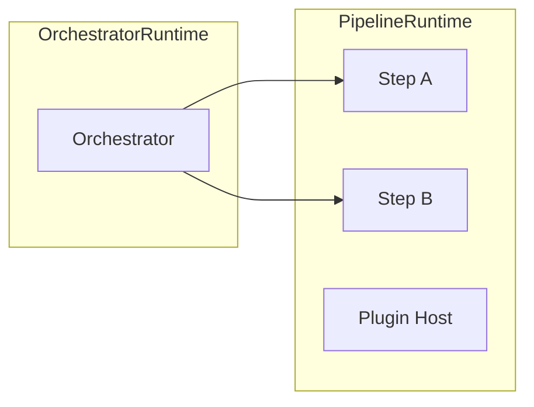
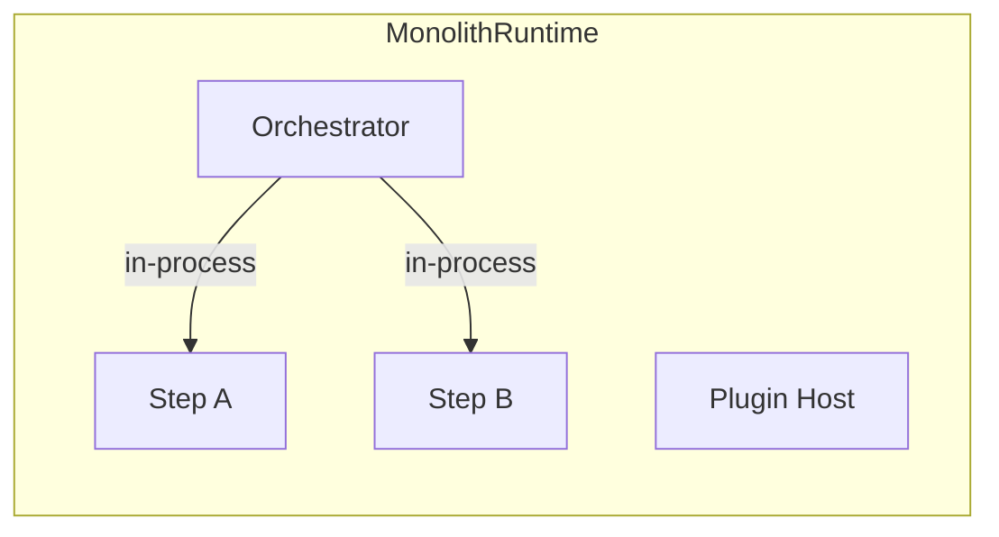

# Runtime Mapping Cheat Sheet

This is a one-page guide to help you pick a layout quickly.

## Pick a layout in 30 seconds

| If this is true | Choose |
| --- | --- |
| Services deploy on different cadences or teams | modular |
| You want fewer containers but keep orchestrator separate | pipeline-runtime |
| You want the simplest ops story (one deployable) | monolith |
| You are unsure and want low risk | pipeline-runtime |

## Typical runtime shapes

### modular

- Runtimes: many
- Orchestrator: separate
- Steps: spread across service modules
- Best for: strict isolation, ownership boundaries



### pipeline-runtime

- Runtimes: one per pipeline
- Orchestrator: separate
- Steps: single runtime per pipeline
- Best for: fewer deployables without full collapse
- Also good for: keeping minimal client/server boundaries so splitting later is easier
- Security note: smaller exposed surface if only the orchestrator endpoint is public



### monolith

- Runtimes: one
- Orchestrator: included (in-process calls)
- Steps: all in one module
- Best for: simplest operations, lowest container count



## Quick cost intuition

- **Containers**: modular (highest) > pipeline-runtime > monolith (lowest)
- **Isolation**: modular (highest) > pipeline-runtime > monolith (lowest)
- **Build time** (per-module vs full rebuild): modular (shortest per-module build) > pipeline-runtime (medium) > monolith (longest full rebuild)

## Minimal YAML starters

### modular (defaults)

```yaml
version: 1
validation: auto
```

### pipeline-runtime

```yaml
version: 1
layout: pipeline-runtime
validation: auto

defaults:
  module: payments-pipeline

runtimes:
  payments: {}
  orchestrator: {}

modules:
  payments-pipeline:
    runtime: payments
  orchestrator:
    runtime: orchestrator
```

### monolith

```yaml
version: 1
layout: monolith
validation: auto

runtimes:
  monolith: {}

modules:
  monolith:
    runtime: monolith
```
