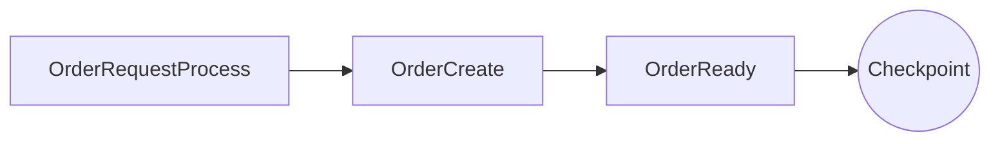
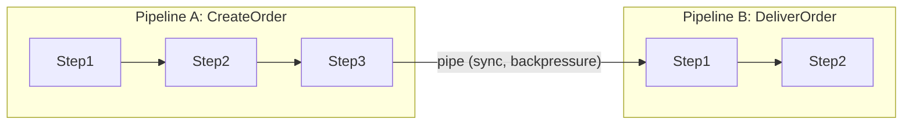
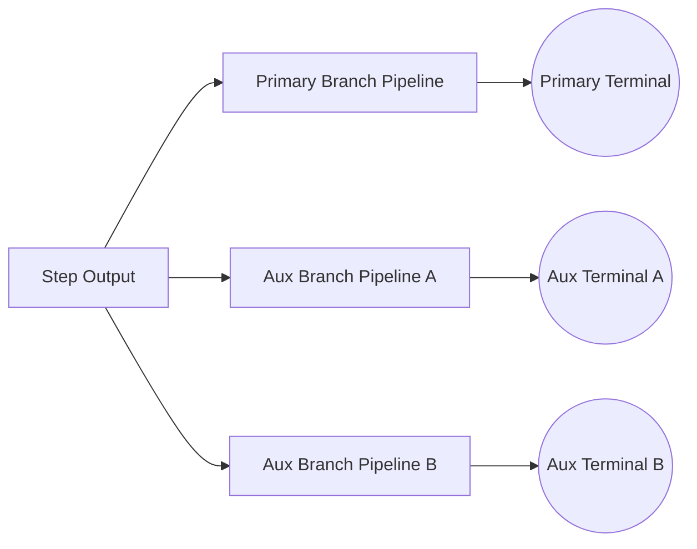
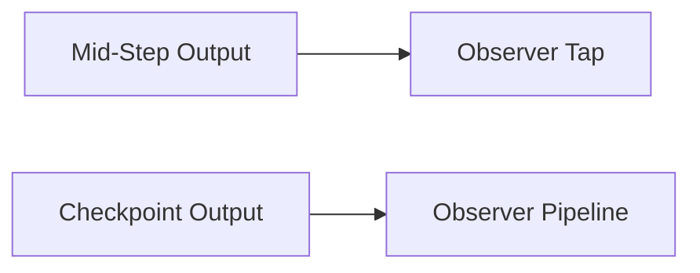
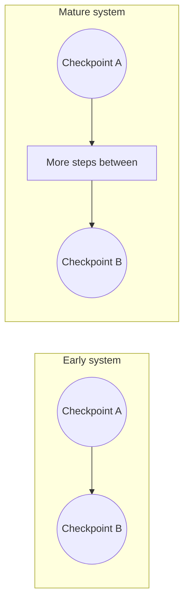

# Roadmap: Checkpoint Pipelines vs FTGO (Pessimist's Notebook)

This guide captures the ongoing architectural exploration of checkpoint-style pipelines as an alternative to FTGO's saga-first model. It is written for the engineer who just entered the meeting room: quick context, core principles, and the risks we are explicitly tracking. The goal is to be intentionally pessimistic: list what can go wrong, what we believe is already covered, and what still needs design work.

For broader context, see:
- [TPF and DDD Alignment](/guide/evolve/tpfgo/ddd-alignment)
- [Application Design Spectrum](/guide/evolve/tpfgo/design-spectrum)

## TL;DR (why this exists)

- We want a **better-than-FTGO** architecture that avoids rollbacks and avoids hiding domain decisions in ops.
- We treat a pipeline as a **checkpoint**: when it finishes, the state is valid and stable.
- We prefer **sync, reactive piping** between pipelines (backpressure preserved) over async fan-out.
- We treat failures as **operational** errors; business unhappy paths are modeled as explicit pipelines.
- We assume a **single tech stack** and a single leadership/business, so "autonomy for its own sake" is not a goal.

## Working Model (current stance)

- **Pipeline = checkpoint**: a pipeline produces a stable, valid state. No status fields, no updates, no rollbacks.
- **Steps own persistence**: 1 step = 1 table/entity type.
- **Success vs failure only**: success flows data; failures are operational and go to an error sink.
- **Business unhappy paths**: modeled as explicit pipelines, not as exceptions.
- **Sync piping**: pipelines can be chained with reactive (non-blocking) request/response.

## Architectural Principles (expanded)

1) **Shipability over modularity**
   The primary boundary is how we **ship/release**. The orchestrator and step runtimes exist to make deployment safe and observable. Code modularity is useful, but secondary.

2) **Immutable checkpoints, no in-place updates**
   Status fields imply updates and mutable state. We avoid them. Each step persists a new, immutable type and hands it forward.

3) **Pipelines are composite steps**
   A pipeline is a higher-order step with clear input and output types. This lets us chain pipelines as a workflow without pretending they are a monolith.

4) **Operational failures are not domain logic**
   A failure (exception) is operational. Domain unhappy paths are modeled as explicit pipelines.

5) **Backpressure is a first-class contract**
   If pipelines are chained, demand must flow end-to-end. We avoid unbounded buffering and treat backpressure as part of the contract.

## Visuals (how it works)

### 1) Checkpoint pipeline (single pipeline, immutable steps)

### 2) Pipeline-to-pipeline piping (sync, reactive)

### 3) Failure handling separation

### 4) Workflow fan-out (pipeline as workflow)

### 5) Observers vs mid-step taps

### 6) Lifecycle evolution (early vs mature)

## Example (CreateOrder, checkpoint model)

**Input DTO**: `OrderRequest`
**Output DTO**: `ReadyOrder`

Steps (each step persists its own type):
- `OrderRequestProcess` -> `OrderRequest` + `LineItem`
- `OrderCreate` -> `InitialOrder`
- `OrderReady` -> `ReadyOrder`

**Outcome**: if the pipeline completes, `ReadyOrder` is valid and stable. No rollback. If a failure occurs, it goes to the error sink; optional ops remediation pipelines can be attached for automation.

## Pain-Point Matrix

Status legend: RESOLVED, DECIDED, PROPOSED, PARTIAL, OPEN

1) **Checkpoint invariants**
- **Problem**: What makes a pipeline output "valid"?
- **Stance**: The pipeline process itself guarantees invariants; no status fields, no validators needed.
- **Status**: RESOLVED

2) **Failure classification**
- **Problem**: Distinguish business unhappy paths vs operational failures.
- **Stance**: TPF uses a single failure channel; exceptions are operational and go to the error sink. Business unhappy paths are separate pipelines.
- **Status**: DECIDED

3) **Partial progress across pipelines**
- **Problem**: Pipeline A completes, Pipeline B fails.
- **Stance**: Treated as an ops failure; A's checkpoint remains valid. Optional ops pipelines may handle remediation. **Blocking for cross-pipeline sync composition** until an ops remediation pattern is defined. Action: define an ops remediation pipeline pattern for partial-progress recovery.
- **Status**: OPEN

4) **Idempotency / duplicate handoff**
- **Problem**: Connector retries can duplicate downstream processing.
- **Stance**: Needs a connector-level idempotency key and de-dup policy. **Blocking for cross-pipeline sync composition** until the connector policy is defined. Action: define connector-level retry keys and de-dup semantics.
- **Status**: OPEN

5) **Traceability / lineage**
- **Problem**: Track the lineage of items through steps and pipelines.
- **Stance**: Implement "Russian doll" tracing in the runtime (TraceEnvelope with previous-item reference or inline payload).
- **Status**: PROPOSED

6) **Type compatibility between pipelines**
- **Problem**: Pipeline B should not depend on Pipeline A internals.
- **Stance**: Use Pipeline B input DTO as the handoff contract; add build-time compatibility checks.
- **Status**: PARTIAL

7) **Backpressure across pipelines**
- **Problem**: Piping should preserve backpressure end-to-end.
- **Stance**: Needs a connector policy that propagates demand (no unbounded buffers). **Blocking for cross-pipeline sync composition** until end-to-end demand signalling is defined. Action: specify end-to-end demand signalling and buffer limits.
- **Status**: OPEN

8) **Branching outputs (multi-out steps)**
- **Problem**: A step may need to emit different output types based on business decisions.
- **Stance**: Allow workflow fan-out by piping sub-pipelines off a step output; require explicit branch policy (primary vs aux, required vs optional).
- **Status**: PROPOSED

9) **Observers and mid-step taps**
- **Problem**: Optional features (e.g., marketing) may want to observe outputs that are not stable checkpoints.
- **Stance**: Distinguish checkpoint observers (stable) from mid-step taps (weak guarantees); allow explicit opt-in.
- **Status**: PROPOSED

10) **Decision points as checkpoints**
- **Problem**: Adding a new decision step can introduce a new step type or complex branching inside a pipeline.
- **Stance**: Prefer ending the pipeline at a decision and spawning one pipeline per outcome. Over time, checkpoints should remain relatively stable even as steps grow.
- **Status**: PROPOSED

11) **Remote subscription trigger**
- **Problem**: Pipeline-to-pipeline chaining currently relies on external triggers (CLI/HTTP).
- **Stance**: Add a streaming trigger to the orchestrator (subscribe/ingest) with backpressure and buffering.
- **Status**: PROPOSED

## Additional Risks (forward-looking)

- **Cross-pipeline atomicity illusion**: sync chaining can look atomic while still being partial. (See Pain-point matrix #3)
- **Schema drift**: handoff DTO versioning can break compatibility without strict rules. (See Pain-point matrix #6; Addressed in Near-Term Design Work: Build-Time Checks)
- **Temporal coupling**: downstream slowness collapses upstream throughput. (See Pain-point matrix #7)
- **Hotspot steps**: a single heavy step can dominate latency and throughput.
- **Backpressure deadlocks**: mismatched demand signaling can stall a chain. (See Pain-point matrix #7; Addressed in Near-Term Design Work: Connector Policy)
- **Implicit retries**: connector retries can trigger duplicate side effects. (See Pain-point matrix #4; Addressed in Near-Term Design Work: Connector Policy)
- **Observability blind spots**: reference-based tracing needs reliable lookup. (See Pain-point matrix #5; Addressed in Near-Term Design Work: TraceEnvelope)
- **Fan-out/fan-in complexity**: ordering and timeout handling become tricky. (See Pain-point matrix #8)
- **Distributed time assumptions**: ordering based on timestamps becomes ambiguous.
- **Policy leakage into ops**: domain obligations can get pushed into SLOs if not modeled. (See Pain-point matrix #2)

## Near-Term Design Work

- **Error Sink**: define a runtime error sink interface with a default StdErrSink and optional gRPC/REST sink service.
- **Connector Backpressure Policy**: define demand propagation, buffer limits, and flow control. (Pain-point #7, Owner: TBD, Acceptance: documented policy + tests)
- **Connector Idempotency Policy**: define de-duplication, retry keys, and exactly-once semantics. (Pain-point #4, Owner: TBD, Acceptance: documented policy + tests)
- **TraceEnvelope**: add optional tracing that wraps step output with previous-item linkage.
- **Build-Time Checks**: verify pipeline-to-pipeline handoff type compatibility.

## Open Questions

- Should the connector enforce strict backpressure by default?
- Should connector idempotency be mandatory or opt-in?
- How should the tracing store be configured (inline vs reference)?
- Should the pipeline definition expose a formal "checkpoint contract"?
- How should multi-out decisions be modeled (discriminated envelopes vs explicit pipelines)?

## Intended Outcome

A pragmatic, pessimistic architecture that improves on FTGO by keeping strong, explicit checkpoint semantics, minimal operational ambiguity, and a clear separation of business vs ops concerns.
