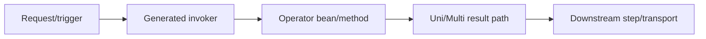

# Operators for Operations

This page is for SRE and platform operations teams running TPF workloads that use operators.

## Operational Expectations

- Operator contracts are validated at build time, reducing runtime signature failures.
- Build failures should be treated as deployment gate signals, not runtime incidents.
- Runtime behavior still depends on upstream/downstream services, transport, and resource limits.

## Runtime Path

## What to Monitor

- Startup/build artifact integrity (`META-INF/pipeline/*` metadata presence).
- Invocation latency and error rates per step/operator path.
- Backpressure and queue behavior for high-volume or expansion/reduction flows.
- Dependency health of services hosting reused operator logic.

## Incident Clues

- Contract/shape issues: usually appear during CI build, not production runtime.
- Metadata-not-found errors: usually indicate packaging/build lifecycle drift.
- Throughput issues: usually indicate operator logic cost, blocking sections, or transport bottlenecks.

## Runbook Pointers

- Validate module build ordering and generated artifact packaging.
- Verify generated pipeline metadata in built artifacts.
- Reproduce locally with the same build profile and pipeline config path used in CI.

## Fast Incident Checklist

1. Confirm artifact contains `META-INF/pipeline/*` metadata expected by runtime.
2. Confirm operator dependency JAR/module version matches what was built/tested.
3. Confirm no stale incremental build artifacts in CI workspace.
4. Confirm step-level latency/error spikes align with operator-heavy stages.

## Related

- [Best Practices](/guide/operations/best-practices)
- [Observability](/guide/operations/observability/)
- [Operators (YAML Build-Time)](/guide/build/operators)
