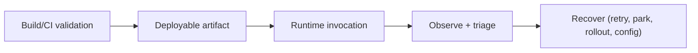

# Operator Runtime Operations

Operators are build-validated and runtime-executed. Most contract errors should fail before deploy; runtime failures should be diagnosable from logs, metrics, and step-level health signals.

## Operating Model

```mermaid
flowchart LR
  A["Build/CI validation"] --> B["Deployable artifact"]
  B --> C["Runtime invocation"]
  C --> D["Observe + triage"]
  D --> E["Recover (retry, park, rollout, config)"]
```

## Start Here

- [Operator Runbook](/guide/operations/operators-playbook)
- [Operator Troubleshooting Matrix](/guide/operations/operators-troubleshooting)

## Scope of This Guide

- Running operator lanes in CI-equivalent modes.
- Diagnosing failure signatures quickly.
- Recovering from retry exhaustion, parking growth, and timeout pressure.
- Understanding current intentional limitations.

## Related

- [Operators](/guide/build/operators)
- [Developing with Operators](/guide/development/operators)
- [Observability](/guide/operations/observability/)
- [Error Handling](/guide/operations/error-handling)
