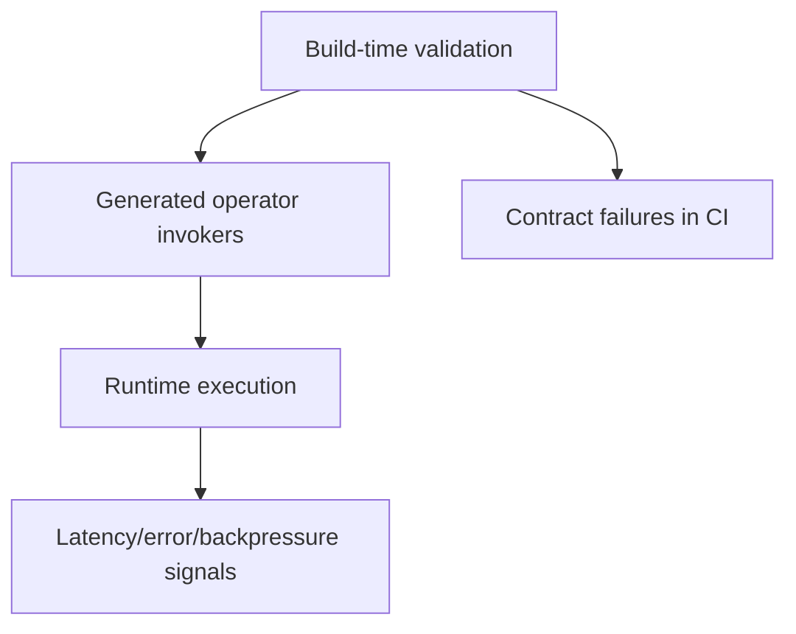

# Operator Runtime Operations

## What Fails Where

```mermaid
flowchart TD
  A["Build-time validation"] --> B["Generated operator invokers"]
  B --> C["Runtime execution"]
  A --> D["Contract failures in CI"]
  C --> E["Latency/error/backpressure signals"]
```

Operator issues split into two classes:
- Build-time contract failures (class/method/signature/mapper/proto prerequisites).
- Runtime behavior issues (latency, dependency faults, throughput pressure).

## Operational Expectations

- Most operator contract defects should fail in CI/CD before deployment.
- Runtime incidents are typically dependency/load/resource issues, not signature lookup issues.
- For gRPC operator/delegated paths, descriptor and mapper prerequisites must be present.

## What to Monitor

- Build artifact integrity (`META-INF/pipeline/*` metadata).
- Step latency and error rates for operator-heavy stages.
- Throughput and backpressure indicators.
- Dependency health for external operator libraries/services.

## Incident Triage Checklist

1. Confirm the deployed artifact matches the commit built in CI.
2. Confirm `META-INF/pipeline` metadata exists in packaged artifacts.
3. Confirm operator library versions match expected dependencies.
4. Confirm gRPC descriptor and mapper generation outputs (for gRPC transport).
5. Correlate runtime spikes with specific operator steps.

## Common Signals

- Build error mentioning operator class/method: configuration or dependency drift.
- Build error mentioning mapper/protobuf for gRPC: transport prerequisites missing.
- Runtime timeout/latency spike: operator logic cost or downstream saturation.

## Related

- [Operators](/guide/build/operators)
- [Observability](/guide/operations/observability/)
- [Error Handling](/guide/operations/error-handling)
